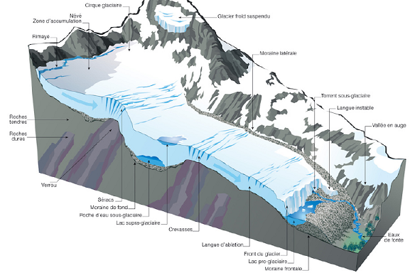
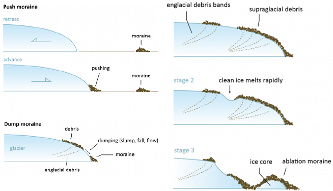
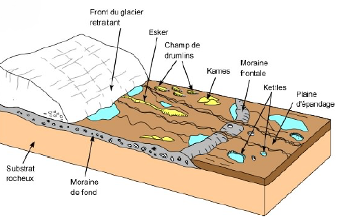
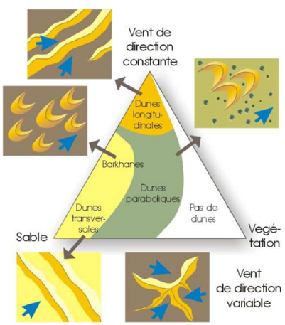

# Partie 2 : Classification des formations superficielles

La classification des formations superficielles est établie en fonction de deux paramètres qui déterminent leur nature
et leur comportement :

- la **topographie**

 - plane ou sub-plane : les formations superficielles évoluent sur place selon la nature de la roche initiale, le climat, le régime hydrique, l’action des organismes et la durée : **formations superficielles autochtones**
  
 - sur versants : les formations superficielles subissent la dynamique gravitaire, qu’elle soit « libre » (éboulis, effondrements) ou assistée par un agent (eau, neige, glace,…) et sont tributaires de la pente (valeur, longueur, concavité/convexité) et de toutes les dynamiques qui s’y exercent, simultanément ou successivement : **formations superficielles sub-autochtones** ou « colluvions de versants »

- les **dynamiques externes** s’exercent sur tout matériel meuble qu’elle peuvent prendre en
charge et déplacer sur de plus ou moins longues distances
selon leur compétence, avant de les abandonner, momentanément ou
définitivement. Ces dynamiques signent leur action par des formes, des structures et des figures
caractéristiques : formations superficielles allochtones

# Chapitre 1 : Les formations superficielles autochtones

## Généralités

Sous l’appellation « autochtones » sont classées des formations superficielles dont la genèse et l’évolution s’effectuent en position topographique plane ou sub-plane : plaines, plateau, interfluves, …

A la surface de la Terre, l’intervention des organismes vivants est générale. Donc, ce n’est que
dans des conditions extrêmes, incompatibles avec le développement du bios, ou au tout début
de la météorisation que la fragmentation physique domine donnant naissance à des régolites,
matériaux constitués de fragments de roches, fins ou grossiers.

Le cas général correspond à une évolution conjointe biogéochimique des constituants minéraux
et organiques donnant naissance aux sols et aux altérites.

Le cas des sols est traité dans un cours spécifique, et nous traiterons ici de 2 cas particuliers :

- les manteaux d’arènes en place qui résultent d’une altération ménagée (arénisaton) particulièrement développée sur les roches granitiques en domaine tempéré et constituent une voie de formation majeure du matériel détritique et néoformé et alimentent
après érosion et transport les formations superficielles sub autochtones et allochtones et les bassin sédimentaires ;

- les argiles sur karsts, les argiles à silex et le sidérolithique qui témoignent de paléo altérations (et de paléo pédogenèses) associant argiles résiduelles et/ou néoformées et oxydes de fer jusqu’à former des gisements minéraux exploitables.

## Manteaux d'arènes en place

Comme d’autres formations superficielles autochtones, les manteaux d’arènes en place se rencontrent dans les interfluves planes, à l’écart des incisions opérées le long des vallées et des valons.

Sur les versants, les volumes d’arènes subissent des
déplacements articulaires ou en masse (ce qui
conduit à les classer parmi les formations superficielles sub autochtones)
mais peuvent néanmoins reposer sur des volumes
non déplacés en s’intercalant entre entre l’arène in
situ (formations superficielles autochtone) et le sol actuel.

L’autochtonie d’une formations superficielles s’apprécie sur le terrain par
un passage progressif de la roche saine à l’altérite et surtout par une architecture préservée soulignée par des diaclases ou des filons.

En complément, des mesures en laboratoire
fournissent des compléments indispensables :
examen en lame mince, granulométrie, cortège
minéralogique, etc

## Manteaux d'arènes et échelles d'analyse

Les couvertures d’arènes montrent des variations d'épaisseur souvent importantes et parfois
brutales … dont la signification varie selon l’échelle d’observation (niveau scalaire).

L’interprétation de ces variations d’épaisseur se fait en raisonnant en termes de bilan : le rapport
entre le volume de débris rendus mobilisables par arénisation et le volume soumis à l’ablation.

Le critère « épaisseur » doit donc être manié avec précaution car certains profils peuvent être
tronqués, voire ne conserver, après décapage, que des « racines » qui peuvent être confondues
avec des pellicules d’arénisation naissante.

A l’échelle locale (site), la topographie jour un rôle décisif : on considère généralement que
l’épaisseur et la continuité du manteau varient en raison inverse de la pente. Il existe néanmoins
de exception, notamment en présence d’une armature de matériaux résistants (filons, etc.).

A une échelle supérieure (10aine km²), la lithologie (composition minéralogique, texture, etc.)
influence directement l’épaisseur du manteau d’arène qui reflète alors la sensibilité du substrat :

- les grès siliceux et les quartzites ont une aptitude à la désagrégation granulaire moindre que les granites en raison d’une
plus faible proportion de minéraux altérables et d’argiles et sont associés à des manteaux d’arènes moins épais ;

- la micro- (microfissures) et la méso-fracturation (joints, diaclases) des roches peuvent expliquer des variations d’épaisseur
car le drainage joue également un rôle important ;

- les mécanismes internes (circulations hydrothermales, mise ne place de corps intrusifs tardi- ou fini-magmatiques)
peuvent également être impliqués dans la formation de certaines arènes profondes.

Au-delà des particularités locales et/ou régionales (topographie, pétrographie, stratigraphie), il existe une distribution zonale des manteaux d’arènes.

## Arènes des hautes latitudes

Dans les milieux froids des hautes latitudes, les revêtements d’arènes ne sont pas exceptionnels
mais ils sont caractérisés par leur faible épaisseur, d’ordre centimétrique à décimétrique.

Deux causes sont retenues pour expliquer cette météorisation pelliculaire :

- ralentissement des processus d’altération par la température basse ;
- ablation d’origine glaciaire qui pourrait éroder une part importante des altérites superficielles.

La minéralogie des arènes témoigne d’une altération peu avancée (très peu d’argiles) qui
pourrait être mettre au compte d’une durée très courte depuis le retrait des glaciers
pléistocènes, d’autant que cette météorisation chimique opère dans un contexte peu favorable.

Des conditions particulières peuvent entraîner un épaississement du manteau d’arènes, comme
dans les zones littorales où l’haloclastie (action des sels) est combinée à la cryoclastie
(alternance gel-dégel) et provoque une micro fissuration qui facilite l’altération des roches.

Noter l’existence de masses d’arènes sableuses ou de saprolites sablo-argileux plus ou moins
dont l’épaisseur pluri métrique semble incompatible avec une altération limitée à l’Holocène et
qui soulève la question d’éventuels héritages pré- et inter-glaciaires.

## Arènes des moyennes latitudes

Sur les massifs anciens des moyennes latitudes, les revêtements d’arènes sont dans
l’ensemble plus étendus et plus épais que sous les hautes latitudes, non seulement parce que
la météorisation y est plus active, mais aussi et surtout parce que les conditions bioclimatiques
de conservation des stocks hérités y sont meilleurs : les couvertures végétale et pédologique
continues assurent une protection efficace contre une érosion généralement peu agressive.

L’étude de ces formations peut commencer avec une analyse granulométrique en mettant
l’agent sur la fraction argileuse, mais doit ensuite intégrer minéralogie et géochimie.

Dans ces milieux tempérés frais de moyenne montagne ou l’eau est abondante, l’obstacle principal à la météorisation chimique est lié à la température : mauvaise circulation des eaux dans les microfissures, réactions chimiques ralenties.

Les études montrent notamment l’existence de deux faciès : des arènes frustes mais majoritaires et caractéristiques d’une altération chimique ménagée co-existent avec des matériaux arénacés minoritaires mais plus évolués sans doute liés à des héritages.

## Arènes des milieux méditerranéens

En milieu méditerranéen, la morphogenèse est souvent active (tectonique alpine) et le décapage
des altérites, accentué par les activités humaines, peut aboutir au dégagement du front
d’altération : le bilan privilégie l’évacuation par rapport à la désagrégation granulaire.

Les manteaux d’arènes sont en général plus minces et moins continus qu’en domaine tempéré,
et présentent une granulométrie sableuse à sablo-limoneuse et peu d’argiles (<10%). Les
néo genèse sont de type illites, vermiculite et interstratifiés, la kaolinite restant peu abondante. La mobilisation géochimique est faible et s’effectue au détriment des plagioclases et des micas.

## Arènes des milieux tropicaux secs

En milieu tropical sec, la désagrégation granulaire affecte les roches granitiques ou plus basiques, et
peuvent coexister des manteaux d’altérites appartenant à différentes générations.

Dans ces milieux actuellement caractérisé par d’importants contrastes saisonniers, il faut s’interroger
sur le facteurs déterminant : l’empreinte paléoclimatique ou la durée d’altération.

A l’échelle des sites, le drainage joue un rôle essentiel : dans les contextes drainants, lessivés, se développent des sols bruns ou rouges argile-sableux à kaolinite, tandis que dans les milieux plus confinés, se développent des sols noirs du type vertisol à montmorillonite.

## Formations superficielles de surface des karsts

La désagrégation et la dissolution des calcaires sont à l’origine de formations résiduelles,
argileuses et sableuses, de couleur jaunâtre, parfois mêlés à des cailloutis, graviers et blocs
calcaires plus ou moins émoussés, qui se rencontrent en surface et sont souvent accumulées
par les eaux dans les dépressions ou entraînées dans les réseaux karstiques souterrains.

Elles résultent de la mise en solution des carbonates de calcium et de magnésium qui laisse sur
place les autres éléments minéraux (sables, argiles, silice, fer sous forme d’oxydes et
d’hydroxydes) et sont d’autant plus abondants que les calcaires sont riches en impuretés.

Elles constituent souvent le substrat de sols de formation récente (ranker, rendzines, sols bruns,
…) dans les dépressions où elles s’accumulent par altération en place ou par colluvionnement.

Une évolution pédologique plus poussée conduit à la formation :

- de terra fusca constituée d’argiles et de limons, de couleur ocre, de même origine mais plus évoluée avec
formation d’hydroxydes de fer (limonite, goethite) sous l’action d’une altération plus longue successivement sous climat chaud, puis en milieu froid et humide. Elle est considérée comme une formation superficielle autochtone fossile ;

- de terra rosa constituée d’argile résiduelle de couleur rouge, riche en hématite et en kaolinite qui se
formerait sous climat chaud, à saison sèche marquée, à saison humide individualisée avec de fortes
précipitations. Elle est considérée comme un sol fersiallitique fossile.

Dans les milieux tropicaux humides, les sables et les argiles résiduelles des karsts ont évolué et
évoluent vers des sols fersiallitiques et ferrallitiques rouges, profonds et riches en argiles.

## Les argiles à silex

Ces formations résultent de l’altération des niveaux de craie à silex du Crétacé supérieur,
correspondent aux « clays-with-flints » des anglo-saxons et apparaissent sur les cartes
géologiques sous l’appellation « formations résiduelles à silex » ou « résidus à silex » (RS).

Ces RS se retrouvent associés aux substrats crayeux en France, Grande-Bretagne, Belgique,
Pays-Bas, Allemagne et Sud de la Suède, mais sont caractérisés par une grande variabilité
d’épaisseur en lien avec la dynamique karstique, responsable des irrégularités du toit de la craie.

La craie se compose d’une fraction carbonatée dominante (calcite) et de résidus constitués
de silex et de quartz, de micas, de feldspaths et d’argiles, plus rarement de phosphates et de
glaucome ; la pyrite et la marcassite pouvant être localement abondantes sous formes de
nodules. L’évolution des RS s’effectue en deux étapes :

- le processus initial d’altération s’effectue au contact direct de la craie (milieu basique) avec évacuation des éléments
solubles et accumulation des résidus sous forme d’argiles (presque exclusivement des smectites) emballant des silex ;

- l’approfondissement du profil et le lessivage des ions entraînent une acidification du milieu qui provoque des
transformations minéralogiques : dé silicifications (formation de kaolinite, dissolution des silex) et néo silicifications.

L’apparition des premiers RS est contemporaine de la phase d’émersion fini-crétacé et leur
évolution se calque sur celles des paléo surfaces dans lequel ils se développent, comme le
démontre le cas du Bassin de Paris où se succèdent 4 faciès du Nord vers le Sud.

La stratigraphie de la craie se retrouve au sein des profils d’altération ce qui démontre que les
RS sont, à l’origine, des FS autochtones, mais qui peuvent être ensuite contaminées par des
apports allochtones au cours d’une évolution différenciée localement et polyphasée.

## Le sidérolithique

Le sidérolithique est un terme désuet, qui a fait l’objet de nombreuses controverses, mais qui est
tout de même important car il fait référence à des formations qui livrent des minerais de fer.

À l’origine le sidérolithique (« pierre de fer ») désigne un matériau à haute teneur en fer exploité
pour la sidérurgie, rattachée à des périodes géologiques déférentes (Crétacé et Tertiaire).

Il est possible de distinguer deux sidérolithiques distincts :

- le sidérolithique in situ : formation autochtone constituée par altération profondes des roches granitiques et métamorphiques, ou carbonatées, sous climat chaud et humide de type fersialitique ou ferrallitique. A noter l’absence d’hydroxydes d’alumine libres ce qui semble indiquer aller à l’encontre d’un climat allitisant ;

- le sidérolithique de transport : formation détritique allochtone constituée de vastes épandages issus du démantèlement
des cuirassés ferrugineuses, dont les matériaux ont subit, après immobilisation, une évolution secondaire par sous
l’action de bactéries aérobies provoquant la précipitation d’oxydes de fer sous forme de pisolithes.

Les études semblent relier la mise en place de ces formations au cadre décrit par Erhart (1967) :

- le sidérolithique in situ serait associé à des période d’équilibre bioclimatique (« biostasie ») suffisamment longues pour
permettre le développement de ces formations autochtones, correspondant sans doute, en France, aux intervalles
Jurassique supérieur - Crétacé inférieur et fin Crétacé - Début Tertiaire ;

- le sidérolithique de transport serait associé à des phases d’érosion des profils en place et de transfert des matériaux sur les piedmonts (« rhexistasie »), qu’elles soient dues à des modifications bioclimatiques généralisées ou à des crises d’extension régionales d’origine tectonique.

En Afrique, des « faciès sidérolithiques » se manifestent, dans le Continental intercalaire
(antérieur à la transgression du Crétacé moyen) et Continental terminal (postérieur au Crétacé
supérieur), par la présence de niveau ferrugineux concrétions ou pisolitiques, de lentille d’argiles
bariolées élaborés durant une longue phase de biostasie sur les reliefs émergés à l’Eocène.

# Chapitre 2 : Les formations superficielles sub - autochtones

## Généralités

Les formations superficielles sub autochtones regroupent toutes les FS en transit sur les versants, quelle que soit
leur origine : altération des substrats rocheux, sédiments en provenance des surfaces
sommitales, dépôts éoliens, …

Toutes ces formations ont en commun une dynamique gravitaire, simple ou assistée par l’eau,
la glace la neige, … dont la résultante est leur transfert d’amont vers l’aval de lamente, quelles
que soient sa longueur et sa pente.

De telles formations sont regroupées sous l’appellation de colluvions de versants.

## Les dynamiques de versant

Les formations superficielles versants sont constituées de matériel local ou proximal mis en place sur les versants
par des mouvements gravitaires. La chute des matériaux de toutes tailles (phénomènes
gravatiers purs) est généralement associée à des déplacement, directement ou indirectement,
activés ou repris par l’écoulement de l’eau sous différentes formes.

Les dynamiques de versants sont donc gouvernés par des phénomènes de gravité qui entraîne,
en fonction de la pesanteur, tout matériau à se déplacer selon la ligne de plus grande pente :

- au delà d’un seuil (« pente d’équilibre » proche de 35°), les matériaux détachés de la paroi rocheuse peuvent se déplacer sous le seul effet de la gravité. Il en résulte généralement un granoclassement : les plus gros en position plus
distale, les plus fins à proximité de la zone de départ. Il s’agit de dépôts ordonnés : éboulis, cônes d’écroulement,… ;

- au dessus, la pente est trop faible pour permettre des déplacements purement gravitaire, et les mouvements dépendent
de processus liés à l’eau (mouvements de gravités assistée par le ruissellement, la neige ou la glace interstitielle).

L’influence du contexte géologique s’exprime à travers :

- la cohésion de la roche, comme les discontinuités de la roche (failles, diaclases), par exemple ;
- la disposition structurale, en particulier le pendage, la schistosité, l’orientation des diaclases. On distingue notamment :
  - les versants à contre-pendage où les formations détritiques s’accumulent lentement vers le talweg ;
  - les versants dans le sens du pendage où les glissement en masse s’effectuent banc sur banc.

Les transit des formations superficielles de versant

- dans l’espace, le relief étant formé par des systèmes ou des ensembles de pentes, chaud plan évolue en fonction de son
point bas, constituait une unité géographique avec des conditions particulière de morphogenèse ;

- dans le temps, les changements climatiques provoquent des mutation profondes du système morphodynamique et
entraînent des ruptures et des déséquilibres dans l’évolution des versants … Chaque phase développe ainsi des mouvements gravitaires en relation avec les formes et les formations créées par les phases précédentes.

## Mouvements gravitaires

Depuis les formations élémentaires (éboulis) jusqu’à des formes plus complexes et de
dimensions parfois considérables (talus d’éboulement,accumulation d’écroulements, glissements de terrain)

Éboulis : accumulation formée au bas d’un versant par la chute répétée de pierres et de blocs

- cône d éboulis : d’une hauteur d’ordre métrique à hectométrique, installé au pied d’un couloir de transit des apports ;
- tabliers d’éboulis : recouvrent de manière continue la partie inférieure des versants (extension longitudinale)

Éboulements : résultent de la chute gravitaire de masses considérables (100aine - milliers de m3)
et forment des cônes et talus d’éboulements, dans lesquels on distingue :

- une zone apicale de forte pente, constituée de matériaux relativement fin (sables, graviers) ;
- une zone médiane où dominent les cailloutis et les petits blocs ;
- une zone distale où s’accumulent des blocs avec un granoclassement vertical.

Écroulements : résultent de la chute gravitaire soudaine d’un pan entier de versant ou de paroi.

Écroulement en masse (rock-slide) : masse de terrain se détachant d'une paroi élevée 

## Glissement gravitaire 

Glissements banc sur banc : roches litées et cohérentes dont le pendage est voisin de la pente

Glissement boueux ou coulées de terre (« earth flows ») : matériaux meuble (sables, argiles)

Glissements en masse : volumes considérables (100 000 à plusieurs millions m3)

## Mouvements hydro gravitaires

Ruissellement en nappe : glacis d’épandage, pédiments des milieux tropicaux humides, glacis
d’érosion et d’accumulation en domaine méditerranéens et semi-arides

Coulées de débris (« debris flows ») : désigne à la fois le processus et l’accumulation d'une
masse de matériaux de toutes tailles qui en résulte

Charriage torrentiel : responsable d’un cône de déjection en aval du torrent ou de l’oued

Coulées de boue (« mud flows ») : écoulement à l’état fluide ou faiblement visqueux

Coulées de boue avec blocs ou laves torrentielles : matériaux hétéro métriques déposés dans un
chenal et pouvant aboutir à son obstruction par un bouchon chaotique

Aléa naturel : description du phénomène (occurrence, fréquence, intensité, emprise géographique)

Risque naturel : aléa x enjeu (x) (un ou plusieurs enjeux sont exposés à l'aléa naturel)

Le risque correspond à la superposition spatiale et temporelle d'un enjeu (par exemple une habitation) caractérisé par sa vulnérabilité et d'un aléa. L'aléa est le croisement (la combinaison) de l'intensité d'un phénomène et de sa probabilité d'occurrence. Dans le cas des chutes de blocs, l'aléas provient de la rupture de blocs depuis la falaise et de leur propagation jusqu'aux zones habitées. C'est de la superposition d'un enjeu à un aléa que naît la notion de risque. Sans enjeux, quelle que soit l'importance de l'aléa, il n'existe pas de risque.

## Formations superficielles : versants à *head*

Les termes *head* ou *rock-head* désignent des accumulations hétéro métriques de blocs anguleux noyés dans une matrice et dont les principales caractéristiques sont :

- une origine locale des matériaux issus du plateau ou du versant sur lequel il transitent pour s'accumuler en bas de pente;
- l'aspect anguleux des fragments de la fraction grossières;
- une matrice suffisamment abondante pour les blocs dans le sens de la plus grande pente;
- la fréquence des blocs relevants i.e d'inclinaisons inférieur à la pente générale du dépôt.

Les observations et les expérimentations semblent confirmer les hypothèses selon lesquelles la fraction grossière est issue de la géli-fraction des roches-mères et que la mise en place du matériau est liée à la cryo reptation et à la gélifluxion.

cryo reptation : déplacement par le gel 

gélifluxion : au moment du dégel, déformation de la roche qui devient malléable, écoulement lent de l'objet du au gel, dégel.

Cela se déroule plutôt en début de phase de début glacière car en phase glacière, le sol devient un **pergélisol**, sol qui est en permanence gelé.

polygénique : plusieurs origines

hétéro métrique : dimension variable

Déplacement en hauteur d'un matériel grossier et fin, les gros blocs vont être tendance à être déplacer moins vite et moins loin que les plus petits par cryo reptation et gélifluxion

Dans les régions tempérées, les heads représentent donc un **héritage des périodes froides** du Quaternaire, notamment de le début (*phase ana glaciaire*) caractérisées par une forte humidité, l'absence de pergélisol et la fréquence des alternances gel-dégel.

Les grès et les schistes des massifs anciens ont fourni les heads les plus typiques, mais les granites, les calcaires et le meulières peuvent également en être à l'origine.

La dimension et la forme des éléments grossiers dépendent de la nature et du degré de fissuration de la roche-mère. L'origine et la composition de la matrice sont en revanche extrêmement variées.

## Formations de versants : versants à grèzes

Les grèzes sont des dépôts de pente (*slope deposists*) d'origine cryo clastique et se caractérisent par une remarquable **homo-métrie des gélifracts** qui constituent sa fraction grossière et dont la taille varie avec la lithologique de la roche-mère.

Souvent confondues avec des éboulis (*éboulis stratifiés*) les grèzes s'en distinguent par des **dynamiques gravitaires assistés**, alors qu'elles sont purement gravitaires pour les éboulis.

Sur substrat calcaire, ces dépôts fossiles sont connus sous les noms de *gravelures* en Champagne, *grouilles* en Lorraine, *groizes* dans le Jura et *grèzes* en Charente. On trouve des dépôts comparables dans les Pays de Gales (sur schistes), dans l'Atlas marocain et en Pologne. Des équivalents ont été observés dans les milieux périglaciaires actuels au Groenland ou au Spitzberg.

Les fragments calcaires anguleux (gélifracts) à arrêtes fraîches sont l'origine autochtone (substratum du versant sus-jacent) et leur aspect atteste de l'absence de transport sur de longue distance. Différentes hypothèses sont évoquées pour leur mise en place : cryo nivale, gélifluxion et ruissellement, cryo reptation primaire + gélifluxion secondaire.

cryo rivale : déplacement par la fonte de neige

ruissellement : eau qui s'écoule dans un espace libre

écoulement : eau qui s'écoule dans un espace limité

**Grèzes et heads se sont donc formés sous des conditions climatiques comparables**, en début de phase froide, et leur mise en place fait appel aux même processus dominants : *cryo reptation et gélifluxion*. La différence entre ces deux faciès de dépôts de pente tient donc à d'autres paramètres, dont leur granulométrie (homogène ou hétérogène) qui semble liée à la lithologie de la roche mère et à la valeur de la pente (pentes douces entre 5 et 15 °C, fortes pentes entre 23 et 27°C)

La différence entre le *head* et les grèzes serait la roche mère, roche mère qui se fragmente très grossièrement pour les *head* et le type de pente où le type de pente sera plus forte pour les grèzes.

faille dystrique : faille normale avec un arrondi à la base

érosion différentielle : érosion différente en fonction de la nature du dépôt.

cône d'éboulis : structure lié aux éboulis

## Formations de versants : versants à arène

En raison de leur dominance sableuse ou sablo-limoneuse, les arènes sont généralement favorables aux déplacements grain par grain (mouvements particulaires solidaires de type reptation ou *creep*). Lorsque la proportion fines (limons fins et argiles) dépasse un certain seuil, les mouvements de masse de type solifluxion/gélifluxion ont tendance à devenir dominants. L'efficacité du ruissellement dépend à la fois de la granulométrie des dépôts et de l'intensité des pluies, et il se comporte comme un agent sélectif en transportant préférentiellement de la fraction la plus fine.

morphogenèse : altération puis érosion qui va mettre à nu un chaos granitique

deux processus sur les tors : altération et érosion

## Glacis ou pédiment

Le terme *glacis* ou *pédiment* désigne une **surface en pente douce**, présentant un profil très tendu ou légèrement concave, dominé en amont par un relief escarpé (crête ou inselberg) et raccordée en aval à une plaine alluviale ou un bassin fermé (endoréique). Certains auteurs distinguent les pédiments réalisés dans un roche résistante et homogène comme le granite, les glacis d'érosion qui recoupent des roches "tendres" en contrebas d'un relief en roches "dures". Sous climat sec, la couverture végétale est peu couvrante et discontinue. Il n'y a pas de sources et pas d'écoulements permanents. Altération, fragmentation, gravité et ruissellement concentré pas la compétence nécessaire pour évacuer cet charge sur une faible pente. Une série de cônes de dejection s'agglomèrent au niveau de la zone de contact entre les relief et la plaine. Le bilan sédimentaire est caractérisé par une évacuation des débris plus ou moins équivalente aux apports. La couverture détritique associe dans une organisation lenticulaire des éléments grossiers et des éléments fins : peu de tri, peu d'usure, mais des décharges brusques sur des distances limitées et des matériaux longtemps immobilisés. Les remaniements superficiels affectent essentiellement les fractions les plus fines, en particulier lors des événements pluvieux. Lorsque la fréquence de pluies est faible, l'activité éolienne peut jouer un rôle important et seules les particules les plus fines sont mobilisées. 

Il y a deux types de pente dans un glacis :

- glacis à érosion de front
- glacis d'érosion de revers

On a tout d'abord une altération, ensuite nous avons une diminution du volume par exportation de la roche altérée. La croûte va se fragmenter, on va retrouver des sédiments en jaune pâle où on va retrouver des fragments de la croûte et de la roche mère. Ensuite, ce matériel va subir une nouvelle altération qui va durcir le matériel du glacis. A la fin on retrouve la roche mer avec une croûte contenant la roche mère, la première croûte et les sédiments de la première phase d'altération ainsi que la les sédiments de la deuxième phase d'altération.

Selon les modalités de leur formation, on distingue : 

- les **glacis d'ablation** ( ou d'érosion, ou de dénudation) sur lequel la roche est mise à nu, ou semée de débris en cours d'évacuation. Le terme est généralement utilisé pour les surfaces taillées dans des roches tendres, car les glacis d'ablation tranchent souvent les roches sédimentaires (argiles, marnes, grès) en contrebas de reliefs structuraux en roches plus cohérentes.

- les **glacis d'accumulation** (ou **alluvial**, ou d'**épandage**) où la roche en place et ses irrégularités sont masquées par une épaisseur variable (de quelques mètres à plusieurs dizaines de mètres) de matériaux (alluvions, colluvions, etc.) Mais des nuances et des combinaisons peuvent être signalées. Le terme d'origine espagnole *playa* désigne la zone aval d'épandage des glacis, là où la pente devient insignifiante, imperceptible. Une playa ou un pédiment bien évolués et presque horizontaux prennent le nom de **pédiplaine**.
Lorsque la pente devient nulle, il peut se former un **barreal** (**sebkha**, ou **sebkra**, argilo-limoneuse) où seules les boues de décantation aboutissent et durcissent après évaporation. Cette forme prend des noms variés selon
les pays (*takyr* en Russie, *khabra* en Arabie, *qu* en Jordanie, *clay pan* en Australie, etc.). Si le fonctionnement hydrologique fait intervenir des remontées temporaires de nappe, la sebkha devient fréquemment saline.
Lorsque ces dépressions sont salées, on parle de *salinas* ou de **salares** (*kavir* en Iran, ou *tsaka* en Mongolie).

- les **glacis couvert et d'ennoyage**. Les pédiments entièrement nus sont très rares dans la nature. Dans la plupart des cas, on a à faire à un glacis dont la surface est complexe, alternant des affleurements et des dépôt. Les dépôts sont parfois très épais (de plusieurs mètres à plusieurs dizaines de mètres) et ont même développé des sols. Ils sont alors griffés de ravines de ruissellement ou d'écoulement. Dans ce cas, le terme le plus
approprié est celui de glacis couvert. Si les volumes montagneux ont fourni beaucoup de débris, soit parce qu'ils sont très sensibles à l'érosion (roches gélives, sensibles à la thermo clastie, etc.), soit parce qu'ils ont subi une évolution très ancienne, le glacis peut devenir un glacis d'ennoyage dont la couverture est très épaisse.

## Glacis : inversion de relief

En Afrique de l’Ouest, trois générations de glacis à cuirasse ferrugineuses sont distingués : les
hauts glacis, les moyens glacis et les bas glacis, dans des paysages dont les inselbergs portent
des témoins de surfaces plus anciennes.

# Chapitre 3 : Les formations superficielles allochtones

## Formations fluviatiles

### Processus de transport sédimentaire

Le matériel transporté par une rivière est appelé son **charge sédimentaire**.

- la **charge dissoute** : il s'agit du transport soluble de produits chimiques dissous dans l'eau
- la **charge en suspension** : il s'agit de sédiments qui ont été brassées par l'eau
- la **charge de fond** : les matériaux trop lourds pour être en suspension peuvent être roulées le long du lit d'un rivière

### Processus d'érosion

- **abrasion** ou **corrosion** : usure du lit et de la berge par la charge transportée par une rivière. C'est le type d'érosion le plus important dans la plupart des rivières. L'abrasion augmente avec la vitesse
- **attrition** : usure de la charge transportée par une rivière. Elle crée des particules plus petites et plus rondes.
- **dissolution** : l'eau contient du dioxyde de carbone dissous, qui peut réagir avec le calcaire et la craie, entraînant sa dissolution
- **action hydraulique** : c'est la puissance de l'eau qui s'écrase sur le lit ou contre les berges. Des bulles d'air peuvent éclater dans les zones de grandes turbulences, ce qui provoque des ondes de choc susceptibles d'accroître l'érosion. C'est ce qu'on appelle la cavitation.

**Diagramme de Hjulstrom** : relation entre la taille des particules et la vitesse d'écoulement

## Systèmes glaciaires

Les formations glaciaires recouvrent des surfaces considérables en Europe, en Amérique du Nord, au Groenland et en Antarctique. 

Selon les contextes, on distingue

- des **glaciers de montagne** limités en extension. 

- des **glaciers de calotte** ou **inslandsis** constitués par une accumulation épaisse de glace qui s'écoule directement dans la mer ("shelf" : plateforme flottante) en libérant des *icebergs* ou sous forme d'émissaires (**glaciers de vallée ou de piémont**). L'accumulation de glace s'y effectue par la surface et la masse flue lentement vers la bordure externe de la calotte, sous laquelle peuvent les lacs d'eau douce ou salée peuvent subsister lorsque la température à la base est proche du point de fusion de la glace.
moraine latérale formée par les phénomènes d'érosion et les chutes qui se font à la surface.

**Cirque glaciaire** : dépression aux parois
abruptes (pente entre 10° et 35°), de
forme circulaire ou semi-circulaire.

**Crevasse** : fente naturelle, étroite et
profonde à la surface d'un glacier et liée
à son déplacement.

**Eaux de fonte** : issues de la fonte
glaciaire à la saison estivale.

**Front du glacier** : limite basse du glacier entre la glace et l'eau. Lorsqu 'il recule on parle de recul glaciaire.

**Glacier suspendu** : type de glacier
résultant d'une zone d'accumulation,
souvent de petite taille, flottant sur les
flancs d'une montagne.

**Lac pro-glaciaire** : formé devant le glacier et dont l'eau est issue de la fonte du glacier. La plupart des grands Lacs alpins sont issus de ce processus de fonte de glacier.

**Lac supra-glaciaire** : formé à la surface d'un glacier, sa durée de vie peut varier de plusieurs heures à plusieurs décennies. Il peut atteindre plusieurs mètres de largeur et de profondeur. Il
est issu de la fonte de la glace en été ou de fortes pluies pendant la mousson.

## Érosion glaciaire

les blocs de toute taille déposés au front du glacier. Le pouvoir érosif d’un glacier sur le paysage s’exerce de deux
façons.

Lorsque le glacier s’écoule sur une surface rocheuse fracturée, il incorpore dans la glace des rochers qu’il emmènera avec lui. Ce processus d’arrachement de blocs du substratum par le glacier (plucking) se produit quand l’eau de fonte pénètre dans les fractures et les joints qui se trouve à la base du glacier. L’eau gèle et exerce une tension qui provoque la désagrégation du substratum en blocs par éclatement. Des blocs de toute taille de quelques cm à la taille d’une maison sont emportés.

Le second processus d’érosion est l’abrasion liée à la charge emmenée par le glacier qui sert à broyer la surface rocheuse. La roche pulvérisée est appelée la poussière de roche(rock flour) effritée par l’action des glaciers. Le torrent glaciaire qui s’écoule possède toujours une apparence grise liée à la charge en suspension (cette poussière de roche) qu’il charrie. La présence de rochers dans la glace laisse aussi des traces, des rigoles (grooves), des
rayures (scratches) ou stries glaciaires (glacial striations) sur le substratum. Ces stries sont la clé pour déterminer la direction suivie par le glacier. En cartographiant à plus grande échelle ces stries, on peut reconstruire les mouvements des glaciers.

Si le glacier s’écoule sur un substratum plus fin, la surface rocheuse est fortement polie, il n’y a donc pas abrasion. Lorsqu ’un glacier s’écoule dans une vallée fluviatile en forme de V, il va élargir, approfondir et redresser (mettre droit)
pour la transformer en vallée glaciaire en U. L’importance de l’érosion va dépendre de l’épaisseur de glace ce qui induit que la langue glaciaire principale va entailler la vallée plus profondément que les langues glaciaires secondaires. Quand le glacier aura reculé, on observera des vallées suspendues (hanging valleys). Elles correspondent aux vallées des langues glaciaires secondaires qui se situeront à une altitude bien supérieure à celle de la vallée principale.

L' **arrachement** de matériaux (érosion mécanique) est le deuxième type de processus d'érosion glaciaire. Le glacier arrache des morceaux du bedrock qui seront incorporés dans la moraine de fond. L'arrachement donne aux roches moutonnées une morphologie dissymétrique : elles sont polies à l'amont, là où le glacier est compressé sur la roche,
et anguleuses à l'aval des obstacles, là où le glacier se décolle de la roche et où par regel des eaux sous-glaciaires, des morceaux de roche sont arrachés.

## Formations superficielles glaciaires : généralités

Les glaciers constituent un puissant agent de transport. Les formes d'accumulation sont donc particulièrement développées à l'aval des glaciers. On distingue deux grands types de dépôts :

- les **dépôts glaciaires**, constitués par les moraines (terme créé par H.-B. de Saussure à la fin du XVIIIe siècle) ;
 
  - **till basal** (« lodgment till ») ou **moraine de fond**, de nature variable selon le substrat, mais généralement formée de matériel limoneux et plus ou moins riche en clastes (diamicton) et affectée de déformations (glaci-tectonique) ;
  - **till d’ablation** qui correspond à un dépôt morainique abandonné lors du retrait du glacier, formé de matériel hétéroclites, hétéro métrique et non-consolidé ;

- des **dépôts morainiques** divers et d’importance variable :
  
  - arcs morainiques frontaux : matériel hétéro métrique, riche en blocs métriques dans une matrice limoneuse ;
  - moraines latérales : idem … mais sa composition n’est représentative que d’une partie du bassin-versant ;
  - moraines centrales : il s’agit de moraines latérales jointives (coalescence de de 2 émissaires glaciaires) ;
  - moraines de poussée : matériel sédimentaire que le glacier charrie devant lui.
  
- les **dépôts fluvio-glaciaires**, liés à la double activité de processus glaciaires et fluviatiles
  
  - pro-glaciaires : liés aux écoulements sous-glaciaires, pauvres en fines, chenaux en tresses / cônes de graviers ;
  - supra-glaciaires : sables et graviers, déposés sur le glacier (vent, éboulis, …) et abandonnées par la fonte ;
  - sous-glaciaires : accumulations de galets très arrondies et de sables (eskers) ou d’incisions remplis de matériel plus grossier que l’encaissant (vallées tunnels) ;
  - fluvio-glaciaires s.s. en aval du glacier : système à écoulement en tresse occupant l’ensemble du lit majeur.

+ des **dépôts glacio-lacustres** liés un transport en suspension puis de décantation

+ des **dépôts glacio-marins** liés un transport par traction, suspension et flottaison.

## Formation superficielles glaciaire, les dépôts morainiques

Les moraines (ou tills) sont des accumulations détritiques très complexes et variées, dont les caractéristiques sédimentologiques majeures sont l'**absence de stratification** (à la différence des dépôts fluviatiles) et l'hétérogénéité de la
granulométrie.

**Une première classification est basée sur la position des matériaux lors du transport** :

- la moraine supra-glaciaire ou superficielle, constituée de blocs éboulés sur le glacier ou amenés par les avalanches et qui sont transportés de manière passive sur le glacier (blocs anguleux) ;
- la moraine intra-glaciaire, constituée par les matériaux enfouis dans le glacier et transportés à l'intérieur des lames de glace ;
- la moraine sous-glaciaire ou moraine de fond, qui correspond au transport dans la glace basale et entre le glacier et le fond
rocheux (avec des blocs plus émoussés et en forme de fer à repasser).

On parle de **moraine construite** lorsque le dépôt prend la forme d'une crête allongée, appelée cordon morainique :

- les moraines latérales, résultant de l'accumulation de matériel tombé des parois et/ou transporté en bordure du glacier ;
- les moraines frontales, résultant du dépôt devant le glacier de sédiments transportés dans ou sur la glace ;
- les moraines médianes résultant de la coalescence de deux moraines latérales.
- les placages morainiques lorsque les dépôts ne sont pas construits en formes de cordons (souvent de moraine de fond).

Une **moraine de névé** est une crête qui résulte de l’accumulation de débris ayant glissé sur une tache de neige permanente.
Le terme ‘’moraine’’ est cependant inadéquat dans la mesure où il n’y a pas de transport ni de processus glaciaire.

Les **drumlins** sont des méga formes résultant d'un processus de déformation différenciée de matériaux préexistants. Il s'agit
de collines aux formes émoussées, allongées parallèlement à l'écoulement du glacier, présentant une morphologie
dissymétrique, la largeur déclinant vers l'aval. Les drumlins sont souvent disposés en groupes (champs de drumlins).

Les tables glaciaires sont des formes éphémères, qui se développent à la surface du glacier par protection de la glace par un
gros bloc, qui se retrouvera ainsi surélevé sur un socle de glace pouvant atteindre quelques dizaines de centimètres de haut.

## Formation superficielles glaciaire, les dépôts fluvio-glaciaire 

La **marge pro glaciaire** est la zone située directement à l'aval du front du glacier et qui est
influencée par des processus à la fois glaciaires, gravitaires, fluvio-glaciaires (eaux de fonte) et
glacio-lacustres. Dans les Alpes, on délimite la marge pro glaciaire active par les moraines du Petit
Age Glaciaire (1850 ap. J.-C.). La surface des marges pro glaciaires est actuellement en
augmentation en raison du retrait des glaciers.

On parle de **processus fluvio-glaciaires** lorsque des dépôts glaciaires sont remodelés par les eaux
de fonte. Le secteur de la marge pro glaciaire concerné est appelé sandur (terme islandais), plaine
d'épandage qui peut occuper tout ou partie de la marge glaciaire. Dans les régions polaires, le
sandur est souvent très étendu, alors qu'au front des glaciers alpins, il peut être réduit à quelques
centaines de mètres carrés.

En raison des variations de débit du cours d'eau pro glaciaire et des grands volumes de sédiments
pouvant être mobilisés, le tracé des cours d'eau du sandur est généralement tressé.

Avec le retrait du glacier et/ou des variations de débits et de la charge sédimentaire, le sandur peut
être incisé et amener à la formation de terrasses.

Parmi les formes qui caractérisent une marge pro glaciaire, on peut encore distinguer

- les **kames** (terme écossais), qui sont des accumulations sablo-graveleuses bordées par des
flancs abrupts et formées par un processus de dépôts supra- ou para glaciaires ;
- les **eskers** (terme irlandais signifiant « crête »), qui sont des crêtes sédimentaires résultant du
remplissage de tunnels intra- ou sous-glaciaires.

**Drumlin** : moraine de fond remodelée par l'avancé du glacier.

**Esker** : dépôt fluvio-glaciaire serpentiforme formé par des cours d'eau confinés qui se situaient à l'intérieur ou sur le glacier; la fonte du glacier laisse un lacet de sédiments.

**Kame** : dépôt fluvio-glaciaire dans une cavité ou une
dépression du glacier qui, après la fonte forme de petits monticules.

**Kettle** : dépression dans une moraine ou un dépôt fluvio glaciaire créée par la fonte d'un bloc de glace emprisonné dans les matériaux.

## Processus para glaciaires

Le terme « para glaciaire » qualifie des processus non glaciaires qui sont pourtant directement conditionnés par l’évolution des masses de glace.

Ont principalement considérés les processus
géomorphologiques opérant autour et à l’intérieur des
marges anciennement englacées.

En s’écoulant, un glacier exerce une force de compression contre les versants. Lorsque la masse de glace diminue ou disparaît complètement, ces versants perdent une partie de leur appui. Cette décompression peut alors donner lieu

- avec un temps de réponse variable
– à différents processus de déstabilisation : éboulement de parois rocheuses anciennement englacées (ex: glacier de Grindelwald), déplacement de masses de roche et de débris (ex: glacier de Findelen), tassement généralisé de grands versants (ex: Moosfluh - Aletsch), rétro fluage de moraine de poussée….

## Vidange de poches d'eau

Les risques glaciologiques ne sont pas liés seulement aux crues glaciaires, aux débâcles et aux avalanches glaciaires, mais également à la vidange
des poches d'eau en relation avec le glacier, et qui peuvent engendrer des crues aux effets catastrophiques. La vidange de ces poches d'eau peut
être catastrophique et dans certains cas peut influencer le débit des cours d'eau jusque dans la plaine.

## Réchauffement climatique et risques environnementaux

Les scénarios globaux élaborés par le GIEC montrent des augmentations des
températures de 0,8 à 2,6 °C d'ici le milieu du XXI e siècle. Ce réchauffement
aura comme conséquence l'accroissement de la fonte des glaciers et de la
dégradation du pergélisol, ce qui pourra avoir des effets notables sur le
potentiel des dangers naturels liés aux processus glaciaires et périglaciaires.

En particulier, on s'attend qu'une partie importante des terrains de haute
montagne situés entre 2400 et 2800 m d'altitude, suite à la disparition des
glaciers et à l'amincissement du pergélisol, dégagent de grandes masses de
matériaux meubles qui pourraient se mettre en mouvement sous l'action de
l'eau. Selon ce scénario, il faudra s'attendre à un déplacement spatial du risque
de chutes de glace et de coulées de boue en haute montagne, suivi
parallèlement par une augmentation de l'extension saisonnière du risque de
crue.

Mais les risques environnementaux ne comprennent pas seulement les risques
et dangers naturels, mais également les risques économiques ou sociétaux. En
particulier, le débit annuel moyen des eaux augmentera en moyenne d'environ
10 % au Nord des Alpes, tandis qu'il diminuera en moyenne de quelque 10 % au
Sud des Alpes. Ceci aura des effets importants sur la production d'énergie
hydroélectrique, très dépendante de l'extension de la surface glaciaire.

Un autre risque économique est lié aux changements des paysages de haute
montagne suite à un retrait généralisé des glaciers. Pour le moment les effets du
retrait des glaciers sur le tourisme sont toutefois difficiles à évaluer.

## Dynamiques éoliennes

défliation : zone où tout est partie par le vent

Le vent est un agent aérodynamique qui s’exprime partout à la surface de la Terre, mais **les
formations éoliennes n’occupent que des aires très réduites**. Le vent est, par lui-même, peu
efficace (sauf situations exceptionnelles). C’est la charge sédimentaire transportée par voie
éolienne qui a une action morphogénique.

Certaines conditions doivent être réunies pour que la dynamique éolienne soit efficace :

- un vent fréquent et fort est une condition favorable, mais un vent faible peut également avoir des effets importants si
les autres conditions sont réunies ;
- des matériaux transportables (granulométrie fonction de la vitesse du vent) ;
- la présence d’un sol dénudé (absence ou discontinuité du couvert végétal).

Les processus éoliens sont plus ou moins actifs en fonction de l’énergie fournie par le vent
(fréquence, vitesse, turbulence) et de la direction des vents (unidirectionnels plus efficaces).

L’**ablation est purement érosive** et se produit selon 2 modalités

- la déflation : mobilisation par le vent de matériel originellement meuble ou désagrégé par altération ;
- la corrasion : usure d’une roche dure ou cohérente par le matériel, surtout sableux, transporté par le vent..

Le **transport par suspension, saltation, ou reptation** selon la vitesse du vent et la
granulométrie, la forme et la densité des particules.

L’ **accumulation s’exprime sous forme de dunes pour les sables ou de placages pour les matériaux plus fins** . Elle intervient lorsque l’énergie disponible est inférieure à celle nécessaire pour le transport du matériel (charge trop abondante ou vitesse trop faible).

### Erosion éolienne

Le vent qui souffle sur une surface désertique
emporte les particules les plus fines et peut
permettre à la surface rocheuse d’apparaître
(hamadas sahariennes), on parle de déflation.

Les hamadas sont des plateaux rocheux
tabulaires limités par des falaises. Ils sont
d'origine sédimentaire, le plus souvent
calcaire. Lorsqu 'ils sont recouverts de grès,
ils sont nommés tassilis (par exemple: Tassili
N’Ajjer en Algérie). En général la surface
montre de la roche nue, lissée par l'érosion
éolienne.

Le Tassili N'Ajjer est un haut plateau aride,
situé à plus de 1 000 mètres d'altitude et
s'étendant au centre du Sahara sur 50-60 km
d'Est en Ouest, et sur 800 km du Nord au
Sud. Sur toute sa surface se dressent des
formations rocheuses fortement érodées, qui
évoquent de loin les ruines des villes
antiques. Ce paysage lunaire fut créé par
l’érosion.

### Distribution des aires

Zones littorales où les plages combinent absence de végétation et apport régulier de matériel mobilisable.

Voisinage des volcans où les cendres sont mobilisables et s’expriment des phénomènes éoliens spécifiques iléaux explosions.

Régions où le climat empêche l'installation d’un couvert végétal protecteur : zone glaciaires/périglaciaires, déserts tropicaux.

## Formations éoliennes sableuses en zone périglaciaire

Loess : dépot de silt

Sables de couverture et sables dunaires : origine éolienne établie depuis les années 40.

Principaux faciès :

- **sables éoliens remaniés** : sables d’origine éolienne, transportés et redistribués par
ruissellement ou par de petites rivières (écoulements), qui s’expriment par des structures
sédimentaires fluviatiles (laminations entrecroisées, lentilles concaves, etc.) ;

- **sables de couverture** (« coversand ») : caractérisés par un litage très fin, parallèle et
horizontal, et une composition granulométrie constante sur de vastes superficies, et qui
forment un manteau qui fossilise la topographie pré-existante ;

- **sables dunaires périglaciaires** : dépôts définis par leu proctologie mais de composition et
de granulométrie variables, attribuées à une provenance locale.
• Les sables de couverture proviennent des grandes plaines deltaïques et des plaines
pro glaciaires. Ils mélangent une fraction distale (apports sur de longue distance) et une fraction
proximate (apports locaux).

## Formations loessiques en zone périglaciaire

malacologique : mollusques

sable de couverture : sable plutôt grossier

Les loess désignent des **sédiments limoneux mis en place dans des conditions périglaciaires** où interviennent des processus d’érosion-sédimentation dominés par une dynamique éolienne (sans qu’elle soit exclusive) et des processus biologiques spécifiques :

- courbe granulométrie sigmoïde ;
- composition minéralogique dominée par le quartz ;
- dépôts non stratifiés ;
- présence de carbonates primaires ;
- structure originelle liée à un processus de diagenèse syn sédimentaire (loessification) ;
- indépendance par rapport au substrat ;
- contenus malacologique et palynologique caractéristiques de la steppe froide (zone périglaciaire).

Leur répartition, entre 30 et 60°N, est conditionnée par l’extension des glaciers continentaux car
ils sont est alimentés par la déflation éolienne sur des zones de l’outwash glaciaire, les paléo estuaires,
les plateaux continentaux exondés et les plaines alluviales périglaciaires.

Il existe un grand nombre de faciès dérivés des loess :

- loess lités d’origine nivéo-éolienne : reprise par la fonte de la couverture neigeuse ;
- loess ruisselé ou soliflués ;
- limons à doublets : loess décarbonatés avec altération pédologique en bande.

Datation de loess et paléoclimats : **les dépôts loessiques s’organisent en séquences
loessiques qui résultent d’un caractère cyclique d’origine climatique**. Ces séquences correspondent plus ou moins à des cycles glaciaire-interglaciaires de l’ordre de 100 000 ans.

## Loess péri désertique

Le terme péri désertique désigne des dépôts présentant des caractéristiques comparables aux loess sensu stricto (périglaciaires) localisés autour des ceinture désertiques.

angle que forme les lamines sont de 34° de dépôt éolien.

## Formations éoliennes sableuses en zone aride

Le matériel sableux est **essentiellement constitué de quartz**. Les grains ont un aspect arrondi et dépoli (grains "ronds-mats" par opposition aux "émoussés-luisants" en milieu fluviatiles)

### Migration des dunes

Le vent déplace les grains de sable en les faisant rouler ou sauter. Ils s'élèvent rarement à plus d'un mètre au-dessus du sol. De nombreux grains
de sable sont mis en mouvement par l'impact d'autres grains. Le dépôt initial est généralement causé par un obstacle ou une irrégularité à la
surface. La vitesse du vent diminue après qu'il ait soufflé au-dessus d'un obstacle - une partie du sable est déposée du côté sous le vent. La face
abrupte et sous le vent d'une dune se développe lorsque le sable roule et sautille sur la pente douce au vent, puis culbute/glisse sur le côté sous
le vent. Ce processus provoque la migration de la dune.

## Formations éolienne sableuses en zone aride

Le matériel sableux est essentiellement constitué de quartz. Les grains ont un aspect arrondi et dépoli (grains « ronds-mats »
par opposition aux « émoussés-luisants » en milieu fluviatiles.

La dune désigne une accumulation éolienne en relief, qui possède une certaine pente et des dimensions minimales (h > 30 cm),
mais les sables s’accumulent différemment selon le contexte.

Les accumulation libres :

- sable « libre » ;
- voiles sableux : saupoudrage diffus des particules sableuses à la surface du sol ;
- nappages :
- placages :

Les rides

- petites rides (« wind-marks ») ;
- grandes rides (méga-rides) .

Les dunes à arêtes vives

- **Sif** (du mot arabe « saff » : sable) ou dune linéaire : édifice allongé, étroit, de forme étirée sur toute sa longueur, qui possède deux côtés à pentes fortes se
rejoignant en une crête active. Sa longueur est toujours plusieurs fois plus grande que sa largeur. En moyenne les sifs ont de 2 à 3 kms de long et 30 à 150 mètres
de large. Quelquefois ils peuvent être discontinus et assemblés en rides pouvant atteindre 30 à 40 kms de longueur ;

- **Barkhane** : dune en forme de croissant convexe face au vent. Sa formation passe par plusieurs stades : bouclier sableux, bouclier barkhanique, dièdre
barkhanique. Les conditions de formation sont un vent dominant et un substrat cohérent constitué d'éléments de taille supérieure à ceux qui sont mobilisables par
le vent. Une barkhane isolée migre dans sa totalité et selon une direction de cheminement conforme à son axe de symétrie. La vitesse de déplacement peut
atteindre plusieurs dizaines de mètres par an. Les barkhanes peuvent fusionner et former des ensembles plus ou moins complexes allant des chaînes ou trains
barkhaniques à de véritables massifs dunaires.

- **Silk** ou dune longitudinale : ensemble formé de longs et minces cordon longitudinal presque parallèle au vent, pouvant mesurer plusieurs dizaines de kilomètres ;
- **Ghourds** ou dune pyramidale : dune en forme d’étoile en étoile, avec au moins trois côtés qui partent de leur sommet. Elles se forment dans les régions
connaissant des vents multidirectionnels. Elles grandissent plus vers le haut que latéralement et sont typiques ont tendance à se former en marge du désert, en
particulier près des barrières naturelles.

- **Dune parabolique** : dune dissymétrique en forme de fer à cheval à concavité au vent souvent plus ou moins fixée par la végétation (figure 9 a). Sa disposition par rapport à la direction du vent est inverse de celle de la barkhane. (figure 9 b). La dune parabolique est peu mobile et généralement ne migre guère une fois qu'elle est formée.

Dunes **linéaires** ou **transverses** : crêtes de sable en forme de vagues
perpendiculaires à la direction du vent dominant. Se forment dans les zones
où le sable est abondant, la végétation rare et les vents modérés et
unidirectionnels. On les trouve non seulement dans les déserts, mais aussi
derrière les plages et sur les îles-barrières.

**Dunes longitudinales** : longues et étroites crêtes de sable
parallèles à la direction du vent dominant. Elles se forment là où les
réserves de sable et la végétation sont maigres et où les vents sont
forts. Bien qu'elles soient parallèles à la direction du vent dominant,
la face de glissement varie d'un côté à l'autre le long de l'axe de la
dune, reflétant les variations de la direction du vent.

**Dunes paraboliques** : En forme de croissant avec la face de glissement
raide sur le côté convexe de sorte que les "cornes" pointent vers le vent.
Elles se développent généralement là où la végétation est disponible pour
ancrer les cornes. Dans de nombreux cas, la zone située devant la dune
(entre les cornes) est une éruption, petite dépression creusée par le vent.

**Barchanes** : en forme de croissant, comme des dunes paraboliques, mais la
face de glissement est abrupte du côté concave - les cornes sont orientées
dans la direction où souffle le vent. Elles se développent généralement sur
des sols désertiques arides où la direction du vent dominant est constante,
la végétation est rare et l'approvisionnement en sable est faible. Elles
peuvent se former seules ou en groupes, où elles peuvent se rejoindre pour
former des formes plus complexes.

### Petits édifices liés aux obstacles

**Nebka** : dépôt sableux provoqué par un obstacle (végétal, rocheux...) sur la trajectoire des particules sableuses en mouvement.

Une nebka présente une pente douce sous le vent et une forte
pente au vent. Vue en plan, leur forme est ovoïde avec la pointe
la plus fine sous le vent. La dimension d'une nebka est de quelques décimètres de hauteur et de 1 à 4 m de long.

Une nebka s'édifie rapidement en quelques jours de vent fort de
direction constante. Elles peuvent se détruire aussi rapidement,
certaines sont de formes fugitives caractéristiques du dernier
vent de sable. Elle indique une mobilité du sable à l'échelle
locale.

## Autres formations éoliennes en zone aride

Les **formes non sableuses** : des placages de matériel plus fins que les sables couvrent des
superficies importantes sur les marges arides (cf. loess péridésertiques)

Les **formes d’érosion éoliennes** (ventifacts) sont provoquées par corrasion et déflation :

- sur roches cohérentes, elle se forment par ablation et peuvent donner naissance à des formes complexes par érosion
différentielle : cailloux éolisés (Dreikanter), petites buttes creusées par le vent (Yardangs) et systèmes Crêtes-Couloirs
sont des formes d’abrasion éolienne le long de diaclases parallèles au vent ;
- le pavage désertique est une formation peu épaisse qui peut affecter un substrat rocheux ou une FS.

Les **grands édifices dunaires** (Sand Ridges, Linear Dunes) combinent accumulation, ablation,
sables grossiers et fins, et témoignent d’une histoire géomorphologie complexe.

Les **ergs** ou « sand seas » constituent une concentration étendues sur plus de 100 km2
d’édifices sableux jointifs ou juxtaposés, actifs ou partiellement fixés et sont classés

- selon le type de dunes dominant (erg à silks dans le sud du Sahara, à ghourds dans le nord du Sahara) ;
- selon la proportion de formations sableuses (continus comme le Grand Erg Occidental en Algérie, dunes jointives ou
séparées par des feidjs ou interdunes comme la Great Sand Sea en Lybie).

Les **yardangs** désignent des rides érodées sous l'action du vent qui se foment dans des matériaux cohésifs.

Plusieurs processus sont à l'origine de ces rides : **l'abrasion éolienne, la déflation, l'incisions fluviatile, les figures de dessication, l'altération et les mouvements en masse**.

L'abrasion est importante dans les portions inférieurs des yardangs comme l'atteste les pentes polies, la présence de flûtes et de pentes décapées par le sable ainsi que le sapement de la face sous le vent très inclinée et des pentes latérales.

La déflation est probablement importante su les sediments plus tendres et l'incision fluviatile, causée par les orages intenses occasionnels, doivent jouer un rôle au début de la formation de la yardang. Ces processus créent des dépressions initiales dans lesquelles le vent va être canalisé.

Par ailleurs, les pentes raides des yardangs favoriseront les mouvements de masse le long de leurs pentes.

Les yardangs varient en tailles entre quelques centimètres (**micro-yardangs**), quelques mètres de longueur et de la largeur (**meso-yardangs**) à plusieurs dizaines de mètre de hauteur et plusieurs km de longueur (**mega-yardangs**).

Un vent très fort, souvent de direction unidirectionnelle et ayant une charge de matériaux en suspension, peut sculpter des yardangs.

Les **yardangs** sont des crêtes allongés, rocheuses (souvent de grès, de calcaire et rarement des roches cristallines) ou composées de matériaux consolidés ou semi-consolidés, séparées par des dépressions, creusées par l'action simultanée à l'abrasion du vent (sable) et de la déflation. Les yardangs sont au moins 3 fois plus longues que larges. Elles sont soit isolées soit en groupe (on parle de champs). Elles sont souvent plus hautes et plus larges dans la partie qui fait face au vent et deviennent plus petites et plus étroites dans la partie à l'abri du vent. On parle de koukour en Tunisie, de kalut en Iran et de "crêtes et couloirs" au Tchad. Les mega-yardangs sont essentiellement observées : 

- dans les environnements hyper-arides, 
- pour des régions avec des précipitations totales < 50 mm/an, 
- dans les zones sèches ou l'abrasion est maximale, le couvert végétal minimal et l'abrasion par le sable peut se produire, 
- dans les zones où la direction du vent est unidirectionnel voire pour des directions bimodales étroites (associés avec des dunes en barchanes),
- se forment à partir des roches homogènes comme des grès
- elles sont vieilles et constituent des figures formées pendant des millions d'années (avant Pléistocène).

Les yardangs sont plus étudiées actuellement car on a retrouvé dans la région équatoriale de Mars des rides (assimilées à des yardangs) de plusieurs dizaines de km de long, 200 m de haut et séparées par des vallées de 1 km de large. La compréhension des processus géomorphologiques qui forment ces rides sur Terre est importante car elle pourrait permettre de comprendre les mécanismes de formation qui sont actifs sur la planète Mars.

La déflation est responsable de la formation de grandes dépression désertiques comme les **chotts** du Sahara ou les **playas** des déserts américains. La déflation s'éxerce jusqu'à ce que le niveau hydrostatique soit atteint. Des eaux permanentes dans le désert sont rares. Quand les pluies apparaissent dans le désert, l'eau dévale les pentes des collines et forment des rivières temporaires dans des zones d'altitudes faibles avant évaporation ou percolation vers la profondeur du sol. Quand les eaux arrivent dans des zones très plates, elles peuvent converger et s'accumuler dans une dépression et former un petit lac qui peut subsister un certain temps. Ce qu'il reste après évaporation ou percolation de l'eau ce sont des sédiments (argiles, silts, du sel) qui forment une large surface craquelée appelée **playa**.

