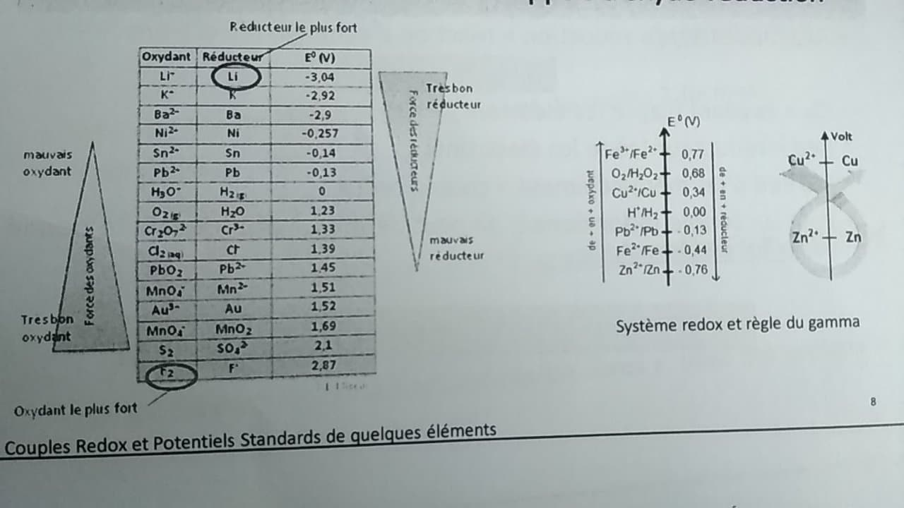
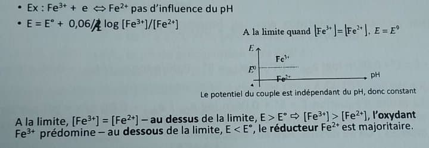

# Géochimie appliquée

## Introduction

Le sol est composé par une succession de couches, appelées horizons (O,A,B,C,R) de compositions et de structures différentes et constituant son profil.

Le sol hydromorphe se rencontrent surtout dans les régions humides. Ils résultent de l'engorgement permanent des horizons profonds les rendant asphyxiques et réducteurs.

L'horizon A supérieur est un horizon mixte organique et minéral.

L'horizon profond est un gley. Cet horizon se caractérise par ses conditions asphyxiques et réductrices où le fer à l'état divalent (ferreux) lui confère une couleur verdâtre.

Dans la zone où la nappe phréatique est en contact avec le sol, on peut observer des zones où le fer, ayant été au contact de l'oxygène, est sous la forme trivalente (ferrique) et de couleur rouille.

Fe2+/ Fe3+ est un couple redox.

La présence des protons va permettre de déterminer un sol acido-basique. 

E et pH vont permettre de faire des diagrammes E=f(pH)

Le diagramme de Pourbaix sert à déterminer la forme d'un élément en fonction du pH et du potentiel du sol.

## Rappels d'oxydo-réduction

Réaction d'oxydo-réduction : réaction d'échange d'électron

**Ox + ne -> Red** avec Ox/Red

Oxydant : capte les électrons

Réducteur : cède des électrons

Fe -> No=0

Fe2+ -> No = II+

Fe3+ -> No = III+

Dans un couple Redox l'oxydant est celui qui a le nombre d'oxydation le plus élevé. Le réducteur est celui qui cède les électron et donc celui qui le nombre d'oxydation le plus bas.

Lorsque l'on a un couple acide-base, on peut établir la force ce ceux - ci en se référant à des grandeurs qui sont les pKa. De même pour un couple redox avec le **potentiel standard**.

Pour un couple redox donné, on peut définir un potentiel E(V) donné par la loi de Nerst

Celle - ci nous donne le potentiel sous la forme :

E = E0 + RT/nF ln aox/ared

E (V); E0 = potentiel standard 

R(8,32 J.mol-1K-1) 

T (K) = température absolue

n = nombre d'électron

F(96 500 C) = constante de Faraday

-> E = E0 + 0,06/n log aox/ared

L'activité d'un composé va dépendre de l'état du composé. L'activité va varier si le composé est en solution (électrolyte) sont activité est égal à la concentration. Si il est en forme gazeuse, son activité est égal à sa pression partielle (pi = ni/nt . Pt = Xi . Pt)

Avec la loi de Nerst, pour le fer, on obtient :

E = E0 Fe+2/Fe+3 + 0,06/1 log [Fe+3]/[Fe+2]

Plus le potentiel standard est élevée en valeur algébrique, plus l'oxydant du couple est fort.

## Influence du pH sur un couple redox.

Les propriétés redox d'un couple redox seront influencées par le pH si et uniquement si la 1/2 équation redox qui caractérise le couple fait intervenir des protons.

Si les protons sont présents dans l'équation, le potentiel sera influencé par le pH.

pH = - log(H+)

On peut donc généraliser à  un couple quelconque : 

Ox + ne +qH+ <-> Red

< AB > = AB est un composé solide

Si ce peut qu'une solution soit sous la forme solide et sous la forme liquide dans ce cas là elle sera donc saturée.

K = [Ag+].[Cl-]/a< AgCl > = [Ag+].[Cl-]

Cela va dépendre de la température et nous permettre de quantifier la solubilité du soluté AgCl.

La concentration d'un solide est de 1.

L'oxydant et / ou le réducteur d'un couple redox peuvent exister sous différentes formes en fonction du pH. En particulier, pour les cations métalliques, on va observer des phénomènes de précipitation. 

Fe +2 <-> < Fe (OH)2 >

Fe +3 <-> < Fe (OH)3 >

Ce seront les mêmes espèces mais sous des formes différentes, du point de vu de l'oxydoréduction ça ne changera pas.

(diapo 15)