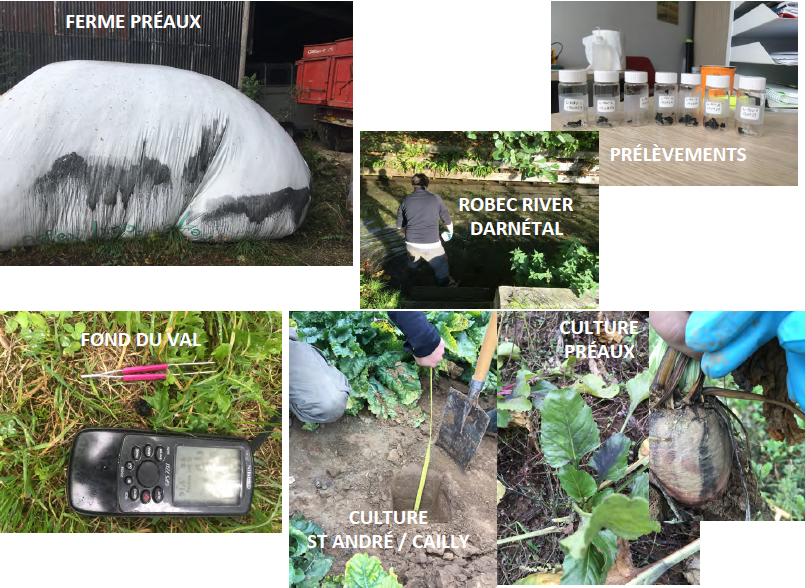
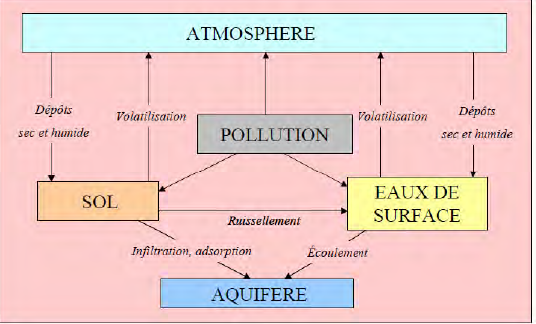
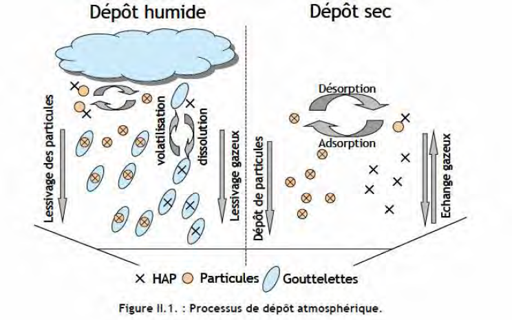
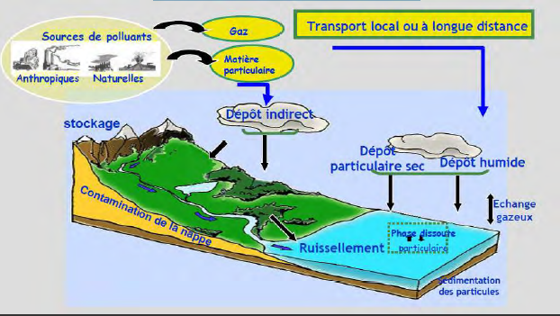

# Géochimie éléments chimiques

## Introduction

Étudier le comportement des éléments chimiques dans l'environnement afin de connaître la qualité des eaux et sert à tracer les éléments depuis une source jusqu'à un réceptacle sédimentaire.

Altération : modifier la composition chimique d'un volume

La composition des eaux varient par les surfaces continentales.

Les argiles a silex sont le produit d'altération de la craie.

La Normandie est la deuxième région la plus pollué de France.

La géochimie a des effets visibles, comme les sculptures. La géochimie conditionne la pédosphère.

Anthropocène : période qui prolonge le quaternaire, l'ère où l'Homme est capable de modifier durablement la Terre de façon chimique

On va utiliser la géochimie dans les zones critiques, les zones les plus touchés par l'Homme.

## Familles chimiques

Valence : la répartition des électrons pour une sous - couche donnée se fait en remplissant d'abord toutes les cases quantiques.

atome métallique : perte d'un électron et acquisition de la structure électronique du gaz rare de la période précédente.

atome non - métallique : tendance à acquérir des électrons pour atteindre la structure du gaz rare de la même période.

L'hydratation va permettre de diviser les éléments en deux parties :

* oxyde métallique -> hydroxyde basique
* oxyde non métallique -> acide

## États de la matière

Les atomes ont des formes en fonction du rapport entre les cations et anions.

Les argiles sont des silicates. Ils se chargent en eau donc les silicates gonflent. Les roches en silicates qui s'altèrent vont produire des argiles. Ils sont en équilibre selon la pression et la température.

* tétraèdres isolés
* tétraèdres en chaînes simples
* tétraèdres en feuillets

La thermodynamique va provoquer l'altération des roches. La vitesse de destruction va varier en fonction des minéraux. Le quartz va se détruire très lentement, c'est le minéral qu'on va retrouver sur les plages.

Deux grands types de minéraux argileux :

* argiles 1:1 -> kaolinite
* argiles 2:1 -> chlorite, smectites, vermiculites, illites

Les argiles sont une famille de minéraux stables dans les conditions de surface. Les métaux vont se fixer sur les argiles. Ils sont capable d'avoir des charges positives et négatives donc absorbent tout. La smectites et vermiculites absorbent l'eau et donc gonflent.

Le volume des particules de ces suspensions varie suivant les types d'argile, les électrolytes présents dans l'eau et leur concentration; cela signifie qu'il existe différentes structures dues aux variations des propriétés de surface.

Van Olphen (1977) distingue quatre cas (figure 1-8) suivant que les particules sont dispersées, agrégées face à face, floculées (les particules étant alors en contact bord/bord ou bord/face), ou défloculées (pas de contact entre les particules).

Formation des argiles :

1. Héritage : roche mère -> argiles
2. Transformations : argiles ou autres silicates -> argiles
3. Néogenèse : réorganisation complète de la structure cristalline

4. Processus diagénétique

Les fonds océaniques sont tapissés d'argiles rouge.

La géochimie est variée car les éléments vont être remplacé par d'autres.

Classification géochimique

Les cations précipitant ont tendance à rester sur place. Les oxyanions solubles sont les atomes qui constituent le vivants, ils sont capables de voyager.

MORB = basalte des dorsales

# Géochimie, processus de surface et altération

Altération chimique : modification chimiques, dissolution des carbonates 

Altération mécanique : érosion par l'eau et transport des matériaux 

Facteurs de l'érosion mécanique :

* fracturation, schistosité, diaclase
* température
* transformation minéralogique
* usure mécanique
* végétation

Les vecteurs de l'érosion mécanique sont le climat mais surtout la disponibilité en mise en solution des ions constitutifs des minéraux des roches.

Les facteurs de l'altération chimique sont l'eau et le carbone. L'eau est le moteur principal de l'altération des roches.

Saprolite : résidu d'une roche altérée

# Un aperçu des contaminants dans l'environnement, transfert des aquifères, indices de la qualité de la ressource en eau

Afin d'avoir tous les mobilités d'un contaminant, il faut prendre des échantillons dans différents milieux.

Les contaminants peuvent rejoindre la nappe phréatique à l'aide :

- érosion 
- stockage dans le sol 
- ruissellement vertical dans le sol
- les rivières 

Pour cela on utilise des témoins sources dans les milieux où ce trouve les contaminants afin de connaître la nature de ceux - ci. On peut cibler les analyses pour cibler les contaminants -> source au puits : origine du matériau.

Les contaminants sont issus d'élements qui ont brûlés comme la dioxine. Ce sont des éléments qui sont issus de la transformation lié à la combustion.

Ici, Lubrizol n'a pas eu assez de chlore pour libérer des dioxines. Cependant, on a des molécules composant les suies : hydrocarbures, aromatiques et polycycliques. -> HAP ainsi que les phytosanitaires et des métaux lourds.

On peut retrouver des contaminants dans différents compartiments :

## Les HAP

### Généralités

Les Hydrocarbures Aromatiques Polycyclique ou HAP sont des composés
organiques neutres, apolaires, constitués d’au moins deux cycles aromatiques
fusionnés par des arrangements linéaires, angulaires ou en coin.

Au sens strict, ils ne contiennent que des atomes de carbone et d’hydrogène.
Néanmoins certains composés aromatiques contenant du soufre, de l’azote
et de l’oxygène leur sont associés.

Le nombre de HAP identifiés à ce jour est de l’ordre de 130.
Parmi ceux-ci, une liste restreinte généralement considérée pour les études
environnementales a été élaborée.
Ce sont les polluants retenus comme prioritaires par l’agence environnementale
américaine (US-EPA).
Elle contient les HAP les plus étudiés et posant des problèmes environnementaux
majeurs du fait de leur toxicité.

Le transport et la répartition dans l’environnement des HAP dépendent notamment de
leurs propriétés physico-chimiques telles que:

-La solubilité dans l’eau
-La pression de vapeur
-La constante de Henry
-Le coefficient de partage octanol-eau
-Le coefficient de partage du carbone organique
-La solubilité dans l’eau

Plus la molécule est lourde, plus elle a du mal à se dégrader. Le benzène étant une molécule légère est déjà dégradé.

Coefficient de partage octanol - eau -> affinité de la molécule avc le support. Les HAP sont hydrophobes et semi-volatiles. Les HAP ont un important potentiel d’adsorption sur les matières organiques particulaires
en suspension dans l’eau et dans l’air, ainsi que sur la matière organique du sol. De plus, ils ont un fort potentiel de bioaccumulation dans les organismes.

### Sources de contaminations

Sources naturelles : 

- feu de forêt
- éruption volcanique 

Sources anthropiques :

- combustion pétrole
- combustion ordure ménagères
- combustion du charbon 
- combustion du carburant des moteurs à essence et diesel

Ils ont trois origines principales :

- pyrolytique :combustion de matériel organique par les industries, transports, incinérateurs, incendies
- pétrogénique :introduction dans l’environnement à partir de produits pétroliers et dérivés
- diagénétique :formation naturelle du pétrole

En confrontant les HAP entre eux, on trouvera les sources.

### Comportement dans l'air 

### Comportement dans les sols

#### Mobilité et transport

Les dépôts atmosphériques ont en grande
partie à l’origine des HAP dans les sols.
Les HAP sont ensuite adsorbés
principalement sur les couches superficielles
du sol riches en matières organiques.
Mais on les retrouve pourtant dans les
couches plus profondes du sol caractéristique
d’un phénomène de lessivage.
Le partage des HAP entre le sol, l’eau du sol
et la matière organique dissoute (MOD) est
crucial pour observer le lessivage.
La MOD peut agir comme un transporteur de
HAP facilitant leur mobilité.

#### Dégradations

Elles sont de type biotique ou abiotique.
La dégradation abiotique regroupe la
volatilisation, l’hydrolyse ou les réactions
photochimiques.
La dégradation biotique est liée à la présence
de micro organismes.

#### Dégradations abiotiques

La volatilisation: phénomène important de
perte des HAP particulièrement ceux de faible
masse. Influencée par l’humidité du sol et son
potentiel redox.

La photodégradation: intervient par une
action directe des rayons UV qui cassent les
molécules. Les HAP sont sensibles à la
lumière entraînant une dégradation
photochimique des composés en produits de
dégradation.

#### Dégradations biotiques

Les microorganismes jouent un rôle
important dans la biodégradation des
polluants organiques dans les écosystèmes
terrestres.
Cette dégradation résulte de voies
métaboliques qui mettent en jeu des
populations microbiennes spécifiques qui
peuvent dégrader:

-Totalement ou
-Partiellement lorsqu ’une autre source de
carbone est disponible pour leur métabolisme

Il existe donc deux types de biodégradation:

-La minéralisation complète des HAP
-La dégradation par co-oxydation ou co métabolisme
ou bio transformation

La structure du sol contrôle à la fois la
distribution des micro organismes, des
matières organiques et xénobiotiques et par
conséquent la biodisponibilité des polluants
dans le sol.
Les propriétés du sol telles que la
concentration en matière organique, son
degré de maturation, la structure ou bien la
taille des particules influencent le taux de
dégradation.

### Comportement dans l'eau 

Les HAP arrivent dans les eaux de surface par les dépôts atmosphériques d’une part et
par le phénomène de ruissellement dû aux eaux de pluie d’autre part.
Une fois dans l’eau, ces contaminants très hydrophobes se fixent aux matières en
suspension en général et à la matière organique dissoute (MOD) particulièrement et
peuvent sédimenter dans le lit des rivières jusqu’à la possible remise en suspension
en cas de crue par exemple.

