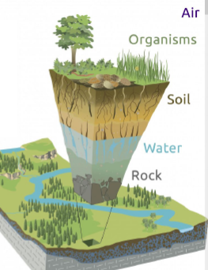
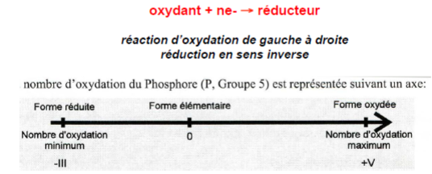
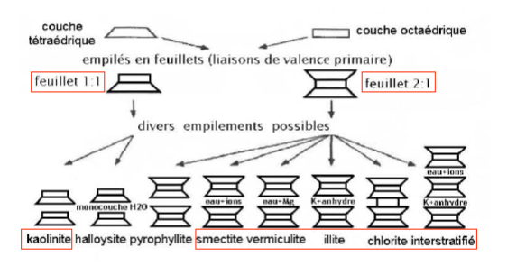
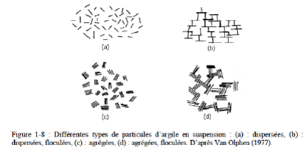
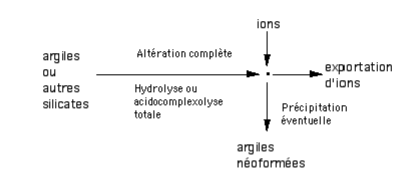
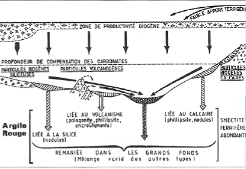
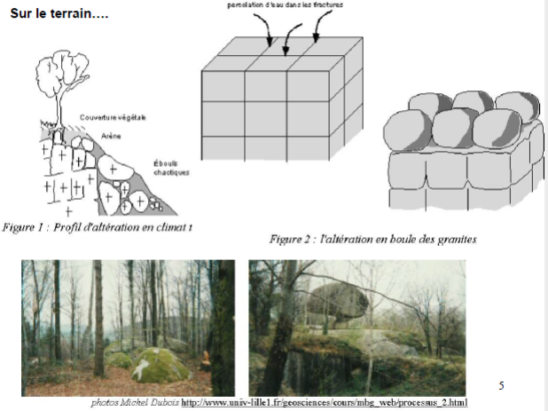
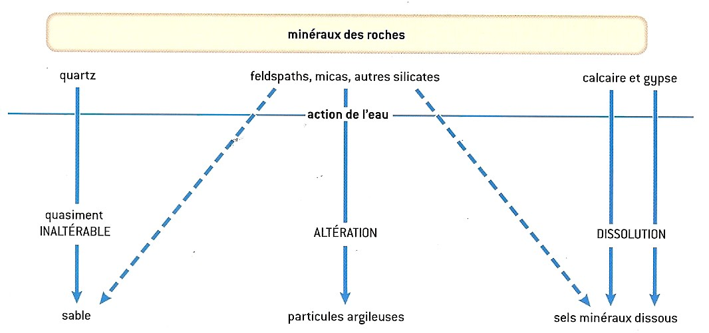

# Géochimie éléments chimiques

## Introduction

Etudier le comportement des éléments chimiques dans l'environnement afin de connaître la qualité des eaux et sert à tracer les éléments depuis une source jusqu'à un réceptacle sédimentaire.

Altération : modifier la composition chimique d'un volume

La composition des eaux varient par les surfaces contientales.

Les argiles a silex sont le produit d'altération de la craie.

La Normandie est la deuxième région la plus pollué de France.

La géochimie a des effets visibles, comme les sculptures. La géochimie conditionne la pédosphère.

Anthropocène : période qui prolonge le quaternaire, l'ère où l'Homme est capable de modifier durablement la Terre de façon chimique

On va utiliser la géochimie dans les zones critiques, les zones les plus touchés par l'Homme.

## Familles chimiques

Valence : la répartition des électrons pour une sous - couche donnée se fait en remplissant d'abord toutes les cases quantiques.

atome metallique : perte d'un électron et acquisition de la structure électronique du gaz rare de la période précédente.

atome non - métallique : tendance à acquérir des électrons pour atteindre la structure du gaz rare de la même période.

L'hydratation va permettre de diviser les éléments en deux parties :

* oxyde métallique -> hydroxyde basique
* oxyde non métallique -> acide

## Etats de la matière

Les atomes ont des formes en fonction du rapport entre les cations et anions.

Les argiles sont des silicates. Ils se chargent en eau donc les silicates gonflent. Les roches en silicates qui s'altèrent vont produire des argiles. Ils sont en équilibre selon la pression et la température.

* tétraèdres isolés
* tétraèdres en chaines simples
* tétraèdres en feuillets

La thermodynamique va provoquer l'altération des roches. La vitesse de destruction va varier en fonction des minéraux. Le quartz va se détruire très lentement, c'est le minéral qu'on va retrouver sur les plages.

Deux grands types de minéraux argileux :

* argiles 1:1 -> kaolinite
* argiles 2:1 -> chlorite, smectite, vermiculites, illites

Les argiles sont une famille de minéraux stables dans les conditions de surface. Les métaux vont se fixer sur les argiles. Ils sont capable d'avoir des charges positives et négatives donc absorbent tout. La smectites et vermiculites absorvent l'eau et donc gonflent.

Le volume des particules de ces suspensions varie suivant les types d'argile, les électrolytes présents dans l'eau et leur concentration; cela signifie qu'il existe différentes structures dues aux varations des propriétés de surface.

Van Olphen (1977) distingue quatre cas (figure 1-8) suivant que les particules sont dispersées, agrégées face à face, floculées (les particules étant alors en contact bord/bord ou bord/face), ou défloculées (pas de contact entre les particules).

Formation des argiles :

1. Héritage : roche mère -> argiles
2. Transformations : argiles ou autres silicates -> argiles
3. Néogenèse : réorganisation complète de la structure cristalline

4. Processus diagénétique

Les fonds océaniques sont tapissés d'argiles rouge.

La géochimie est variée car les éléments vont être remplacé par d'autres.

Classification géochimique

Les cations précipitants ont tendance à rester sur place. Les oxyanions solubles sont les atomes qui constituent le vivants, ils sont capables de voyager.

MORB = basalte des dorsales

# Géochimie, processus de surface et altération

Altération chimique : modification chimiques, dissolution des carbonates 

Altération mécanique : érosion par l'eau et transport des matériaux 

Facteurs de l'érosion mécanique :

* fracturation, schistosité, diaclase
* température
* transformation minéralogique
* usure mécanique
* végétation

Les vecteurs de l'érosion mécanique sont le climat mais surtout la disponibilité en mise en solution des ions constitutifs des minéraux des roches.

Les facteurs de l'altération chimique sont l'eau et le carbone. L'eau est le moteur principal de l'altération des roches.

Saprolite : résidu d'une roche altérée

