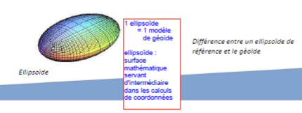

# Système d'information géographique

## Définition d'un SIG 

### Qu'est ce qu'un SIG ?

Système informatique permettant, à partir de diverses sources, de rassembler et d'organiser, de gérer, d'analyser et de combiner, d'élaborer et de présenter des informations localisées géographiquement, contribuant notamment à la gestion de l'espace.

SIG : principe de superposition de  couches d'information

### Utilisation

- hydrologie (gestion des ressources en eau,…)
- biologie (étude de zones protégées,…)
- géologie (prospection minière)
- forêt (gestion de la sylviculture, protection …)
- protection civile (prévention des risques d’inondation)
- planification urbaine (cadastre, réseaux d’assainissement, voirie)
- marketing (étude de clientèle…)
- tourisme ( infrastructures, itinéraires…)
- transports (gestion des réseaux urbains, optimisation…)
- télécoms (couverture de réseau…)

### Exemples de logiciels de SIG 

- ArcGIS 
- QGIS

## Géodésie

Science qui a pour objet l’étude de la forme et la mesure des dimensions de la Terre, notamment dans le but de représenter la surface terrestre.

## Géoïde et Ellipsoïde

La Terre n’est pas une sphère parfaite: géoïde terrestre.
On l’approxime avec des ellipsoïdes 

- les ellipsoïdes locaux sont utilisés à plus petite échelle (Pays), précision plus fine.
- les ellipsoïdes globaux permettent de travailler à l'échelle du globe.

Système géodésique : référentiel appliqué à un ellipsoïde permettant de définir les valeurs des coordonnées des points à la surface de la Terre. 

Coordonnées géographiques

- unités : degrés, minutes, secondes
ou degrés décimaux
- système géodésique (ex: WGS84)
- lecture GPS

Ex : Coordonnées de Rouen en syst. WGS84:
N 49°26’35.6’’
E 1°5’59.90’’

Coordonnées projetées

- unité : souvent en m
- système de projection (ex : Lambert I à IV; Lambert 93)

Ex: Coordonnées de Rouen en Lambert 93 :
X= 562171.12 m ; y=6928747.59 m

## Systèmes de projection

En France, plusieurs projections sont utilisées:

Dans le système géodésique NTF, quatre projections sont utilisées selon la zone à étudier
(Lambert I, Lambert II, Lambert III et Lambert IV). Le Lambert II étendu est la projection associée au centre de la France, étendue à l’ensemble du pays.

Dans le système géodésique RGF 93 (Référentiel Géodésique
Français), c’est la projection Lambert 93 qui est
utilisée.
C’est celle qui est la plus utilisée actuellement, et
recommandée officiellement.

[Logiciel de conversion de données gratuit](http://geodesie.ign.fr/index.php?page=circe)

[Site de conversion utile](http://twcc.free.fr)

### Géoréférencement 

Géoréférencer, c’est affecter une référence spatiale, dans une projection géographique donnée, à une image ou une carte qui n’en a pas.

C’est la première étape à
effectuer lorsqu 'on ajoute des
données dans le logiciel de SIG
(ex : orthophotos, carte
géologique, carte IGN, …). Pour cela, il suffit de choisir au moins trois points dont on connait les coordonnées sur la zone étudiée, et de rentrer leurs coordonnées.

## Structure de données

### Données Raster et données Vecteurs

#### Raster

Un raster est une grille régulière et rectangulaire, organisée en lignes et en colonnes. Chaque maille ou pixel de cette grille a une intensité de gris ou une couleur, avec une valeur associée. Un raster peut être une photo, une image (carte scannée), un Modèle Numérique de Terrain (MNT) , une couche d’information comme la répartition de forêt, ….

#### Vecteurs

Les données vectorielles sont des objets spatiaux qui peuvent être de trois types:

- points
- lignes
- polygones

Ces objets ont à la fois une forme avec ses références spatiales, et des informations
apportées par un tableau appelé table attributaire (données alphanumériques).

Exemples de vecteurs:

- points : localisation de sources, de points de forages, de villes,
d’antennes téléphoniques…
- lignes : réseau hydrographique, réseau routier, ligne de transport,
lignes topographiques….
- polygones : zones naturelles protégées, étendue de forêt…

### Formats des Données

Un "ShapeFile" ou "Fichier de Forme" est le format de stockage des données vectorielles
utilisé par ArcGIS. Il est constitué des fichiers suivants :

* .shp : stocke les entités géographiques. Il s'agit du shapefile proprement-dit.
* .dbf (DataBaseFile) : stocke les données attributaires (consultable sous Excel).
* .shx : stocke les index des enregistrements du fichier ".shp".
* .prj (recommandé) : stocke la projection associée.
*.sbn, *.sbx (facultatifs) : stocke des index n'existant qu'après une requête ou une jointure.
* .xml (facultatif) : stocke les métadonnées relative au shape. A chaque couche il faut avoir son information de positionnement.

Les rasters sont stockés dans un dossier du nom de la couche avec plusieurs fichiers
de format .adf, ainsi qu’un format .aux.

Le projet (ensemble de toutes les couches) est stocké sous le format .mxd. seulement les chemins d’accès et lien.

Les logiciels de SIG permettent une mise en page des informations en cartes légendées.

* échelle
* flèche du Nord
* légende modulable
* titre

## Interpolation spatiale

On passe de données ponctuelles en données continues.

Il existe dex méthodes d'interpolation : 

* approche déterministe : regroupe les méthodes d’interpolation dont la fonction de structure (fonction de
pondération) est déterminée à l’avance.
Elle ne renseigne pas sur la variance d’estimation.
* approche géostatistique : méthode qui décrit l'auto corrélation spatiale des données avec une modélisation spatiale.

