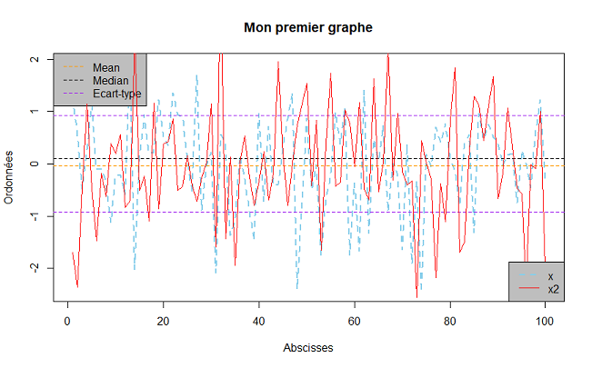
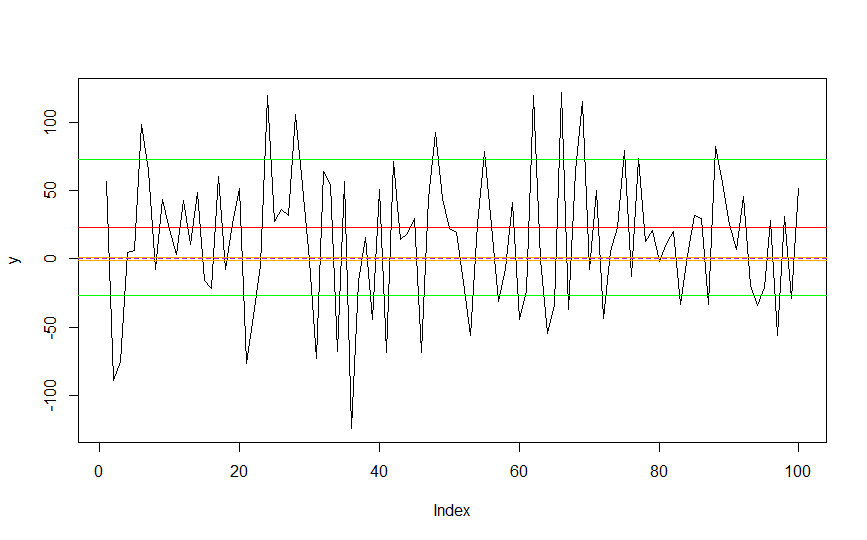
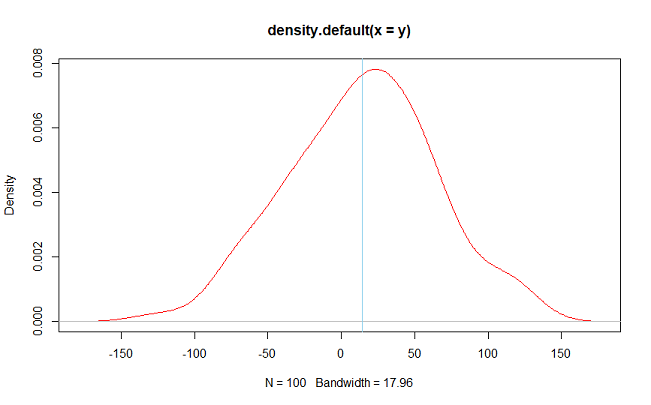

# Introduction à R

Il existe 3 grands types de formations : 

* booléens
* nombre 
* chaîne de caractère

## Nombres


```
5
5*3+1
a <- 5*3+1
```

## Booléens

```
a <- TRUE   
a==2
a<2
a>=16
```
## Chaîne de caractère

```
a <- "R"
```
## Vecteurs
```
a <- c(3,5,3,6,8) 
E <- c(7,9,45,85,14,8:36,a,78)
E[] #extraire les informations d'un vecteur
E[1] #renvoie la première valeur
length(E) #donne la longueur d'un vecteur
ls() #liste les objets en mémoire
rm(a) #supprimer l'objet a
rm(list = ls()) #efface tous les objets en mémoire
```

Exercice : créer un objet x contenant successivement les valeurs
de 1 à 10, puis les valeurs 3, 4 et 5

```
x <- c(1:10,3,4,5)
```

Exercice: extraire de la 2ème à la 6ème valeur de x, puis les 9è,
11è valeurs. Stocker le résultat dans un objet X. Extraire ensuite
seulement la dernière valeur de x (juste en l'affichant, i.e. sans en
faire un objet)

```
X <- x[c(2:6,9,11)]
x[13] ou x[length(x)]
```

# Objets sous R

## Les valeurs arithmétiques

```
xlog <- log(x)
xlog10 <- log(x,base=10)
xlog==xlog10 #vérifier une condition d'égalité
xlog > xlog10
xlog <= xlog10
```

Exercice: faire la somme des valeurs n°4 à 8 de x et de l'avant dernière
valeur de x

```
sum(x[4:8],x[length(x)-1])
sum(x[c(4:8, length(x)-1)])
```

Exercice: multiplier la 2eme valeur de x par la 3eme valeur de y <-
1:4

```
y <- 1:4
x[2]*y[3]
```
Exercice: mettre à 0 à toutes les valeurs de x inférieures ou égales à
5

```
toto <- x[x>=5] #on extrait les valeurs de x >=5
x[x<=5] <- 0
```
## La fonction which()

La fonction which() donne les indices (les positions dans l'objet) des
valeurs vérifiant le critère qu'on spécifie dans la fonction

```
which(x!=0) #position des objets différents de 0
```
## La fonction seq() 

```
seq(1,10,by=2)  
seq(1,10,length.out = 5) # on veut 5 éléments entre le 5 et le 10
diff(seq(1,10,length.out = 5))
```
Exercice: pour une valeur sur 5 de l'objet x, ajouter 0.5 et prendre le
log10 de la valeur obtenue x+0.5 (les valeurs de x seront modifiées)

```
log10(x[seq(1,length(x),by=5)]+0.5)
```
Exercice: créer un objet X ne contenant qu'une valeur sur 2 de x

```
X <- x[seq(1,length(x),by = 2)]
```
## Générer des valeurs aléatoires

```
y <- rnorm(10) # génère 10 valeur aléatoire dans un loi centré réduite tourne autour de 0
mean(y)
sd(y)
```
Exercice: où sont les valeurs négatives de y ?

```
which(y<0)
```
## Matrices

```
A0 <- matrix(data = rnorm(25),nrow=5,ncol=5) # matrice de 5 lignes par 5 colonnes
dim(A0)
A0[1,1] # élément de la première ligne de la première colonne
A <- matrix(data = NA,nrow=4,ncol=4)
```
Exercice: dans la matrice A, extraire 1 valeur sur 2 de la colonne 3, la
3eme valeur de la colonne 2, toute la colonne 1,les 1ere et 3e valeurs
de la colonne 4.

```
A[1,] <- 0
A[2,] <- rnorm(4)
A[3,] <- seq(4,56, length.out = 4)
A[4,c(1,4)] <- 0
A[4,c(2,3)] <- c(4,5)
```
Ranger toutes ces valeurs dans un objet a de type
vecteur les unes à la suite des autres (dans l'ordre énoncé
précédemment).

```
a <- c(A[seq(from=1, to =4, by =2),3], #extraire 1 valeur sur 2 de la colonne 3,
A[3,2], #la 3eme valeur de la colonne 2, 
A[,1], #toute la colonne 1,
A[c(1,3),4]) #les 1ere et 3e valeurs de la colonne 4.
``` 

Modifier  la matrice  A  en  triant  dans  l'ordre  décroissant  les  valeurs  de  la  3e colonne de A 

```
A[,3] <- sort(A[,3], decreasing = TRUE)
```

Les fonctions rbind() et cbind() permettent  de  créer  des  matrices. Créer  une  matrice  B  de  valeurs aléatoires  à  l'aide  de  la  fonction  cbind(),  puis  une  matrice  C  de valeurs aléatoires avec rbind(). 
```
B <- cbind(rnorm(4),rnorm(4), rnorm(4),rnorm(4)) # 4 colonnes et 4 lignes
C <- rbind(rnorm(5),rnorm(5),rnorm(5)) # 3 colonnes et 5 lignes
```

is.matrix afin de savoir si l'objet et une matrice

## Data frames

Les data frames sont des matrices où ont peut stocker plusieurs types d'arguments.

```
A <- c(21,20,23,19,21,26) 
B <- c("h","f","f","f","h","h") 
Dn <- data.frame(Age=A,Genre=B) 
``` 

class() va permettre de donner le type de structure
```
row.names(Dn) <- c("Jean","Marie","Valérie","Chloé","Paul","Pierre")
```
Exercice : Afficher l'âge de Chloé
```
Dn["Chloé","Age"]
```

Exercice:  afficher dans  Dn,  les  valeurs  de  la  colonne  1  pour lesquelles la colonne nommée "Sexe" correspond à "h

```
Dn[Dn$Genre == "h", "Age"]
```

Exercice: Afficher le sexe des  personnes dont  l'âge est strictement inférieur à 23 ans
```
Dn$Genre[Dn$Age <23] 
```

### Statistiques élémentaires sur une data frame 

mean(Dn$Age) 
min(Dn$Age) 
max(Dn$Age) 
median(Dn$Age) 
sd(Dn$Age)

# Représentations graphiques simples
```
x <-rnorm(100)
x2 <-rnorm(100)
plot(rnorm(100))

plot(x,type="l",xlab="Abscisses",ylab="Ordonnées", main="Mon premier graphe", lwd=2, lty=2, col="skyblue")  
abline(h=median(x),lty=2,col="black")
abline(h=mean(x),lty=2,col=rainbow(10)[2])
abline(h=c(-sd(x),sd(x)), lty =2, col="purple")
legend("topleft",c("Mean","Median","Ecart-type"),col=c(rainbow(10)[2],"black","purple"), lty=2, bg="grey")
lines(x2, col="red")
legend("bottomright", c("x","x2"), col=c("skyblue", "red"), lwd = c(2,1), lty=c(2,1), bg="grey")

lwd= #épaisseur du trait
lty= #continuité de la courbe
grid()# ajouter une grille sur le graphique  
```


La figure s'enregistre dans le répertoire de travail courant. Pour le  connaître, on utilise la commande getwd() et pour changer de répertoire de travail: setwd()

# Fonctions et structures de contrôle dans R

## Fonctions
```
aire <- function(longueur,largeur) {
  result <- longueur * largeur
  return(result)
}
A <- aire(3,2)

vol <- function(hauteur, longueur, largeur) {
  result <- hauteur*aire(longueur, largeur)
  return(result)
}
V <- vol(6,3,2)
```
Exercice: créer une fonction surfcy qui calcule la surface et le volume d'un cylindre pour des dimensions données du cylindre

```
surfcy <- function(hauteur, rayon) {
  result <- (2*pi*rayon)*(rayon+hauteur)
  return(result)
}
```

Exercice: créer une fonction surfcy qui calcule la surface et le  volume d'un cylindre pour des dimensions données du cylindre

```
surfcyvolume <- function(rayon,hauteur) { 
  S <- 2*pi*rayon*(rayon+hauteur) #calcul de la surface
  V <- pi*rayon^2*hauteur #calcul du volume 
  return(c(S,V)) 
} 
```

Exercice : générer  une  série  de  100  valeurs  aléatoires  de moyenne 23 et d'écart-type 50, puis créer une fonction centred() pour standardiser la série (i.e. pour ramener la moyenne à 0 et l'écart-type à 
1)
```
y <- rnorm(100, mean=23,sd=50)
plot(y,type="l")
abline(h=23,col="red")
abline(h=c(-50+23,50+23),col="green")

abline(h=0,col="purple",lty=2)
abline(h=c(-1,1),col="orange")
```


Centrer et réduire
```
centragereduction <-function(y) {
  toto <- (y-mean(y))/sd(y)
  par(mfrow=c(1,2))
  hist(y, freq = FALSE)
  lines(density(y), type="l",col="red")
  hist(toto, freq=FALSE)
  lines(density(toto),type="l", col="green")
  return(toto)
}

cr <- centragereduction(y)
lines(cr,col="blue")

par(mar)# choisir les marges pour l'affiche des graphiques
```


Completer la fonction de manière à ouvrir une fenêtre graphique contenant l'histogramme et la densité de probabilité de y
```
hist(y, freq=FALSE) # Fréquence devient densité de probabilité
lines(density(y),type="l", col="red")

plot(density(y),type="l",col="red")
abline(v=mean(y),col="skyblue")
```


### Boucles avec if 

Afficher à l'aide de if/else, soit
- print ("Le nombre est positif") si le nombre est positif
- print ("Le nombre est négatif") si le nombre est négatif  

```
x <- 0

if (x>0) 
{
  print("Le nombre est positif")
} else {
  if (x<0) 
  {
    print("Le nombre est négatif")  
  } else 
  {
    print("Le nombre est égal à 0")
  }
}
```
### Calcul des aires et volumes

Aire d'un rectangle avec test sur la valeur des arguments :afficher un message d'erreur avec print ("Entrer une dimension négative n'a aucun sens, recommencez!")

```
aire <- function(longueur,largeur) {
  if(longueur<=0 | largeur <=0){
    stop("Entrer une dimension négative n'a aucun sens, recommencez!")  
  } else {
  result <- longueur * largeur
  print(paste("Surface =",result,"m2",sep=" "))
  return(result)
  }
}
```

Choix du calcul de la surface ou du volume d'un cylindre

```
surfcyvolume <- function(rayon,hauteur, choix) { 
  if(choix =="S"){
  S <- 2*pi*rayon*(rayon+hauteur) #calcul de la surface
  return(S)
  } 
  if(choix=="V") 
  {
  V <- pi*rayon^2*hauteur #calcul du volume 
  }
    return(V) 
  
  if(choix != "S"& choix != "V") 
  {
    stop("Vous devez entrer S ou V !")
  }
} 

surfcyvolume(3,8,choix = "V")
surfcyvolume(3,8,choix = "S")
surfcyvolume(3,8,choix = "A")
```
Même chose en utilisant else if()

```
cyl <- function(r,h,choix)
{
  if(choix =="S")
  {
    s<- 2*pi*r*(r+h)
    return(s)
  } else if (choix == "V") {
    v<- pi*r^2*h
    return(v)
  } else {
    stop("vous devez entrer S ou V")
  }
}
```

Choix du calcul de la surface ou du volume d'un cylindre sans l'utilisation de l'argument choix

On va utiliser la fonction readline()

Exemple

```
fun <- function() {
  ANSWER <- readline("Are you a satisfied R user? ") #lecture d'une chaîne de caractère écrite dans le terminal
  if (substr(ANSWER, 1, 1) == "n") #elle extrait la première lettre de l'objet ANSWER
    cat("This is impossible.  YOU LIED!\n") #si la première lettre est n
  else
    cat("I knew it.\n") #si la première est différent de n
}
```

Avec l'objet cyl :

```
cyl <- function(r,h) {
  choix <- readline("Voulez vous calculer la surface (s) ou le volume (v)?")
    if(substr(choix,1,1)=="s")
  {
    s<- 2*pi*r*(r+h)
    return(s)
  }
  if (substr(choix,1,1)== "v")
  {
    v<- pi*r^2*h
    return(v)
  } else {
    stop("Vous devez entrer s ou v !!!")
  }
}
cyl(3,8)
```  

Modifier la fonction cyl de manière à ce qu'elle relance automatiquement si une autre valeur que "s" ou "v" est entrée

```
cyl <- function(r,h) {
  choix <- readline("Voulez vous calculer la surface (s) ou le volume (v)?")
  while(choix !="s"& choix !="v") choix <- readline("Voulez vous calculer la surface (s) ou le volume (v)?")
  
  if(substr(choix,1,1)=="s")
  {
    s<- 2*pi*r*(r+h)
    return(s)
  }
  if (substr(choix,1,1)== "v")
  {
    v<- pi*r^2*h
    return(v)
  } else {
    stop("Vous devez entrer s ou v !!!")
  }
}
cyl(3,8)
```

Exercice : créer une fonction pour générer et tracer une somme cumulative d'une série de valeurs

```
data <- rnorm(100)
plot(cumsum(data),type="l",col="skyblue",lwd=2)

fonctioncumsum <- function(donnees)
{
  donneescomsum <- c() #création du vecteur
  donneescomsum[1] <- donnees[1] #initialisation du vecteur
  
  for(i in 1:length(donnees))
  {
   donneescumsum[i] <- donneescomsum[i]+x[i+1] 
  }
  return(donnéescumsum)
}

fonctioncumsum(x)
```