# Introduction à la dynamique côtière

## Zones côtières

La zone côtière marine et son littoral sont de natures très variées (lagons,
baies, embouchures de rivières, falaises, plages, mangroves…etc…).
C’est le lieu où s’exacerbent les pressions anthropiques et climatiques.

L’hydrodynamique côtière est responsable de :

* le transport de polluants (pétrole, ..), des mouvements sédimentaires (érosion, sédimentation, ..) ayant des conséquences importantes, comme le recul du trait de côte ou la formation de bancs de sable,
* fort impact sur les paysages et les habitats marins: fonctionnement des écosystèmes marins

Échelles Différentes : court-terme au long-terme

L’objet de l’hydrodynamique qui fait partie d’une façon générale de l’étude
des fluides en mouvement ou encore Mécanique des Fluides : ce domaine
s’attache à étudier la façon dont les forces génèrent les mouvements de l’eau : mesurer un ou plusieurs paramètres de ce mouvement: courant en surface, au fond.

Mesure discrète et représentative en un point donné ou une zone très
particulière et pour une période temporelle correspondant à celle de la mise
en oeuvre du matériel de mesure.

Description du champ complet de ce mouvement -> faire appel à des résolutions numériques du problème mathématique continus -> modélisation

Dynamique des masses d'eau -> équation physiques complexes -> conservation du mouvement et de l'énergie

Ces équations ont été établies progressivement mais le formalisme actuellement utilisé doit beaucoup aux physiciens français Henry Navier et anglais Georges Stokes qui leur ont donné leurs noms.

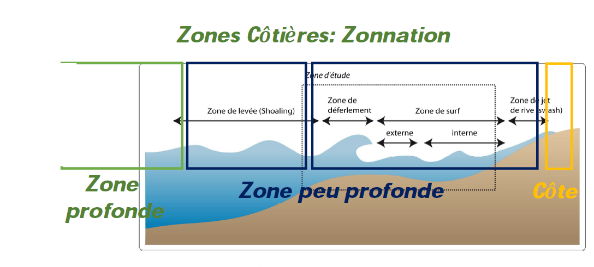

## Pression atmosphérique

La pression atmosphérique est donc le poids exercé par une colonne d’air
partant du sol et s’étirant jusqu’à l’atmosphère.

La pression se mesure à l'aide d'un baromètre et s'exprime en hectopascal
(hPa). 1 hectopascal équivaut à 100 Pascals (Pa) ou encore à 1 millibar.
Au niveau de la mer, la pression moyenne est de 1013.25 hPa.
En météorologie , dès lors que la pression descend en dessous de 1010 hPa, il s'agit de basses pressions (dit aussi : « conditions dépressionnaires »).
(Le vent est plutôt fort avec un ciel souvent fort encombré et des précipitations fréquentes.) Au contraire, lorsque la pression dépasse 1015 hPa, on parle alors de hautes pressions (dit aussi : « conditions anticycloniques »). (Le vent est faible avec un ciel souvent bien dégagé)

Pour analyser une situation météorologique, le champ de pression est un
élément fondamental. Chaque observation de pression à l’échelle du globe est ramenée au niveau de la mer, de façon à ce que les mesures soient comparables entre elles.

Un tracé de lignes isobares est ensuite réalisé, reliant les points d’égale
pression, effectués généralement de 5 hPa en 5 hPa. Ainsi, on obtient une carte isobarique permettant de délimiter les zones dépressionnaires et les zones anticycloniques.

La pression peut également être représentée sous une autre forme : « les
géopotentiels ». Il est d’ailleurs plus pratique de reporter les altitudes où se situent les mêmes pressions de manière à cartographier le champ de pression à différentes altitudes.

Les lignes d’égale altitude sont appelés des isohypses. Les formes dessinées par les isobares nous permettent de reconnaître la nature des perturbations atmosphériques comme les dépressions, les anticyclones.

Elle varie aussi en rapport avec la température de l’air parce que l’air chaud a une moins grande densité que l’air froid ; une couche d’air chaud de même taille qu'une autre couche d’air froid aura une moins grande pression.

## Vent

Le vent représente la vitesse à laquelle une particule d’air présentée dans
l'atmosphère est soumise. Il prend naissance sous l'effet des différences de
températures et de pression.

Plus la différence de pression entre deux masses d'air est importante et plus le vent sera important. Au contraire si la pression reste constante, les vents demeureront faibles. Les courants d'air horizontaux sont en moyenne beaucoup plus importants que les verticaux.

La vitesse verticale moyenne des vents ne dépasse pas quelques dizaines de
centimètres par seconde, contre 10 m/s pour la vitesse horizontale ; toutefois, à l'échelle locale, en présence de reliefs importants et à l'intérieur des systèmes convectifs, elle peut atteindre des valeurs extrêmes, jusqu'à 40 m/s (dans des super cellules).

Les données de vent sont classifiées selon deux informations : la vitesse et la direction selon le plan horizontal. En général l’unité du système international pour la vitesse est le mètre par seconde (m/s), or en ce qui concerne la vitesse du vent en météorologie, on utilise le plus souvent les kilomètres par heure (km/h) et les noeuds pour la météorologie maritime.

1 m/s = 3.6 km/h, 1 km/h = 0.5 noeuds

Concernant la direction du vent, on indique d’où vient le vent. Pour cela on
utilise le plus souvent une rose des vents où est indiqué les 4 points cardinaux.

Les mesures de vent sont recueillies par les stations météorologiques avec des appareils adaptés comme l'anémomètre (équipé d'une girouette).
Cet instrument possède une partie mobile qui entre en mouvement autour d’un
axe sous l’effet d’un flux d’air. La girouette indique la direction d’où vient le vent alors que l’anémomètre est quant à lui constitué de trois coupelles qui tournent plus ou moins vite selon la pression exercée par l’air.

Les données de vent sont recueillies par l'anémomètre de trois manières :

* le vent instantané ; qui correspond à la vitesse de déplacement du vent à un instant précis qui permet d’enregistrer les rafales de vent.

* le vent moyen ; calculé dans un intervalle de temps plus ou moins précis en fonction de son utilisation qui correspond à la moyenne de la vitesse instantanée du vent.

* la vitesse maximale est la vitesse instantanée la plus forte enregistrée lors des rafales de vent les plus puissantes.

### Origine du vent

#### Les gradients de pression

Il existe de fortes variations de température entre les zones équatoriales et les régions polaires qui engendrent des gradients de densité de l'air (car une masse d'air froid est plus dense qu'une masse d'air chaud) et donc des gradients de pression atmosphérique. Il en découle des mouvements de l'air présents à l'échelle planétaire.

Les vents ainsi générés ont un rôle principal : celui de transporter de la chaleur depuis les régions équatoriales vers les zones polaires pour compenser le déséquilibre thermique. Seulement, l'équilibre thermique n'est jamais atteint, car le rayonnement solaire l'en empêche ;aucun équilibre ne peut donc être atteint de façon durable.

#### Rotation de la Terre

La rotation de la Terre intervient dans la déviation, à l'échelle planétaire, des courants aériens : vers la gauche dans l'hémisphère sud et vers la droite dans l'hémisphère nord. La force responsable de cette déviation est la force de Coriolis qui dépend à la fois de la vitesse de la masse d'air et de la latitude concernée.

Dans les régions équatoriales la force de Coriolis est faible, les vents soufflent donc des hautes vers les basses pressions sans être déviés. Aux latitudes tempérées et près des pôles, les vents ont tendance à suivre les lignes isobares en tournant dans le sens des aiguilles d'une montre autour des anticyclones dans l'hémisphère nord et dans le sens anti-horaire autour des dépressions.

Près du sol, les forces de frottement sont plus importantes ; ainsi la vitesse du vent décroît suivant la verticale pour atteindre une valeur quasi nulle à la surface.

Les régions polaires et tempérées sont exposées à une décroissance des vents qui se traduit par une réduction de la force de Coriolis ; le vent est alors dévié vers les basses pressions.

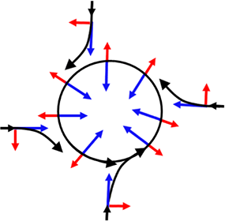

Schéma montrant comment les vents sont déviés pour donner une circulation antihoraire dans l’hémisphère nord autour d’une dépression. (La force de gradient de pression est en bleu, celle de Coriolis en rouge et le déplacement en noir).

### Écoulement du vent

Le vent s'écoule de façon plus ou moins régulière et peut-être caractérisé par différents régimes. Nous parlerons d’écoulement laminaire lorsque l'air est peu agité, les lignes de courant disposées en couches parallèles; donc le vent est régulier.

Dans le cas de l'écoulement turbulent, l'air est agité de façon désordonnée, le vent est alors très irrégulier en direction et en vitesse (les fluctuations peuvent atteindre des valeurs importantes sur des temps relativement brefs).

Pour finir, l'écoulement est anarchique lorsque les vents se déplacent dans tous les sens à cause de la turbulence due aux frottements contre les massifs montagneux par exemple, et aux perturbations associées à la présence de barrières orographiques ou de mouvements convectifs.

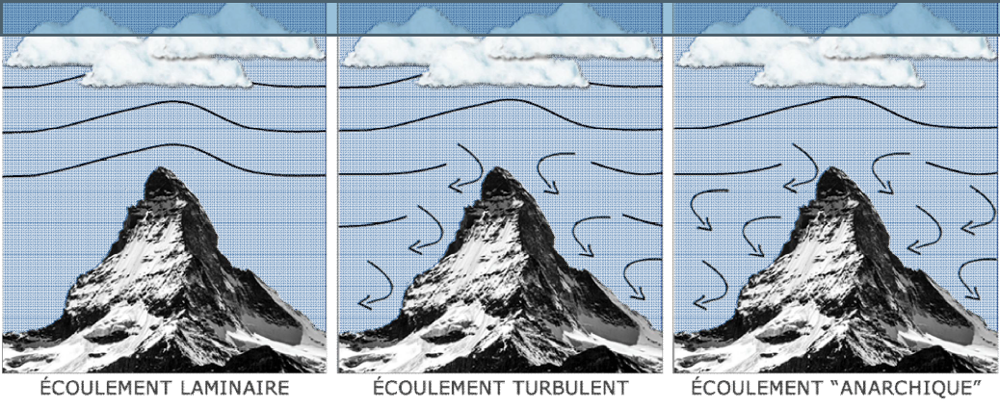

### Courants de jet

Un tube de vent très fort s’observe dans les moyennes latitudes : le courant-jet ou jet stream. Il existe différents courants-jets.

Situé à des altitudes évoluant entre 6 et 15 km, le courant-jet ondule autour de la planète en ayant des phases d’accélération ou de décélération. Ces différentes phases rythment le temps de chaque parcelle de notre planète.

Dans les zones les plus actives du courant-jet, les vents peuvent y atteindre plus de 500 km/h comme lors de la tempête du 27 décembre 1999 où à la verticale de Brest, une rafale de 529,2 km/h a été mesurée par radiosondage à 8 138 m du sol !

Cette tempête illustre bien les dangers causés par le vent ; celui-ci peut parfois atteindre des valeurs remarquables, comme par exemple lors des cyclones les plus actifs.

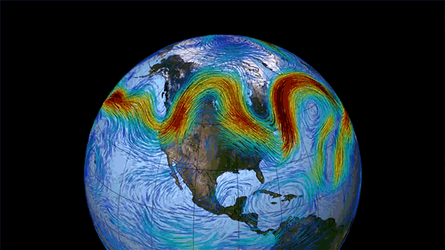

### Échelle de Beaufort

Vent -> état de mer : houle

En 1805, Francis Beaufort a imaginé une échelle capable de décrire assez
précisément les effets du vent sur la mer. Il en est ressorti une échelle de
mesure empirique comportant 13 niveaux (de 0 à 12) auxquels on associe une
vitesse moyenne de vent et une description de l’état de la mer. Par la suite, des critères liés aux conditions sur terre furent ajoutés pour étendre son utilisation.

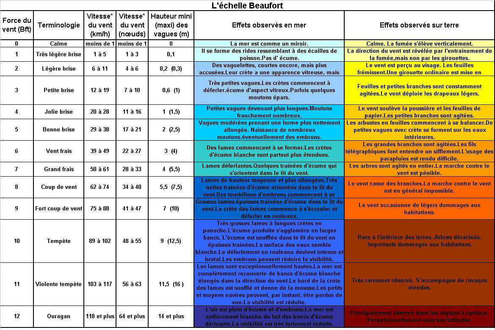

## Patrons isobares : cyclones - dépression

### Formation d'un anticyclone

Au cours de ce déplacement l’air, le parcours de l’anticyclone est modifié par une force nommée la force de Coriolis. L’anticyclone se met alors à
effectuer des tourbillons, de façon horaire dans l’hémisphère Nord et antihoraire dans l’hémisphère Sud.

Un ciel dégagé et de l’air sec sont donc les résultats du passage d'un anticyclone. Alors, si un anticyclone reste dans une région plusieurs jours
des périodes de sécheresse et de froid intense peuvent s’en suivre.

### Formation d'un cyclone

Quand l’air circule par-dessus un océan quelconque ou d’un sol à température assez élevée, il finit par se réchauffer. Ce réchauffement entraîne une diminution de la masse volumique de l’air en question. Répondant aux courants de convection, l’air chaud monte et forme une zone de basse pression en raison de sa faible densité. Cette zone est appelée «cyclone » ou même « dépression ».

La formation de cyclone est souvent causée par la rencontre de deux masses d’air, mais celles-ci sont généralement beaucoup plus petites que les anticyclones. Les cyclones apportent avec eux des précipitations et des vents parfois violents.

Il existe cinq facteurs précurseurs de la formation d’un cyclone :

* la température de la mer doit dépasser 26,5°C jusqu’à une profondeur d’au au moins 60 mètres, et la température de la surface doit dépasser 28/29°C. En effet, si l’ouragan se déplace vers une source plus froide, il perd rapidement en intensité

* les conditions atmosphériques doivent être favorables à la formation d’orages : cumulonimbus, instabilité de l’air, humidité…

* une perturbation atmosphérique préalable. Il est possible de le voir dans le tableau un peu plus haut, il est toujours question de dépression ou de
 perturbation tropicale avant l’évolution en cyclone. Le point de départ de tout ceci est appelé l’onde tropicale

* une distance de plus de 10° de l’équateur. C’est la force de Coriolis qui crée la rotation du cyclone. Or, autour de l’équateur, cette force est quasiment inexistante, empêchant la création de gros ouragans.

* une absence de « cisaillement vertical du vent », qui nuirait fortement à la structure déjà instable du cyclone.

### Cyclone, ouragan, typhon, tornade

L’échelle de Beaufort mesure la vitesse moyenne du vent sur une durée de 10
minutes. Selon la zone géographique, la limite nécessaire pour qu’une tempête devienne un cyclone n’est pas la même (niveau 7, 10…). C’est également cette zone qui définit le nom du phénomène :

L’**ouragan** : un ouragan s’appelle ainsi lorsque il se situe dans la partie nord de l’océan Atlantique, ou bien dans la région nord-est du Pacifique

Le **cyclone** : un cyclone s’appelle ainsi lorsque il se situe dans l’océan Indien, autour de l’Australie et dans le sud du Pacifique

Le **typhon** : un typhon s’appelle ainsi lorsque il se situe dans le nord-ouest du Pacifique.

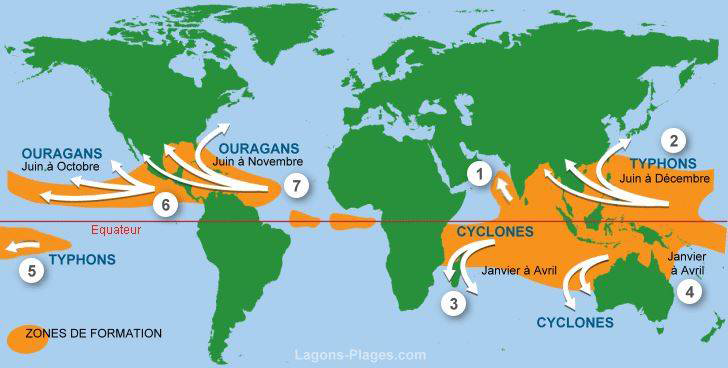

# Processus physique au large

## Caractéristiques

Déformation périodique d'un interface. En océanographie, les ondes se matérialisent par un déformation de la surface de la mer (l'interface entre l'atmosphère et l'océan).

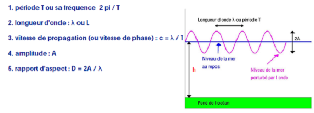

H = 2A
h = profondeur
L ou delta = longueur d'onde
T = période
g = 9.81

Les ondes sont classifiées en fonction du rapport entre la longueur d'onde et la profondeur à laquelle elle se propage

* ondes courtes
* onde longues

### Types

En eau profonde, c'est-à-dire lorsque la longueur d'onde de l'onde est faible par rapport à la profondeur de l'océan (au moins 2 fois plus faible), les particules d'eau se déplacent sur un cercle.

La houle est produite au large (profondeur supérieure à 4000m) La houle est une onde de longueur d'une centaine de mètres, elle est largement inférieur à la moitié de la profondeur, donc est considérée comme une onde courte.

C = célérité = L/T = (g.h) 1/2

Les vagues ayant la longueur d'onde la plus grande se propagent le plus vite (pour T=cte)

La vitesse de propagation des ondes courtes en eau profonde est donnée par l'expression :

λ << h/2

C = célérité = L/T = (g.h)1/2

En eau profonde, c'est à dire lorsque la longue d'onde est très grande par rapport à la profondeur d'eau (au moins 20 fois plus grande). Les particules d'eau déplacent en ellipse.

Les ondes longues sont localisées près des côtes, en eau peu profonde. Les particules d'eau se déplacent en suivant la forme d'une ellipse, contraint par la faible profondeur. Dans ce cas, l'onde est appelée onde longue.

La vitesse de propagation des ondes en eau peu profonde est donnée par l'expression:

λ >> h/20

#### Tsunami

Lors de la formation d'un tsunami au large, la profondeur de l'eau est de l'ordre de 4000 m. La longueur d'onde d'un tsunami est en général supérieur à 100 Km.

C'est pourquoi, un tsunami au large peut passer sous les bateaux sans être ressenti car la
distance séparant deux crêtes successives étant de l'ordre de 100 km et la hauteur des vagues étant de l'ordre de quelques centimètres.

De plus, la longueur d'onde d'un tsunami est bien au moins vingt fois supérieure à la profondeur de l'océan.

Nous pouvons donc dire que les tsunamis sont des ondes longues.

Au large, les tsunamis se propagent très rapidement. En effet, ceux sont des ondes longues et leur vitesse est proportionnelle à la profondeur de l'océan.

Au large, la profondeur de l'océan est 4000 m et les tsunamis se propagent avec un vitesse bien déterminé (50-900 Km/h)

A l'arrivée près des côtes, un tsunami devient dangereux : la hauteur des vagues augmente de façon considérable. En se rapprochant des côtes, la longueur d'onde diminue car la profondeur diminue.

De plus, g a toujours la même valeur donc la vitesse de propagation du tsunami dépend de la profondeur.

A l'approche des côtes, la profondeur h diminue et par conséquent la vitesse de propagation c du
tsunami diminue également.

La quantité globale d'énergie dépend de la vitesse du tsunami et de l'amplitude A des vagues. Or nous
savons que la vitesse c diminue, pour conserver l'énergie globale, l'amplitude des vagues doit
augmenter : c'est la proportionnalité inverse.

Quand le tsunami arrive près des côtes où la profondeur peut être de 10 m, la vitesse de propagation
diminue fortement elle est alors de l'ordre de 40 km/h.

Ce fort ralentissement conduit à une augmentation de la hauteur des vagues, accroissement qui peut
atteindre plusieurs mètres

En eau profonde, un tsunami atteint généralement quelques dizaine de centimètre de hauteur en surface, mais la hauteur de ces vagues augmentent rapidement en eau peu profonde. L'énergie de la vague va de la surface au fond de la mer, même dans les eaux les plus profondes.

Quand le tsunami attaque le bord de mer, l'énergie de la vague est comprimée sur une distance beaucoup plus courte et sur une profondeur beaucoup plus faible, ce qui engendre des vagues meurtrières et destructives. Ce sont donc les configurations de la côte et du littoral qui déterminent la hauteur et l'impact du tsunami. Les
récifs, les baies, les embouchures de rivières, les reliefs sous-marins et les pentes de la plage
sont autant de paramètres qui modifient le tsunami à l'approche de la côte. La direction de
provenance du tsunami a également une influence.

Lorsque le tsunami atteint la côte et pénètre dans les terres, le niveau de l'eau peut dépasser plusieurs mètres. Dans les cas extrêmes, le niveau de l'eau a atteint plus de 15 mètres pour des tsunamis en champ lointain et plus de 30 mètres pour des tsunamis générés en champ proche, près de l'épicentre du séisme. La première vague n'est pas toujours la plus élevée. Les zones inondées peuvent s'étendre jusqu'à 300 mètres à l'intérieur des terres, recouvrant de vastes terrains d'eau et de débris.

#### Marées

La marée est le mouvement périodique de montée et descente du niveau de la mer. Arrivée en estuaire il y a une déformation des ondes de marées.

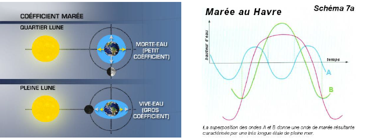

courant de flot : courant de l'océan vers les côtes

courant de jusant : courant des côtes vers l'océan

#### Houle

La longueur d'onde de la houle est de l'ordre d'une centaine de mètre. Au large, la profondeur de l'océan est supérieur à 4000 m.

une onde mécanique qui se propage à l’interface entre la surface de l’eau et l’air. Le vent est le facteur principal de l’apparition des vagues.

Un écoulement de type turbulent se forme dans les très basses couches atmosphériques.
Ceci provoque LOCALEMENT des frottements et des ondulations au niveau de la surface des
océans qui sont d’autant plus importantes que le vent est fort.

ondulation -> vague -> houle

La houle peut être observée en absence de vent car la houle vient du large et correspond en
quelque sorte à une "vague fossile" formée il y a plusieurs jours.

L'énergie houlomotrice (l’énergie de la houle) est une source d'énergie d'origine
cinétique et potentielle, liée au déplacement de la surface de la mer sous l'action
de la houle. Le principal facteur est le vent.

Créé en se déplaçant d'un anticyclone (zone de haute pression atmosphérique) vers une dépression, il
s'écoule de façon turbulente à la surface des océans et induit l'apparition d'ondulations plus ou moins
fortes en fonction de sa force

Le "fetch" est un plan d'eau sur lequel souffle le vent sans rencontrer d'obstacle.

Du fait du sens dominant du vent, son action sur le fetch va ordonner l’ondulation. Un train
de houle va grossir plus que les autres, puisque le vent pousse sur l'arrière des vagues. La
houle ainsi formée va croître jusqu’à ce que la vitesse des vagues soit égale à la vitesse du
vent.

Le clapot correspond à l'état de la mer caractérisé par de toutes petites vagues dont l'onde
a une période comprise entre 1 à 4 secondes.
La "mer de vent" désigne l'ensemble des vagues générées par un vent local. Les vagues ont
une plus grande longueur d'onde que le clapot : période supérieure à 5 secondes.

L'effet du vent sur l'état de la mer dépend :

1. de la distance sur laquelle le vent souffle sans rencontrer d'obstacles (île par exemple). Cette distance est appelée le fetch. Au large, le fetch est généralement déterminé par la taille de la "dépression" qui produit le vent
2. du temps pendant lequel le vent souffle de façon continue à une force donnée. Ainsi, pour une vitesse de vent donnée, il faudra un certain temps pour que les ondes créées atteignent un état d'équilibre. Ensuite, même si le vent continue à souffler, la houle ne grossiront plus

La hauteur d'une vague dépend donc de la durée d'exposition au vent et de sa zone effective d'action, ou plutôt la surface sur laquelle il souffle.

Le vent doit atteindre une vitesse de quatre noeuds (c'est-à-dire environ 7 km/h) au minimum
pour former de petites oscillations. Les vagues connaissent ensuite une phase de croissance.

Cette croissance est déterminée par trois facteurs :

* La distance sur laquelle le vent souffle.
* La vitesse du vent.
* La durée pendant laquelle le vent souffle.

Pour se développer, les vagues ont donc besoin de temps et d’espace.

La création des vagues obéit à un cycle de vie que l'on peut identifier clairement. Ainsi les vagues connaissent elles aussi une vie divisée en plusieurs étapes bien distinctes, délimitées par la naissance et par la mort.

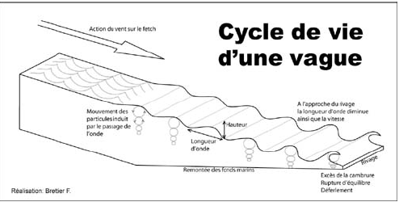

Quand le vent souffle sur l'eau, il créé des rides à sa surface. Ce transfert d'énergie, de l'air à l'eau donne naissance à une houle, vibration superficielle ébranle la surface et se répercute en profondeur grâce à la poussée du vent qui continue sur l'arrière des ondulations. La houle, constitué de plusieurs trains d’ondes va alors prendre la direction du vent.

Les vagues sont des ondes, et comme toutes les ondes on peut les caractériser par :

* la célérité : c’est la vitesse de la vague, noté c.
* la longueur d’onde : c’est la distance entre deux crêtes successives, elle est notée lambda ou L.
* la période : c’est l’écart temporel entre deux vagues, elle est notée P.
* l’amplitude (aussi appelée hauteur de la vague) : c’est la distance verticale entre un creux et la crête suivante, noté A.

L'énergie d'une houle, c'est son énergie cinétique (représentée par la vitesse), avec son énergie potentielle. (L'énergie potentielle est une énergie qui a le potentiel de se transformer en une autre forme d'énergie).

E houle = E cinétique + E potentiel

Les houles sont d'autant plus rapides que leur longueur d'onde est grande, et, à longueur égale,
les grosses houles sont légèrement plus rapides que les petites houles.
En l'absence de vent qui les entretiennent ou les font grossir, les vagues s'éteignent
progressivement (et d'autant plus vite que leur longueur d'onde est petite).
C'est pour cela que les seules vagues qui arrivent à traverser les océans (même par temps calme)
sont les houles , aux crêtes espacées de plusieurs centaines de mètres.

Quand le vent s’arrête, la houle continue de se propager au loin.
Une fois que la houle quitte la zone de fetch où souffle le vent, une sélection se créée.
Les ondes les plus courtes se dissipent et les autres s’additionnent aux plus grandes. Les
houles se déplacent alors en trains d’ondes qui s’épuisent se font remplacer par les
suivantes.
La vitesse de propagation de la houle est, pour une période de 10s, de 58 Km/h.
Quand les houles matures atteignent les côtes, les vagues déferlent et peuvent être surfé.

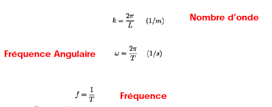

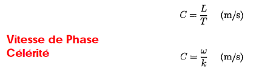

Célérité = fréquence angulaire / nombre d'onde

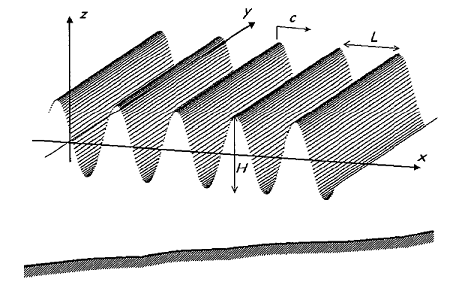

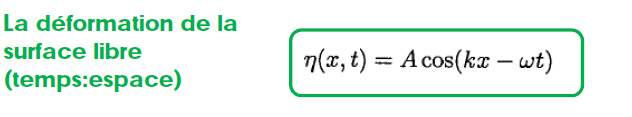

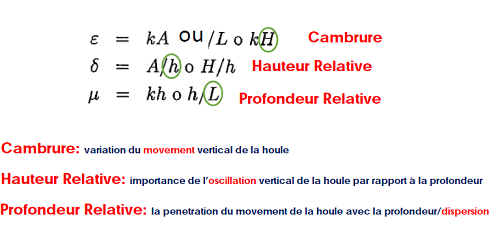

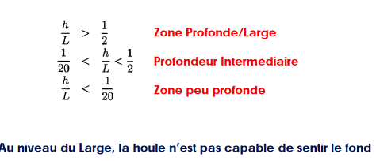

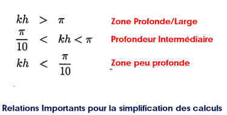

H/L<<1: hauteur de houle réduite par rapport à la profondeur ou la longueur d’onde.
Mouvement de Petit Amplitude, Houle Linéaire

h et d = la profondeur de l'eau

# Relations mathématiques pour calculer le mouvement de la houle

## Hypothèse du fluide

noeuds : intersection entre le niveau de repos et l'onde

anti - noeuds : crête de l'onde

Les vitesses varient. Au niveau des crête et des creux, la vitesse est essentiellement horizontale.

Dans une zone de creux on a une force inverse à la propagation horizontale.

Au niveau des noeuds, les forces sont essentiellement verticales.

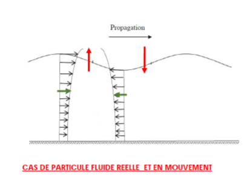

Profil de vitesse : vitesse d'une particule d'eau de la surface au fond marin. Au fond marin, les particules ont une vitesse nulle.

Lors de la descente, la force tangentiel est plus grande que la force de pesanteur, donc la résulte de force va vers le haut. Lors de la remontée, c'est l'inverse. La force tangentiel est plus faible que la force de pesanteur, donc la résulte de force va vers le bas.

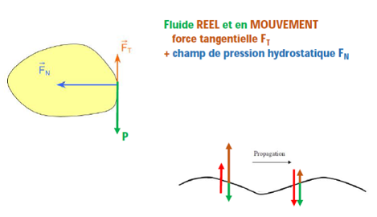

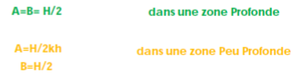

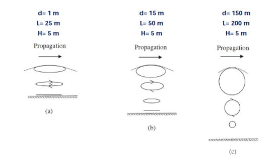

Onde dispersive : différentes fréquences d'onde vont se propager avec des vitesses différentes. Ce phénomène se fait dans les zones profondes.

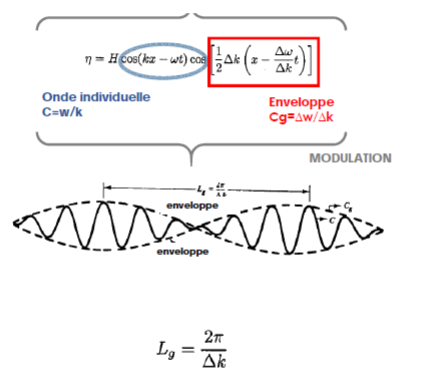

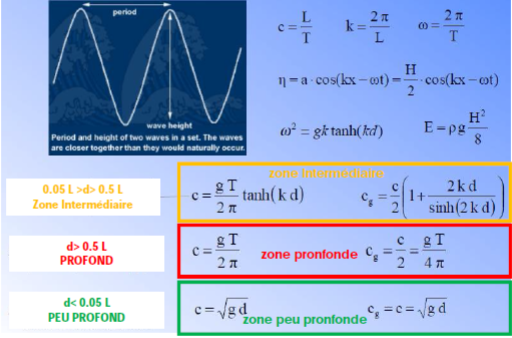

L'énergie totale d'une onde est la somme de son énergie cinétique (associée au mouvement) et de son énergie potentielle (par rapport au niveau de repos; lié à la gravité). L'énergie cinétique pour une longueur d'onde et par unité de largeur de crête Ecin, peut - être obtenue à partir de la relation suivante :

Ecin = 1/(16 ρ gH² λ)

Durant sa propagation, la houle change de hauteur H et de densité d'énergie. Le flux d'énergie se conserve. L'énergie intégrée sur une longueur d'onde :

ET (J/m²) = Ec + Ep = ρg(H²/8)

Energie du flux :

$$
\frac{n!}{k!(n-k)!} = \binom{n}{k}
$$

$$
\frac{\rhogH\exp{2}Cg}{8}
$$

Tenseur de radiation :

Sxx : force dans la direction de propagation de l'onde

Syy : force orthogonale à la direction de propagation de l'onde

Zone profonde : Sxx = 1/2 E, Syy = 0

Zone peu profonde : Sxx = 3/2 E, Syy = 1/2 E

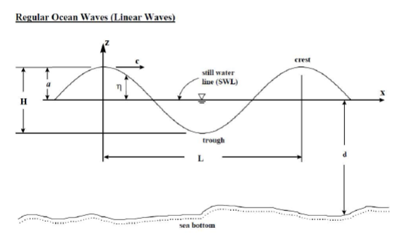

# Relations mathématiques

## Distribution statistique de la houle

La distribution de la houle est une distribution normale et gaussienne. 

Moment de la houle : mn 

H1/3 est appelé hauteur significative des vagues. Cette valeur correspond à l'amplitude moyenne des trois (N/3) ou des dix valeurs (N/10) les plus hautes houles observées en un lieu et à un moment précis.

## Les moments spectraux de la houle

Bande spectrale  = à savoir

On appelle la valeur qui dépasse les maximums a1/N. On va appeler a1/10 la valeur qui dépasse les maximums de 10%. 

Deux types de spectre : 

* josnwap 
* 

# Cours 4

Angle d'incidence : angle entre les fronts d'onde et l'horizontal.

La houle en propagation : 

1. Shoaling : changement de la hauteur de la houle, la longueur d'onde va diminuer. Il ne peut pas se propager au large.

(schéma)

2. Diffraction
3. Refraction
4. Reflexion
5. Breaking

Elle aura une nouvelle hauteur lié à l'ancienne hauteur et du coefficient de changement.

