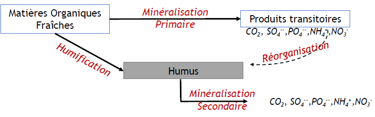
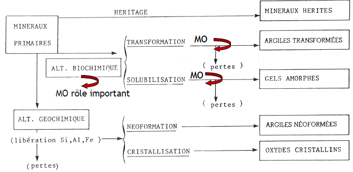

# Les constituants du sol

## I. Les différentes fractions

Le sol est un milieu triphasique : 

- solide : constituants organiques et minéraux (50%)
- liquide : solution du sol constitué d'eau et d'éléments dissous issus des processus (26%)
- gazeuse : atmosphère du sol (22%)

## II. Fraction gazeuse

Le sol est composé des mêmes gaz que l'air, avec en plus des gaz provenant de la décomposition de la matière organique. Comme dans l'atmosphère, l'azote et l'oxygène sont les principaux gaz dans le sol. En comparaison avec l'atmosphère, le dioxyde de carbone est plus présent dans le sol. Les fluctuations saisonnières sont importantes dues aux variations de l'activité biologique.

Les fluctuations saisonnières sont importantes dues aux variations de l'activité biologique (ex. respiration des racines, microflore, faune, fixation d'azote et dénitrification..)

## III. Fraction organique

Un sol prend naissance dès que la moindre vie végétale et animale vient s'installer dans les débris d'altération de la roche mère, souvent regroupé sous le terme *matière organique*. La faune est les micro organismes représentent la MO vivantes. Les résidus organiques fraîs et évolués représentent la MO facilement décomposable. L'humus représente la MO stable.

Il existe trois type de forme d'humus :

- MULL : les sols forestiers à litière mince
- MODER : les sols forestiers à litière épaisse
- MOR : sols siliceux naturellement acides

La matière organique fraîche est composée de feuilles mortes, de brindilles, de résidus de récoltes, de racines mortes, de cadavres d'animaux, de matière organique particulaire ou encore de cellules microbiennes mortes. L'humus est la fraction colloïdale de la MO obtenue par synthèse microbienne et physico chimique à partir des MO fraîches. Les termes humification et minéralisation et l'utilisation du terme "humus".

Une matière organique possède des composés complexes, elle aura plus de mal à se dégrader. Une partie de la MO fraîche se transforme en produit transitoire, **minéralisation primaire** où on passe d'une matière organique à un minéral simple ou un gaz. Cela est provoqué par les micro organismes avec tout d'abord un découpage en petit morceau, puis la matière organique est ingérée par le micro organisme et enfin une respiration dans la cellule microbienne. Pour accélérer la décomposition, il y aura une production d'enzymes. Les produits transitoires vont être perdus dans l'atmosphère (dioxyde de carbone), absorbés par les plantes (azote, phosphore), fixés par l'argile et l'humus (azote, souffre, phosphore), perdus par lessivage ou repris par les micro organismes (azote, phosphore).

Une partie des matière organique fraîche échappe à la minéralisation primaire. Elle peut être à l'origine de l'humus en formant des complexes avec des minéraux du sol, **humification**. Cet humus peut être dégradé est minéralisé, **minéralisation secondaire** processus plus lent que la minéralisation primaire.

Une partie n'est pas décomposé par l'activité microbienne par récalcitrante chimique pour les MO fraîches ou l'humus (trop complexe). Mais aussi par des contraintes énergétiques, si le retour énergétique est négatif pour le micro organisme, plus la MO est décomposée, plus elle est pauvre en énergie. Ou enfin par des protections physico-chimiques (occlusions par agrégats, adsorption sur les particules minérales).

La **minéralisation** est donc le stade ultime de la biodégradation des matières organiques du sol en matière minérale ou gazeuse sous l'influence de micro organismes du sol.

L'**humification** est l'ensemble des processus de transformation des matière organiques fraîches en humus sous l'influence des micro organismes du sol.

La minéralisation en montagne est plus faible, cela est lié à l'acidité du sol ainsi que la température qui peuvent ralentir les processus. Peut de restitution de MO dans les sols dans les zones d'agriculture donc on a plutôt un appauvrissement.

## IV. Fraction minérale

La fraction minérale du sol se compose d'éléments grossiers et d'éléments fins. Les éléments varient en terme de taille et de nature. Ils proviennent de l'altération des roches mères. Présence de minéraux primaires, minéraux pas ou peu altérés ainsi que des minéraux secondaires qui ont eu une transformation plus poussée provenant des minéraux primaires. Les minéraux secondaires forment **le complexe d'altération**, ils sont en association avec des matières organiques. Ils vont nous renseigner sur les processus de pédogenèse. 

Différenciation du complexe d'altération et de la roche mère par :

1. une **désagrégation physique** : agents climatiques (vent, gel, eau) sur la roche mère, pas de modification chimique
2. altération biogéochimique : action de l'eau associée ou non avec du dioxygène, du dioxyde de carbone et des acides organiques. 5 voies possibles : *hydratation < dissolution < oxydation < réduction < hydrolyse*

1. **hydratation** : adjonction de molécules d'eau aux minéraux : fragilisation et ameublissement (hématite (Fe2O3) -> goethite (FeOOH)).

2. **dissolution** : altération de la roche mère par l'eau et ses substances dissoutes (roches salines, calcaires).

3. **oxydation** : libération de Fe2+ présent dans certains minéraux sous forme ferrique

4. **réduction** : solubilisation de Fe2+ à partir d'oxydes et d'hydroxydes de fer en milieu mal aérés.

5. **hydrolyse** : processus le plus important : décomposition de la matière minérale à l'aide de matière organique et d'eau et les minéraux dissous. Réarrangement important des réseaux cristallins. Dépend des facteurs abiotiques (conditions climatiques) et biotiques (activité des micro organismes).

Conséquences : création d'un mélange de constituants variables en taille et qualités minéralogiques : le **complexe d'altération**. 

Pour étudier les constituants minéraux des sols, trois approches possibles : 

- **selon la taille**
    
      - définie la texture 
      - renseigne sur les processus de pédogenèse notamment propriétés fonctionnelles. 
      - est en lien avec la structure -> facteurs clés de la fertilité/qualité du sol.

La texture peut être différente :

- **texture sableuse**: sol aéré bien équilibré, facile à travailler mais pauvre en eau et en éléments nutritifs
- **texture limoneuse**: si excès de limon et insuffisance d’argile mauvaises propriétés physiques, structure massive (cf. battance)
- **texture argileuse**: sol riche chimiquement, mais imperméable et mal aéré

- **selon la nature minéralogique des fractions**

L'analyse de géologie plus difficile fonction de l'altération ou la présence de différents minéraux. 

- **selon l'importance des argiles minéralogiques** 

Phyllosilicates d'aluminium organisés en feuillets constitués de couches de silice (tétraèdre silicium-oxygène) ou d'alumine (octaèdres, aluminium-oxygène).

Ce sont des colloïdes minéraux électronégatifs, hydrophiles, à pouvoir de dispersion et de floculation.

- électronégativité : présence de valences négatives non satisfaites à la périphérie des feuillets
- hydrophilie : possibilité d'hydratation
- forme dispersée ou floculée : selon les forces de répulsion ou d'attraction exercées sur les particules 

Ces derniers ont des rôles importants dans la **formation des agrégats**.

## V. Complexe argilo-humique

Dans les sols, les argiles et l'humus peuvent s'associer et former le **complexe argilo-humique**.
Il constitue l'**ensemble des substances du sol** formées par l'**association des molécules organiques humifiées et des argiles**.

Ce complexe est formée par 3 modes de liaison argile - humus : 

- intermédiaire du calcium : très stable, empêche une minéralisation trop rapide de la MO, s'oppose à la dispersion des argiles, confère au sol une teinte noire
- intermédiaire du fer : fragile, sols décalcifiés ou riches en fer, colore le sol en brun
- fixation directe de l'humus sur certaines charges positives de l'argile

Le complexe argilo-humique intervient dans l'organisation structurale du sol (macro à micro agrégats). Cela permet une **stabilité structurale**, qui va permettre par exemple, de résister à l'érosion hydrique.

Le complexe est à l'origine des propriétés favorables à la fertilité globale du sol : 

- minéralisation secondaire de la matière organique humifiée freinée par la liaison argile-humus
- colmatage et compaction du sol réduits car l'humus empêche la dispersion des argiles
- structure et compaction du sol réduits car l'humus empêche la dispersion des argiles
- augmentation de la capacité du sol à retenir certains des éléments minéraux indispensables à la nutrition des plantes

## VI. Fraction liquide ou solution du sol

La fraction liquide est très mobile dans le sol et à la surface (ex. ruissellement)

**Solution du sol** : eau dans laquelle sont dissoutes des substances solubles issues :

- de l'altération des minéraux de la roche-mère
- de la décomposition des MO (minéralisation)
- des apports par l'Homme (engrais ou amendements)

Phase dynamique : solution du sol reflète le fonctionnement actuel du sol ( par opposition aux fractions minérales/organiques)
  
La solution du sol est soumise à d'importantes variations influençant les formes d'eau disponibles dans le sol (eaux de ruissellement, gravitaire, retenue et souterraine).  

Les propriétés et comportements des sols ont pour rôles fondamentaux : 

- facteur essentiel de l'altération de la roche-mère
- conditionne l'activité biologique (humidité -> biocénose du sol, racines)
- influence les propriétés physiques des sols

Mesures de la quantité d'eau dans les sols : 

- taux d'humidité 
- eau retenue dans le sol
- eau libre de la nappe : piézométrie