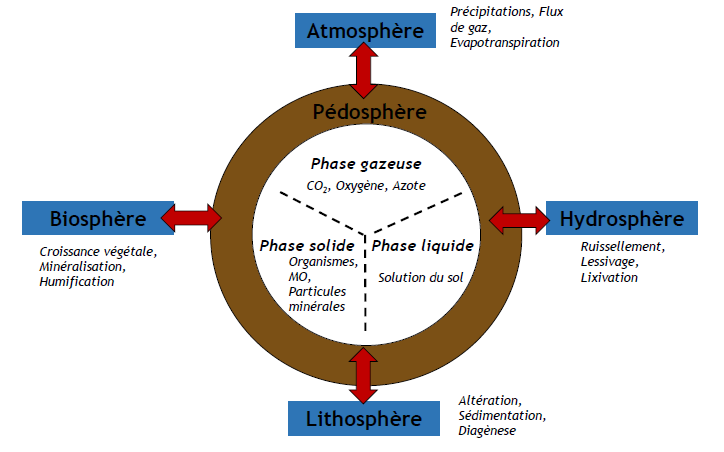

# Introduction

Un sol est un **volume** qui s'étend depuis la surface de la Terre jusqu'à une profondeur marquée par l'apparition d'une roche dure ou meuble, peu altérée ou peu marquée par la **pédogenèse**. L'épaisseur du sol peut varier de quelques centimètres à quelques dizaines de mètres. En France, l'épaisseur du sol peut aller jusqu'à 2 mètres. Il comporte le plus souvent plusieurs **horizons** correspondant à une organisation des constituants organiques et /ou minéraux. Il est un lieu d'une **intense activité biologique**. Le sol est aussi un **volume ouvert** en interface avec des échanges qui se passent dans le sol (phase solide, liquide et gazeuse) mais aussi à l'extérieur (atmosphère, lithosphere, biosphère et hydrosphère).

On peut étudier le sol à l'échelle du paysage mais aussi de façon plus locale avec l'étude de profil de sol (horizon) ou encore l'étude des mycéliums, des agrégats ou des pores présents dans ce sol.

L'**horizon** est une couche grossièrement parallèle à la surface du sol et dont l'existence est reconnue par l'observateur. Les horizons sont différents les uns des autres par leur constituants, leur organisation et leur comportement. Différents horizons d'un même sol donne un profil de sol.

Un **profil de sol** est une superposition des horizons pédologiques dans un sol, observable à la faveur d'une coupe verticale, il correspond à l'**ensemble des horizons** d'un sol.

Une **couverture pédologique** est une **distribution dans l'espace des horizons** du sol. L'échelle peut être métrique à kilométrique. 

L'étude des sols comporte 2 aspects complémentaires et indissociables : 

- **aspect statique** : étude des constituants et des propriétés physiques chimiques ou biologiques du sol qui permet d'aborder le *fonctionnement actuel des sol*;
- **aspect dynamique** : étude de la pédogenèse et la formation des profils qui permet d'appréhender *l'évolution des sols*

La **pédogenèse** est l'**ensemble des processus physiques, chimiques et biologiques** qui, en interaction les uns avec les autres, aboutissent à la formation, la transformation ou la différenciation des sols.

Les sols se forment à l'aide de 5 facteurs différents : 

- la nature de la roche mère
- le climat
- la topographie
- les organismes vivants
- le temps

Le sol se transforme par des **processus pédogénétiques** avec des transformations de matière (altération, MO) mais aussi par des transferts de matières liés à l'eau. L'ensemble de ces mécanismes et de ces processus forment la **pédogenèse**.

Pour décrire un profil de sol il faut :

1. situer le contexte dans le pédo-paysage
2. décrire le profil et horizons (forme d'humus, épaisseur)
3. description fines des horizons (couleur, consistance, texture, taille)
4. prélèvements d'échantillons et analyses complémentaires en laboratoire
5. nommer / référencer les horizons et les rattacher à un profil de référence

Le sol remplit de nombreuses fonctions essentielles qu'il exerce en interactions avec des compartiments, le sol joue un rôle majeur dans le fonctionnement général de la planète Terre.

Le sol est un milieu menacé. En effet, il existe des dégradations biologiques, la perte de matière organique liés à une transformation du milieu ainsi qu'une perte de biodiversité. Des menaces liés à l'érosion du sol, le sol étant un processus très lent, le tassement, les inondations ou l'imperméabilisation. Mais aussi des contaminations, des pollutions ainsi que la salinisation.

