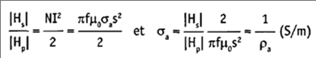
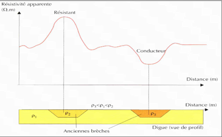

# Chapitre II :  Méthodes électromagnétiques basse fréquence en champ proche

## Principe 

Les ondes de basse fréquence vont s'enfoncer plus loin dans les profondeur. Les ondes à haute fréquence ont a un faible profondeur mais plus de détails en surface.

Un champ électrique va provoquer un champ magnétique, onde électromagnétique.

Le champ magnétique a comme unité le tesla. La champ électrique a comme unité le volt/mètre.

Les méthodes basse fréquence en champ proche ont comme émetteur et récepteur des dipôles magnétiques (boucles de courant) verticaux ou horizontaux par rapport au sol. La source génère un champ magnétique primaire à une fréquence donnée *via* une bobine d'induction reliée à une source oscillante. Lorsque le champ primaire rencontre une anomalie conductrice, un champ secondaire, beaucoup plus faible est créé.

## Grandeur mesurée en méthode EM

La profondeur d'investigation dépend de la distance entre le récepteur et l'émetteur. Pour l'électromagnétique, on se déplace en ayant les données. On mesure la conductivité apparente.

La mesure du rapport de la composante du champ secondaire en quadrature par rapport au champ primaire va permettre de décrire au mieux les hétérogénéités conductrices du sous-sol en termes de conductivité apparente (S/m), inverse de la résistivité apparente p. (Ohm.m).

S (m) La distance émetteur récepteur. Le rapport des champs magnétiques primaire et secondaire en quadrature Hp et  Hs  est alors directement proportionnel à la conductivité apparente du terrain: secondaire, f est la fréquence (Hz) de l'onde émise dans la boucle émettrice et perméabilité magnétique du vide.

Avec la conductivité, nous allons avoir l'hétérogénéité du sol et non pas la formation du sol.

## Profondeur d'investigation

La profondeur d'investigation annoncée par les constructeurs est la profondeur pour laquelle le dispositif est sensible en champ proche à la présence d'une couche  conductrice. Elle est indicative et dépend fortement de la structure interne de la nature du sous sol. La distance s entre bobines et leur orientation par rapport à la surface influent sur la profondeur d'investigation.

**Dipôles magnétiques verticaux** : les bobines coplanaires sont horizontales par rapport au sol (configuration encore appelée HCP. La profondeur d’investigation théorique est de l’ordre de 1,5 x distance émetteur-récepteur.

**Dipôles magnétiques horizontaux** : les bobines coplanaires sont verticales par rapport au sol et les couches superficielles contribuent majoritairement à la réponse du système. La profondeur d’investigation théorique est  0, 5x distance émetteur-récepteur.

## Résultats attendus

Les résultats attendus représentent le rapport de la composante du champ secondaire en quadrature par rapport au champ primaire. Mais on traduit ces profils en termes de conductivité apparente (S/m) ou résistivité apparente.

