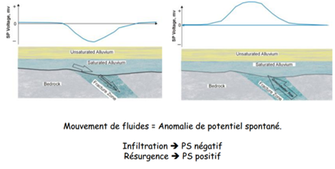

# Chapitre III : Potentiel spontané

## Principe

Le potentiel spontané est une méthode passive avec un jus électrique. La différence avec la méthode électrostatique, on mesure le champ électrique naturel de la Terre avec deux électrodes impolarisables. L'une des électrodes est fixe et, l'autre est mobile. On mesure le champ électrique naturel avec un voltmètre sensible.

Un mouvement de l'eau dans le sol peut générer un courant électrique, ce qu'on appelle un électrocinétique. Ce signal dépend de la vitesse.

## Principe de la méthode

Derrière la genèse d'un champ électrique existe quatre mécanismes de transports de charge électrique :

- **électro-diffusion** : variations de concentration des ions (ex. différence de salinité des eaux)

- **oxydo-réduction** : variation du potentiel redox, notamment dans les aquifères contaminés

- **électro-thermique** : variation de la température du sol (ex. volcans)

- **électro-filtration** : mouvement de l'eau dans le sol (ex.nappe)

Déplacement des ions : électro-diffusion (gradient de concentration des ions) ou électrocinétique (écoulement dans un milieux poreux)

Déplacement des électrons : potentiel électro-redox, électrons mis en mouvement dans un conducteur qui leur assure un transfert entre deux zones de conditions redox différentes.

Lorsque l'on mesure, nous n'avons pas de profondeur d'investigation. Elle est efficace pour les points d'infiltration des écoulements.

