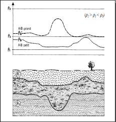

Le forage s'utilise après l'observation de la zone par imagerie.

Géophysique active :

- méthode sismique possédant des sources (marteau, vibro sismique..) et des récepteurs (Géo sonde).
- méthode électrique : injection de courant, on mesure la différence de potentiel.

Géophysique passive : n'utilise pas de source

- sismique passive : observation de séismes
- gravimétrie
- mesure magnétique
- potentiel : on mesure la différence de potentiel sans injection de courant

# Chapitre I : Tomographie de relativité électrique 

## Définitions

La conductivité électrique représente la capacité de la matière à mettre en mouvement les charges libres sous l'action d'un champ électrique. Au contraire, c'est la résistivité électrique.

## La résitance 

La loi d'Ohm : **R = R.I**

La résistance R dépend de la géométrie du matériau; pour un cylindre de section A et de longueur L : ρ = R.A/L

ρ(Ohm/m) est la résistivité du matériau 

Nous avons besoin de quatre électrodes en surface, deux pour ajuster le courant et deux pour mesurer le potentiel. Ce potentiel est généré par le courant.

Plus on augmente la distance entre les électrodes, plus les lignes de courants descendent en profondeur. Cependant, on espaces les lignes de courants et donc, nous aurons moins d'informations.

Le courant circule dans le sol d’une électrode de courant à l’autre. La densité de courant est plus forte près de la surface qu’en profondeur.

La **résistivité apparente** est la valeur de résistivité obtenue sur le terrain. Elle résulte de la contribution volumique de toutes parcelles du milieu traversé par le courant émis en fonction de la distance à la source. Si le sol est homogène la résistivité apparente est égale à la résistivité intrinsèque. Après avoir une résistivité globale de toute les couches, on cherche théoriquement la résistivité vraie de chaque couche.

Pour mesurer la résistivité du sol, on utilise un quadripôle, formé d’un dipôle d’injection de courant et d’un dipôle pour la mesure de la différence de potentiel V.

ρ = ΔV/I x K(m)

d'où K : coefficient de géométrie 

## Dispositifs

Plusieurs dispositifs sont communément utilisés.

Le dispositif de Wenner est un quadripôle avec une distance identique entre les électrodes. Le dipôle de mesure de tension est au centre. Ce dispositif est recommandé pour les structures horizontales. La profondeur d'investigation plus faible que celle du Dipôle-Dipôle et du Wenner-Schlumberger.  
 

Le dispositif dipôle - dipôle est recommandé surtout pour les structures verticales. La profondeur d'investigation plus grande que pour le Wenner et Wenner -Schlumberger. Il nécessite des appareils sensibles et un bon couplage des électrodes avec le sol peut être utilisé pour de la 3D seulement pour des grilles de 12 x 12 électrodes 

Le dispositif Wenner - Schlumberger est recommandé à la fois pour les structures horizontales et verticales. La profondeur d'investigation est d'environ 10 % plus élevée qu'avec le dispositif de Wenner.

En présence d'un terrain bruité et sans aucune connaissance préalable de la géométrie du corps à étudier, il est conseillé d'utiliser de préférence un dispositif Wenner-Schlumberger. Ce dispositif peut à la fois être utilisé en recherche géologique à grande échelle, en hydrogéologie, en génie-civil, en archéologie et pour des problèmes d'environnement. 

Si l'on recherche des structures verticales dans une zone qui n'est pas trop bruitée, avec un résistivimètre est assez sensible et un bon contact avec le sol, il est recommandé d'utiliser un dispositif Dipôle-Dipôle. Ce dispositif peut par exemple convenir en archéologie, en géophysique minière et en génie-civil.

Lorsqu' il s'agit de mettre en évidence des structures horizontales, si le terrain n'est pas trop bruité et que l'on dispose de peu de temps, on utilise un dispositif Wenner. 

En 3D, on doit utiliser un dispositif pôle-pôle ou Dipôle-Dipôle. 

## Modes de prospections

Il existe deux modes de prospections. Le profilage de la prospection et le sondage de la prospection.

### Le profilage

Le profilage est le fait de trouver des anomalies. Pour cela on bouge les électrodes en réalisant plusieurs traînées de même distance. Les résultats d'un ensemble de profils sont représentés sous forme de cartes de résistivités. Une carte de résistivité doit être accompagnée de la longueur de ligne utilisée, de l'échelle, de l'espacement des mesures, d'une légende permettant de localiser l'étude.

On peut faire seulement une traînée afin d'avoir un profil topographique sur cette distance où on réalise une mesure de résistivité sur plusieurs couches. 

Les principaux avantages de profilage résident dans la rapidité de sa mise en œuvre et dans la simplicité de l'interprétation qualitative des résultats. Les résistivités apparentes reflètent en effet les variations correspondantes à la distribution des résistivités vraies dans une tranche de terrain de profondeur assez bien déterminée et à peu près constante qui dépend de la longueur du dispositif. Elles rendent compte de la variation de la résistivité dans le sens horizontal.

### Le sondage

Le sondage est un dispositif qui ne va pas bouger en surface. On écarte seulement les électrodes afin d'avoir plus d'informations sur la variabilité verticale de résistivité. Pour déterminer la profondeur ou la résistivité on utilise des abaques de bicouche.

### Exercice 

On effectue 10 mesures de résistivité apparente avec une inter mesure de 10m.
La distance entre A et B est de 30m. 0.11x30 = 3,3m de profondeur d'investigation si on prend Roy. Nous pouvons aussi prendre Barker. On utilise l'abaque pour le cas vertical.

### Profilage et sondage simultanés

On utilise un dispositif de type Wenner où on va profiler le sol en écartant de plus en plus les sondes ce qui va permettre de descendre de plus en plus en profondeur. Cependant plus on descend en profondeur, moins on a de mesure en profondeur. Afin d'en avoir plus, on ajoute des électrodes. Comme cela on a une idée de l'hétérogénéité en latéral mais aussi en profondeur. C'esr la pseudo - section de résistivité apparente.

Les points d'une image du modèle de résistivité représentent la porosité.

Pour faire l'interprétation, il faut un modèle numérique. On divise les zones de mesures en blocs de mêmes tailles et essayer de trouver la résistivité de chaque bloc. Pour chaque bloc une valeur sera proposée de façon théorique et mathématiques. On va essayer d'avoir le meilleur modèle, celui qui se rapproche le plus de la zone mesurée. La coupe géologique pourra ensuite être interprété.

Plus un milieu est résistant, moins il est conducteur.

