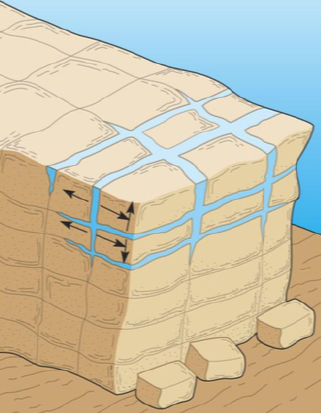
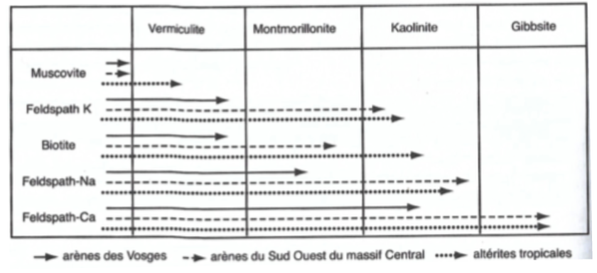
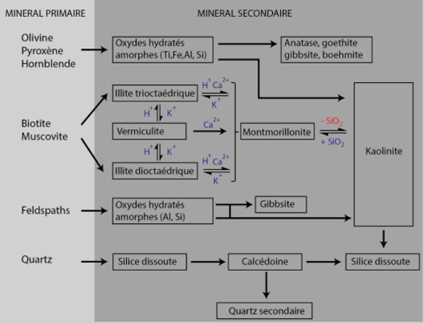

# Partie 1 : Les processus de fragmentation mécanique

# Chapitre 1 : Les processus de fragmentation mécanique

## Quelques rappels de géologie

Les roches sont classées en trois groupes selon leur origine : 

- magmatiques : cristallisation totale d’un magma (plutoniques ou intrusives) ou partielle (volcaniques ou effusives)
- métamorphiques : recristallisation et/ou réarrangement en milieu solide de roches préexistantes
- sédimentaires : transformation diagénétique plus ou moins intense de sédiments
  
Les roches sont classées en deux catégories selon leur propriétés mécaniques :

- meubles : ne présentent aucune cohésion, peuvent s’imprégner d’eau et se déformer par fluage sur les versants
exemples : sables, limons, argiles, marnes, moraines, cendres volcaniques, …
- cohérentes ou indurées : résistent bien à l’eau, semblent massives et résistantes
exemples : grès, calcaires, granites, gneiss, basaltes, …

Les roches cohérentes sont fragilisées par des **discontinuités** qui se matérialisent souvent par des fissures, des fentes, des fractures qui facilitent la circulation des eaux d'infiltration. 

- communes à toutes les roches cohérentes : failles, diaclases, schistosité de fracture
- propres aux roches sédimentaires cohérentes : joints de stratification (interruption), stylolites (surfaces de dissolution)
- propres aux roches magmatiques : plan de fluidalité
- propres aux roches métamorphiques : schistosité de flux (réorganisation physique), plans de foliation (recristaliisation)

Les roches sont toutes soumises à des champs de contraintes externes et à la relaxation des contraintes internes.

## La météorisation

La météorisation est l'ensemble des processus par lesquels les agents météoriques agissent sur les roches.

Les principaux agents météoriques : 

- l'eau
- l'air
- les particules en suspension et les éléments chimiques

Les mécanismes physiques conduisent les roches à se fragmenter sous l'effet :

- thermoclastie : variation de la température
- cryoclastie : alternance gel-dégel
- hygroclastie : variation de la teneur en eau
- haloclastie : la teneur en sel

L'altération chimique par les agents météorique provoque une transformation profonde à basses pression/température (ce qui exclut la diagenèse et le métamorphisme). Les mécanismes physiques augmentent la perméabilité des roches ainsi que leur surface de contact avec les fluides et favorisent ainsi l'altération chimique et biochimique.

### La thermoclastie

La thermoclastie est la désagrégation mécanique des roches sous l'action des variations de température sans aucun autre processus. 

Elle dépend des paramètres internes (porosité, composition..) et externes (climat, nombre de cycles) et apparaît davantage comme un processus d'affaiblissement progressif de la résistance mécanique des roches qui peut favoriser l'action d'autres processus associés

### La cryoclastie

La cryoclastie est définie comme l'action du gel sur les roches a été identifiée depuis très longtemps, aussi bien sur les affleurements rocheux que sur les pierres des bâtiment.

L'action du gel n'est efficace que si le matériau contient une certaine quantité d'eau mais il s'agit d'un mécanisme complexe qui ne se limite pas aux effets de l'expansion volumétrique associé au changement de phase de l'eau.

### L'haloclastie

L'haloclastie est définie comme la fragmentation des roches sous l'action des "sels" notamment ceux qui constituent les minéraux évaporitiques.

L'haloclastie regroupe un ensemble de phénomènes liés à la cristallisation des sels très solubles, mais toujours en association avec d'autres phénomènes (agressivité des ions, rôles de micro organismes, impact de la pollution) dont les effets propres sont souvent sous-estimés.

# Chapitre 2 : Les processus de désintégration granulaire

## Arénisation

La désagrégation granulaire est une forme particulière de fragmentation des roches qui ne relève pas de la seule dissociation mécanique ou des actions (bio)chimiques. Elle peut être définie comme l’ensemble des mécanismes conduisant à une dissociation et à la
libération de particules granulaires, notamment de la taille des sables, aboutissant à la
formation d’arènes (arena = sable). Toutes les roches sont susceptibles de subir une dissociation des éléments constitutifs en
libérant des débris de taille variée, mais les roches à texture grenue (plutoniques, gréseuses)
ou riches en cristaux isolés (volcaniques) sont particulièrement concernées par l’arénisation.
Les arènes constituent un faciès de convergence résultant de divers processus qui
s’entretiennent mutuellement : la voie est ouverte par la fragmentation qui permet l’entrée
des solutions aqueuses et active ainsi des processus de météorisation chimique qui, à leur
tour, augmentent la porosité de la roche et sa vulnérabilité aux agents d’altération.

La désagrégation granulaire peut prendre des formes très différentes :

- simple pellicule décimétrique
- couche d’épaisseur métrique
- couche pénétrante

Les volumes d'arènes observables sur le terrain ne sont pas nécessairement en équilibre avec le climat actuel et peuvent témoigner d'évènements anciens.

### Mécanismes physiques

La désagrégation granulaire résulte en premier lieu de la fragilisation des roches par des
mécanismes physiques (thermoclastie, cryoclastie, haloclastie) en laissant circuler l’eau et les
solutés le long des fissures ou des espaces intergranulaires, ouvrant ainsi la voie à la
météorisation chimique en multipliant les surfaces d ‘attaque.

En retour, l’augmentation de la porosité consécutive à l’altération développe la vulnérabilité
aux actions mécaniques. 

Tous les mécanismes physiques n’ont pas la même efficacité :

- thermoclastie : rôle mineur même sur des roches hétérogènes où les écart des coefficient de dilatation entre les minéraux
jouent en faveur d’une dissociation (quartz versus feldspaths, par exemple) ;

- cryoclastie : roches plutoniques et grès peu vulnérables en raison de leur faible porosité et de leur isotropie, mais
sensibilité accrue avec l’augmentation de la porosité en lien avec les premiers stade d’altération chimique

- haloclastie : beaucoup plus efficace mais extension géographique réduite aux milieux favorables aux efflorescences
salines : poussières des déserts continentaux, embruns des franges littorales, …

### Altération ménagée

La désagrégation granulaire comporte trois mécanismes en interactions : 

- le dégagement des cristaux primaires les plus résistants au sein des roches hétérogènes grenues ;
- l’exploitation des microfissures intracristallines et des vides intercristallins agrandis par dissolution ;
- la néogenèse de minéraux argileux gonflants qui exercent une action de disjonction.

Les arènes issues de cette altération ménagée présentent une forte proportion de minéraux
primaires les plus résistants à la météorisation (quartz et feldspathique potassiques), ce qui se
traduit par un pourcentage de sables et de graviers compris entre 70 et 80%.

A l'inverse, les minéraux argileux néoformés aux dépends des minéraux primaires fragiles
(plagioclases, minéraux ferro-magnésiens) représentent moins de 6% du volume

Arène granitique : sable peu évolué avec présence de quartz et de feldspath

L'arénisation produit des altérites dominées par un "squelette" de minéraux primaires identifiables et caractérisées par un degré d'argilisation peu poussé.

Elle se rencontre dans tous les milieux où  l'hydrolyse est entravée par des températures trop basses ou par une sécheresse saisonnière marquée, mais peut se développer sur des épaisseurs importantes (jusqu'à 5-10m).

- zones tempérées : hydrolyse modérée et lente, argiles peu évoluées (type 2/1) à partir des biotites et des plagioclases
- gradient de transformation (argiles de transformation/néoformation) du domaine atlantique au domaine méditerranéen
- zones tropicales à saison sèche : humectation trop épisodique, argiles néoformées plus abondantes (jusqu’à 20 à 30%)
- zones équatoriales : arènes limitées à la base des profils d’altération, néoformation > transformation

L'extraction est le remplacement de certains constituants s'opèrent sans que l'édifice originel soit détruit : l'architecture initiale est donc conservée.

L'analyse isovolumétrique peut s’appliquer aux bilans géochimiques globaux et fait apparaître
des pertes de masse pouvant atteindre 20 à 30%.
Les argiles néoformées sont peu ou pas gonflantes et peuvent se loger dans la porosité créée
par l’hydrolyse des minéraux primaires … ce qui permet à l’arénisation des rester, au moins
localement, isovolumétrique malgré la perte de matière.
L’arénisation s’accompagne donc d’un ameublissement lié aux pertes de matière bien que
l’architecture générale soit conservée, et d’un degré d’évolution minéralogique variable qui
impacté les séquences de minéraux argileux (transformés versus néoformés).

Altération squelettique : altération où il reste les minéraux primaires

Altération plasmique : plasma de minéraux secondaire, avec présence d'argiles

Argile : transformation des micas ou recombiné des feldspath

Saprolite : roche pourrie  

# Chapitre 3 : Les processus d'altération chimique

## Quelques généralités 

L'altération chimique des roches résulte d'un déséquilibre thermodynamique où se trouve les minéraux à la surface de la Terre, d'autant plus grand que les conditions du milieu (P, T, pH, Eh) sont différentes du milieu de formation.

L'altération chimique est une simplification moléculaire qui conduit d'une substance chimique minérale ou organique, cristallisée ou amorphe, à des produits plus petits qui sont libérés dans le milieu (ions, molécules, fragments de cristaux, produits amorphes).

Les éléments les plus solubles sont exportés hors des altérites et des sols dans les eaux
d’infiltration ou de ruissellement vers les nappes et les réseaux hydrographiques. Ces éléments
solubles peuvent être absorbés par les êtres vivants et entrer dans les cycles biogéochimiques,
ou se fixer sur des substances organiques.
Les éléments les moins solubles restent dans les minéraux résiduels ou se recombinent pour
donner naissance à de nouveaux minéraux, stables dans les conditions de surface (NEOGENESE =
NEOFORMATION = AUTHIGENESE), ce qui explique la formation, dans les FS et les sols, d’oxydes de
fer, d’hydroxydes d’aluminium, d’argiles, de carbonates de calcium, de sels, etc.

L’altération des minéraux commence par une simple hydratation à laquelle succède une
série de réactions chimiques (dissolution, hydrolyse, oxydo-réduction, etc.)
Roches + Eau + Réactifs -> Résidus solides + Minéraux néoformés + Produits en solution

L'influence des êtres vivants s’exerce à travers leur effet sur la composition atmosphérique, la
libération de protons et d’acides organiques en solution, ou la réduction d’éléments chimiques

Hydrolyse : Roches + Eau + Réactifs -> résidus solides + minéraux néoformés + produits d'altération

### Mécanismes d'altération chimique

Les réactions d'altération sont de 5 types que l'on peut distinguer par la nature des réactifs mis en jeu dans leur bilan global :

- dissolution : qui ne consomment ni eau, ni ions H+, ni oxygène
- hydratation/déshydratation : qui ne consomment que de l’eau 
- hydrolyse : qui consomment à la fois de l’eau et des ions H+
- acido-complexolyse : qui consomment des ions H+ et des anions organiques
- oxydo-réduction : qui consomment à la fois de l’eau, des ions H+, des
oxydants (surtout l'oxygène) et des réducteurs (surtout la matière organique)

L’eau a des propriétés acido-basiques et oxydo-réductrices qui limitent les formes sous lesquelles
les éléments peuvent exister de manière stable en solution :

- acides et bases plus forts que H2O : dissociés sous forme d’anions et de cations ;
- acides et bases faibles : plus ou moins dissociés selon le pH, différentes formes présentes ;
- oxydants ou réducteurs de H2O sont instables, mais peuvent exister temporairement ;
- réactions acido-basiques sont très rapides : les équilibres sont considérés comme réalisés ;
- réaction oxydo-réductrices sont plus lentes : formes différentes peuvent coexister.

## Cinétique d'altération

La vitesse d'altération des minéraux obéit à des lois différentes selon le niveau d'organisation considéré du minéral à l'assemblage élémentaire de minéraux et de constituants organiques jusqu'au niveau du bassin versant.

La dissolution d’un minéral isolé implique 3 étapes successives :

- transport des réactifs en solution jusqu’à l’interface minéral-solution ;
- réaction de surface qui peut impliquer différents phénomènes tels que l'adsorption des réactifs, l'échanges d’ions, la rupture
de liaisons ioniques ou covalentes, le transfert l’électrons, la désorption des produits de la réaction ;
- transport des produits en solution, ce qui libère la surface d’attaque et permet la progression de la dissolution.

L’étape la plus lente détermine la vitesse globale de dissolution :

- minéraux les plus solubles : le transport limite la dissolution, l’altération est donc plus rapide dans les milieux drainants ;
- minéraux les moins solubles : la réaction de surface est limitante, l’altération est donc favorisée par la fragmentation ;
- lorsque plusieurs réactions de surface sont concomitantes, la plus rapide détermine la vitesse globale de dissolution.

La forme des cristaux en voie de dissolution renseigne sur le mécanisme limitant : une
morphologie arrondie indique un contrôle par la diffusion (transport des réactifs ou produits),
alors que les figures de corrosion indiquent un contrôle par la réaction de surface.
A une température et pH donnés, la vitesse d’altération des minéraux dépend essentiellement de
leur composition chimique et non de leur structure. Dans une roche, les minéraux sont altérés simultanément et libèrent des éléments communs,
dans une chaîne de réactions parfois complexes, les unes alimentant les autres …

## Altération chimique et puits de CO2

L’altération chimique consomme des H+ et met enjeu des réaction d’oxydo-réduction ce qui
entraîne un couplage altération - oxydation la MO (donc avec les cycles C et O).

Les ions H+ nécessaires aux réaction d’hydrolyse sont fournis par :

- essentiellement, par la dissolution du CO2 (diacide) : CO2 + H2O -> H+ + HCO3- et HCO3- + H2O -> H+ + CO32-
- dans une moindre mesure, par la pompe à protons racinaire
- et par les réaction d’oxydation des composés azotés (nitrification) et soufrés.

L'hydrolyse des minéraux est la réaction majeure de consommation des protons. Pour
équilibrer chaque charge électrique d’un ion en solution libéré 1 H+ est consommé.

Si3AlO8Na + CO2 + 11/2H2O -> 1/2Si2Al2O5(OH)4 + Na+ + HCO3- + 2Si(OH)4

- la libération d’un ion Na+ nécessite la neutralisation par 1 H+
- la libération d’un ion Al3+ nécessite la neutralisation par 3 H+
- la très faible solubilité de l’aluminium entraîne la précipitation d’hydroxyde l’aluminium ou d’aluminosilicate
- au final, cette réaction ne consomme donc qu'un seul proton (H+) et une molécule de CO2.

Le même raisonnement peut s’appliquer pour la hydrolyse de l’anorthite ou la dissolution de la
calcite, qui libère un ions Ca2+ et sont donc associées de 2 ions HCO3-.

La mesure de ces ions HCO3-, ou plus exactement de l’alcalinité de la solution, permet de
mesurer la quantité de cations libérée par hydrolyse et de distinguer la part qui provient de
l’hydrolyse des minéraux de celle qui résulte de la dissolution des sels neutres.

## Conséquences sur l'effet de serre

Sur les terres émergées, l’altération des roches dans les formations superficielles et les sols conduit
donc à une consommation de CO2 directement corrélée aux flux d’alcalins et d’alcalino-terreux
exportés vers les bassins sédimentaires et les océans.

Dans ces derniers, lorsque le sodium précipite sous forme d’argile sodique selon une hydrolyse
inverse, une molécule de CO2 retourne à l’atmosphère et le bilan est donc nul.
En revanche, pour le calcium qui précipite sous forme de carbonate, pour chaque ion provenant de
la dissolution d'un calcaire le bilan est nul, mais pour chaque ion provenant de l’hydrolyse d'un
silicate, le bilan est négatif retirant ainsi une molécule de CO2 de l’atmosphère :

Si2Al2O8Ca + CO2 + 2H2O -> Si2Al2O5(OH)4 + CaCO3

La précipitation de l’oxalate de calcium est encore plus efficace, car elle immobilise 2 molécules
de CO2 par atome de calcium sous l’action préférentielle des champignons. Mais l’oxalate peut
ultérieurement se dissoudre et le calcium re précipiter sous forme de calcite.

L'atmosphère terrestre était initialement très riche en CO2 provenant de l’activité volumique et ce
sont les processus d'altération des surfaces continentales avec précipitation directe ou indirecte de
calcite qui l'auraient progressivement appauvri.

L'augmentation récente de la pCO2 couplée à une augmentation de température aurait donc
tendance à accélérer les processus d’hydrolyse des roches continentales et ainsi retirer du CO2
de l’atmosphère, sous réserve d’une précipitation de carbonate dans les océans.
