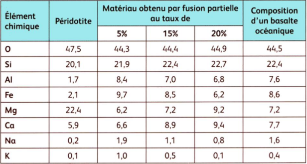
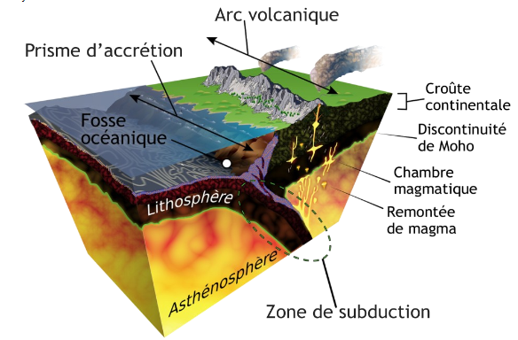
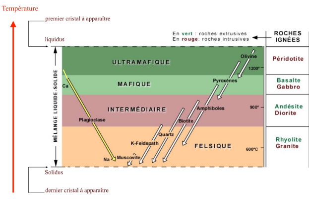
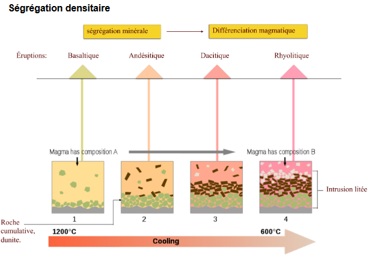

# 2. Genèses des magmas

Anatexie : fusion des roches préexistante locale ou généralisée

Il faut créer des déséquilibres pour fondre les roches. On a une fusion partielle car les roches ne fondent jamais complètement, c'est un liquide magmatique primaire avec du solide résiduel.

Les déséquilibres sont liés aux plaques tectoniques.

Magma = liquide + solide (cristaux) + gaz

La composition des liquides et solides résiduels dépend de plusieurs facteurs:

* la nature des matériaux sources (manteau et croûtes terrestres)
* le taux de fusion partielle
* les conditions thermodynamiques : pression, température, pression des fluides (déséquilibre)
* collectage et transport des liquides magmas jusqu'au lieu de mise en place (fusion fractionnée)

## Le manteau

Le manteau est la source principale de magma.

Les alcalins sont beaucoup moins denses et très volumineux. Ils cristallisent en dernier (feldspaths alcalins): éléments incompatibles. Les alcalino-terreux (sauf Mg) sont légèrement moins denses, mais volumineux. Ils cristallisent ensuite (clinopyroxènes, plagioclases, ...):éléments
incompatibles. Les ferromagnésiens, éléments les plus denses, participent en premier à la formation des minéraux (olivines, pyroxènes...): éléments compatibles.

[magma primaire](https://planet-terre.ens-lyon.fr/article/magma-primaire-mantellique.xml)

La décompression de la roche va permettre une augmentation de chaleur qui va causé la fusion partielle de 20% à 30%.

L'hydratation du manteau va permettre de baisser le solidus et donc va causé la fusion partielle entre 5 et 10%. La croûte continentale ne fond pas.

L'apport de chaleur va permettre une une remontée de chaleur et la formation d'un point chaud et une fusion partielle de 5%.

Il existe donc différentes conditions :

* l'hydratation
* température
* pression

Qui va permettre un taux de fusion partielle qui va varier.

Plus on a de silice, plus le magma sera visqueux. Plus la pression est faible, plus on a de silice.

## La croûte continentale

La croûte continentale est constitué en grande partie de granite. Il existe deux moyens pour produire un granite:

* fusion et recristallisation d'une roche de composition granitique (gneiss, pélite)
* différenciation d'un magma basaltique

On aura une évaporation de l'eau provenant de la roche inférieur lié au frottement.

# Evolution des magmas

Si on a peu de mélange, les solides vont se mettre au fond de la chambre magmatique.

Ségrégation ouvert : aucun mélange dans la chambre magmatique et l'olivine va se retrouver au fond. La composition du magma va donc changer. Les plagioclases vont se stocker en haut de la chambre magmatique.

On peut avoir un réapprovisionnement de la chambre magmatique qui va rechanger la composition du magma. Dans les roches on peut voir si la chambre a été réapprovisionné ou non.

