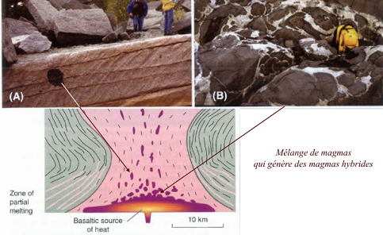
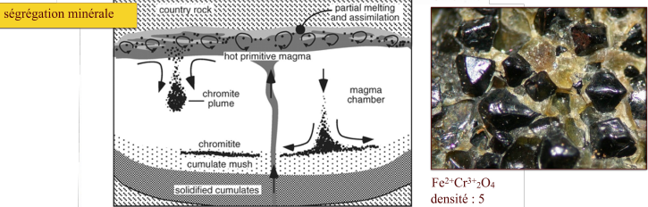
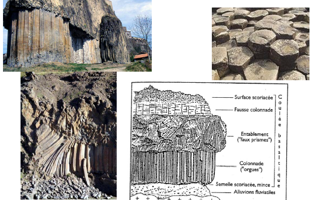
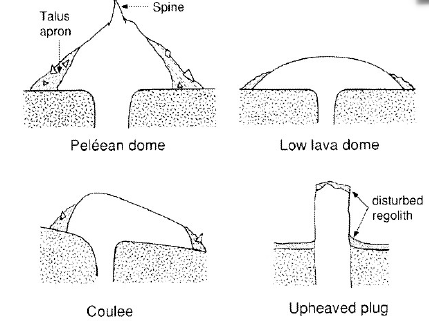
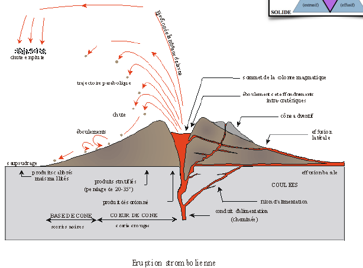
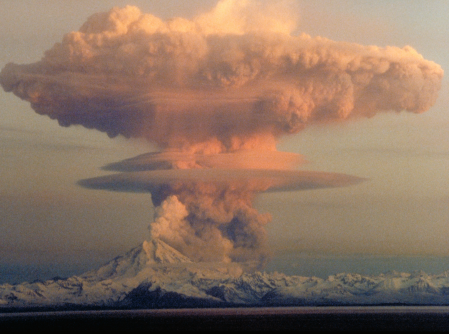

# 4. Mise en place des roches magmatiques

## Caractéristiques physiques des magmas

### La viscosité

La viscosité exprime la résistance d'un matériau au fluage

Viscosité (Pa.s) = Déformation cisaillante / Contrainte cisaillante

Elle dépend de :

* la température
* proportion solide - liquide
* dégazage
* composition chimique
* ect.

### La température

La température des laves lors des éruptions est entre 600 et 1200 °C

On ne peut pas mesurer les volcans explosifs, on analysera donc la composition chimique

## Roche plutonique : mise en place des intrusions

intrusion autochtone : magma fond sur place

intrusion allochtone : magma va s'installer dans les milieux de faible pression

### Plutons autochtones : batholites

On peut avoir une source batholithes qui va faire fondre la croûte. A la base on a un magma basaltique, à la surface on a un magma d'origine crustale. Les bulles qui remontent ne vont pas forcément se mélanger.

On peut les observer lorsque le magma est refroidit 

Pegmatite : roche filonienne, cristallisation d'un magma très différencié, riche en eau dissoute. Très bonne diffusion des éléments (incompatibles).

### Plutons allochtones : les lopolithes

Dans le complexe  nous avons des étages et alternance de zones sombres et de zones clairs. On a un gros contraste de densité.

Le premier minéral composé sera la chromite, étant très dense, elle se posera au fond.

Les différentes séquences suivent la série de Bowen.

Lorsque l'on s'éloigne de la fontaine, on a des strates très distinctes, au niveau de la fontaine on aura des cours où les différentes minéraux seront mélangés.

### Intrusions planiformes 

Dyke :strates verticales, inversion de topographie

Sill : strates horizontales

### "Cones sheets" & "ring dykes"

1. Formation des "cones sheets" due à la surpression des fluides magmatique sur les roches encaissantes.
2. Formation du "ring dyke" suite à l'effondrement du toit de la chambre magmatique.

Les roches des "cones sheets" sont dites filoniennes, et les roches du "ring dike" sont plutoniques.

## Les volcans

Il existe 4 types de volcans :

* explosif : grande proportion de gaz qui remontera le magma assez violemment, le magma est très liquide donc peu dense
* extrusif : magma  visqueux (Montagne Pelée)
* effusif : magma liquide
* mixte

### L'activité effusive

Les pentes du volcan sont très faibles. Son activité principal est la coulée de lave de type basaltique. On appelle ces volcans les volcans boucliers. On a deux types de coulées basaltique définie en fonction de la rhéologie :

* Aa : mal à s'écouler
* Pahoehoe : magma très liquide

Il existe des laves grises constituées majoritairement de carbonate de calcium. On ne sait pas encore comment se forme ces magmas.

La partie verticale se refroidie très doucement, zone très dense et sans bulle. Au dessus on retrouve encore du basalte mais moins organisé car se refroidisse très vite. On va finir avec une surface volcanique horizontal.

[Volcan effusif, lave fluide](https://www.youtube.com/watch?v=bro9UuvYQSg)

[Volcan effusif, lave visqueuse](https://www.youtube.com/watch?v=_ZV_xCRX1PM)

[Carbonatites](https://www.youtube.com/watch?v=qputaVyn7TE)

Les structures internes des coulées : 

### L'activité extrusif

Le magma est visqueux, des parties ont déjà cristallisée. On a un magma déjà différencié, une forte proportion de silice. Il a donc beaucoup de mal à s'écouler. A la surface il est cristallisé donc on aura des dômes qui vont se former. On aura une rupture du dôme et des gaz vont s'écouler du volcan, ce sont les nuées ardentes. On a du mal à les prévoir.

On a différents types de dômes suivant la rhéologie du magma

* péléen dôme
* low lava dôme
* coulée
* upheaved plug : ce qui sort est déjà quasiment solide

### Le type strombolien

Le type strombolien est effusive et explosif. Les deux phénomènes peuvent être en même temps ou en alternance. Les explosions ne seront pas phénoménales.

### L'activité explosive

Les téphras sont des fragments de roches qui vont être expulsés dans l'air durant une éruption volcanique.

Les pyroclastes sont des roches de taille imposante qui vont être expulsés dans l'air durant une éruption volcanique.

Il peut y avoir l'apparition d'éclair.

Le magma va remonter très rapidement et va se fragmenter. La fragmentation se fera lorsque le volume de gaz atteint 75%. On peut avoir la formation de téphras et de pyroclastes.

Lorsque les volcans rencontrent de l'eau, on aura de forte explosion. Le champ de magmatique va rencontrer l'eau et va être propulsé hors du volcan, on aura une pression très importante. On a du mal à prévoir ce phénomène.

Les maars sont des structures volcaniques particulières crées par des phénomènes explosifs de grande ampleur, formation d'un trou.

Les éruptions pliniennes ont une panache de cendres qui peuvent monter très haut dans l'atmosphère. Plus les centres montent dans l'atmosphère, plus elles refroidissent. La densité va devenir brutalement plus importante et la panache va s'effondrer sur elle - même. On aura une alternance de strate de ponces et de cendres.

Les cendres ne vont pas forcément monter dans l'atmosphère mais créer des coulées si le débit massique est trop grand. On les appelle les coulées pyroclastiques.

[Les coulées pyroclastiques](https://www.youtube.com/watch?v=nFEwgBkzTiM)

## Les facteurs déterminants d'une éruption

Dans le conduit, nous avons une baisse de la pression ce qui va provoquer une phase gazeuse importante. Ce qui gouverne la dynamique d'une éruption volcanique :

* quantité de gaz présente
* sa vitesse de remontée par rapport au magma 

Si la vitesse des bulles est supérieure à celle du magma, les quatre régimes sont possibles. Sinon elle est inférieure à celle du magma, seuls les régimes A et D sont possibles.

[Volcan en Island](https://www.youtube.com/watch?v=JwEprwMGPq4)

### Les caldeira

A la fin de l'éruption on aura une chambre magmatique moins importante et on peut avoir un effondrement du cratère.

Elles peuvent avoir des tailles impressionnantes et liés à de grosse éruption car il faut vider une grande partie de la chambre pour provoquer des caldeiras.
