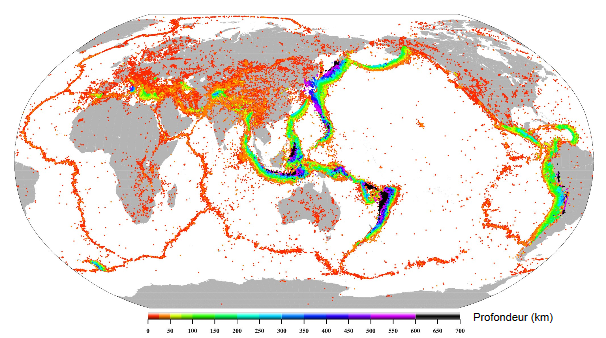

# Introduction 

## Introduction à la pétrologie endogène

La pétrologie sert à :

* la description des roches
* comprendre leur origine et leurs transformations
* comprendre les processus en oeuvre 
* retracer l'histoire des roches
* retrouver l'histoire de la Terre et comprendre son fonctionnement : **Géodynamique**

### Les types de roches

Un roche est une asssociation de cristaux. Il en existe deux sortes : 

* les monominérales 
* les polyminérales

Une roche cristalline est craractérisée par :

* sa composition chimique 
* sa composition minéralogique
* sa texture : l'arrangement et la forme des minéraux

Ceux - ci varient en fonction de la température et de la pression.

Afin de différencier les roches magmatiques et les roches métamorphiques on utilise : 

* étude de terrain
* étude macroscopique et microscopique des échantillons
* analyse chimique des roches et des minéraux
* pétrologie expérimentale

## Structure de la Terre

La Terre est formée de plusieurs couches de densités et de rhéologies différentes. La litosphère est composée d'unités : les plaques lithosphériques. Les plaques naissent au niveau des dorsales et disparaissent dans les zones de subduction. Les plaques litosphériques sont mobiles, animés par la convection dans le manteau, l'accrétion des dorsales, le plongement des slabs...

### Les plaques lithosphériques

Il existe 7 plaques majeures et environ 45 plaques mineures. Elles sont possiblement continentale et océanique. Il existe 3 types de limites de plaques :

* dorsales et failles transformantes
* zone de collision
* zone de subduction

Ces plaques peuvent être déterminées par :

* la sismicité

* le volcanisme

* le GPS

### La chaleur interne de la Terre

Il existe deux types de transport de la chaleur :

* la convection
* la conduction

Les différentes sources de chaleur sont :

* chaleur initiale : liée à l'accrétion de notre planète à son origine
* chaleur latente de cristallisation du noyau : liée à l'accroissement du noyau interne cristallisé aux dépends du noyau externe "liquide".
* chaleur de désintégration radioactive : liée à la présence de 3 éléments radioactifs de longue période (U,Th et K)

On peut percevoir la chaleur de désintégration radioactive par des manifestations minéralogiques : auréoles des zircons dans les biotites 

Les roches de la croûte terrestre (continentale et océanique) sont les plus productives. Les granites et la croûte continentale sont les plus productives. Le manteau est la principale source de chaleur. Elle représente 82% du volume terrestre.

