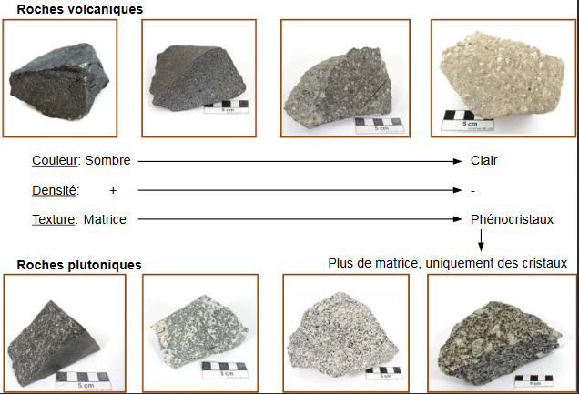
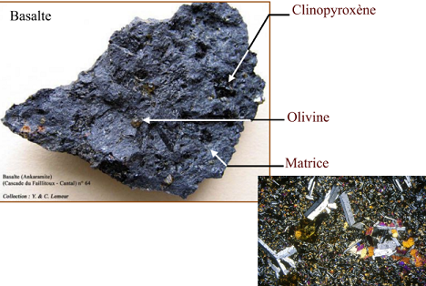
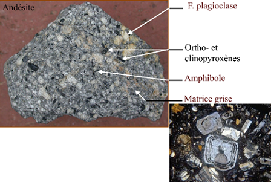

# Les roches magmatiques

Les roches magmatiques sont des roches issues de la cristallisation d'un magma. Il en existe deux types :

* roches extrusives, éruptives ou volcaniques. Elles sont cristallisées

1. lentement en profondeur
2. au moins partiellement rapidement, à la surface terrestre (Basaltes, Trachytes...)

* roches intrusives ou plutoniques. Elles sont cristallisées dans la croûte terrestre (Granites, Gabbros..)

Le magma est un mélange de solide, de liquide et de gaz.

## Variété des roches magmatiques

* roches volcaniques
* roches plutoniques

## Critères

### Critère sur la coloration

### Critère sur le pH

### Critère sur la minéralogie

* minéraux blancs **tectosilicates** : feldspaths, quartz, tridymite, feldspathoïdes
* minéraux colorés **ferromagnésiens** : olivines, pyroxènes, amphiboles, mica
* minéraux accessoires : oxydes (chromite, magnétite, spinelle, ilménite), sulfures, phosphates (apatites), titanite (sphène)

### Critère sur la texture

* **texture vitreuse ou hyaline** : aucun cristal. Il s'agit d'un verre, matériau amorphe. Les sphérolites sont des minéraux fibreux organisés radialement, signe d'un refroidissement brutal.

* **texture aphanitique** : minéraux à l'oeil nu. La roche se présente sous la forme d'une pâte ou "matrice" ou "mésostase" homogène.

* **texture phanéritique** : tous les cristaux sont visibles à l'oeil nu. Plusieurs types de textures : grenue, microgrenue, porphyroïde ect..

* **texture porphyrique** : cristaux de grande taille, visibles à l'oeil nu, pris dans une matrice. Si les cristaux sont centimétriques à pluri centimétriques, on parle de phénocristaux. Ils sont hérités d'une période de cristallisation en profondeur.

Les conditions de cristallisation vont impacter la vitesse de refroidissement.

### Critère sur la forme des cristaux

Les cristaux de plagioclases sont les premiers à apparaître, ils sont automorphes ou sub- automorphes. Les pyroxènes cristallisent en second dans l’espace interstitiel, ils sont xénomorphes.Les cristaux de pyroxènes sont les premiers à apparaître, ils sont automorphes ou sub-automorphes. Les plagioclases cristallisent en second dans l’espace interstitiel, ils sont xénomorphes.

## Classifications

Granites: roches plutoniques riches en quartz, qui comportent plus de feldspath alcalin que de plagioclase.

Granitoïdes: roches plutoniques avec plus de 20% de quartz, indépendamment de la nature du ou des feldspaths.

Classification des granites et des granitoïdes sont fait en fonction de la granulométrie et la chimie des roches.

Si on a plus d'aluminium, on aura un excès qui va former des minéraux comme le micas blanc, le grenat, la muscovite.

Si on a un déficit en aluminium :

* magma métalumineux : Na, K et Ca seront en excès, on aura la formation d'amphiboles et de clinopyroxènes.
* magma peralcalin : Ca sera dans les feldspath plagioclases et les alcalins seront en excès, on aura la formation d'amphiboles ou pyroxène sodiques.

## Géodynamique et magmatisme

Quand on a toujours une remontée magmatique on a toujours du magma qui reste coincé.

Les dorsales représentent un très grande proportion de ce magmatisme, c'est la principale source. Une grosse partie cristallise en profondeur. On y aura accès par érosion ou rarement par les ophiolites (croûte océanique qui passe au dessus de la croûte continental).
