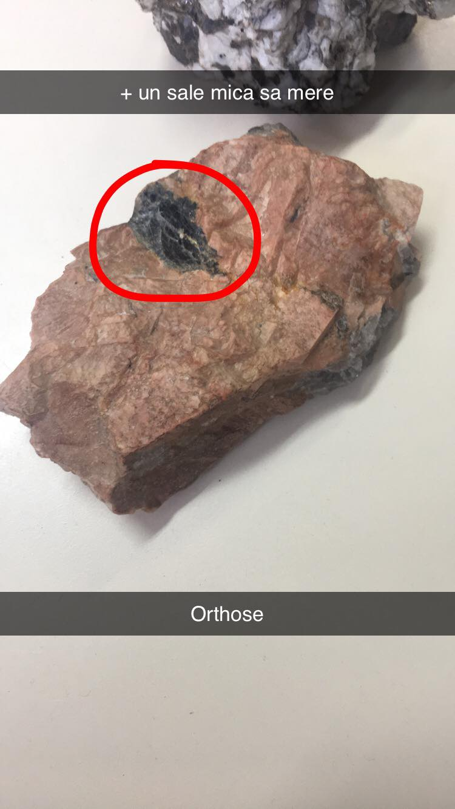
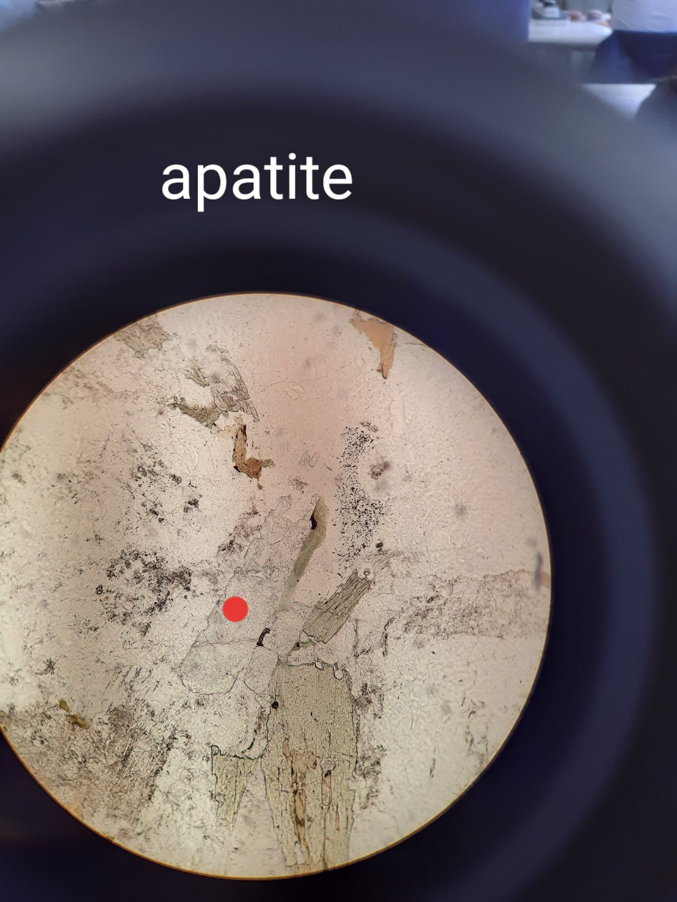
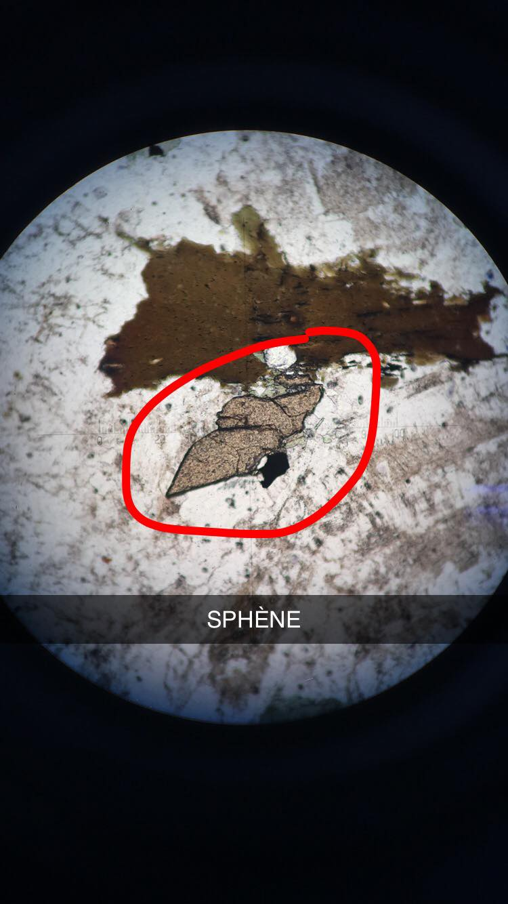
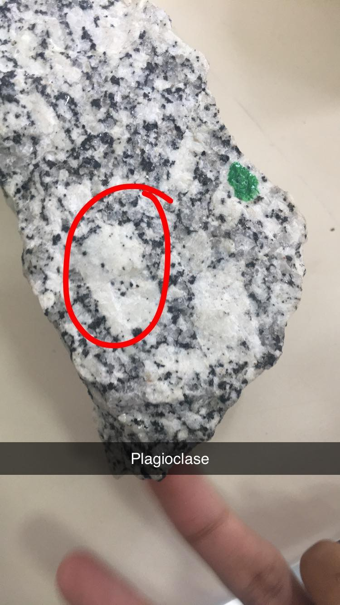
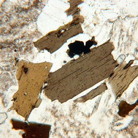

# Séance n°1 : La détermination des minéraux et des roches

## La structure cristalline 

Un minéral est un espèce chimique. Les minéraux vont s'associer entre eux d'une façon particulière pour former un **cristal**. Deux minéraux de même nature associés vont former le **macle**. Les structures peuvent montrer des fragilités qu'on appelle les **clivages**. 

Afin de déterminer les différents minéraux, on utilise des lames où des fragments de roches de 30μm y seront collés.

Pour la première séance nous allons observer les minéraux qu'on retrouve dans le granite, une roche plutonique magmatique à texture grenue. 

## Loi de Fresnel 

δ = V.T d'où V = C/n

Isotrope : la lumière se déplace partout à la même vitesse; gaz, liquides, corps vitreux, ou encore les solides parfaitement cubique  comme le grenat ou la pyrite.

Anisotrope : Biréfringence. Plusieurs types de rayons sont réfractés, on aura donc plusieurs teints sur la lame.

## Clivages et mâcles 

## Granite 

| Masse  |  Lame  | Minéral |
| :--------------- |:---------------:| -----:|
| incolore |   incolore       |  quartz |
| coloré | incolore |   feldspath |
| opaque  | opaque         |   oxyde de fer |
| coloré | coloré | biotite, amphibole 

## Observation des minéraux en LPA

Un minéral donné peut avoir différentes couleurs, ce sont les couleurs résultantes. 

La table des couleurs de Michel Levy

Echelle de biréfringence 

## Les extinctions, l'allongement d'un minéral 

Extinction droite : extinction lorsque les clivages sont dans le même plan que l'analyseur.

La biotite possède 4 moments d'extinctions tous les 90°. L'horblende a une extinction oblique de 15 à 27°.

## Les minéraux du granite 

