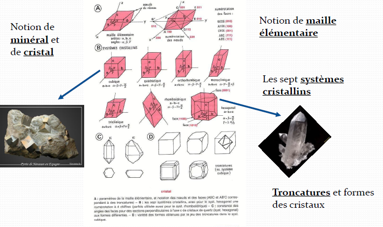
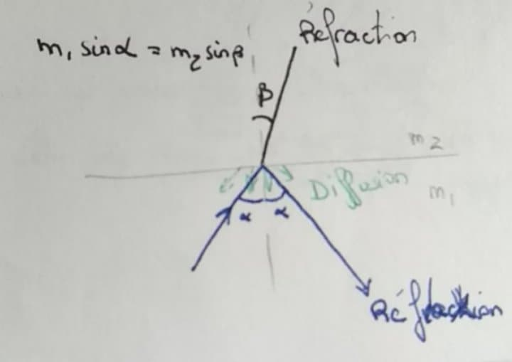
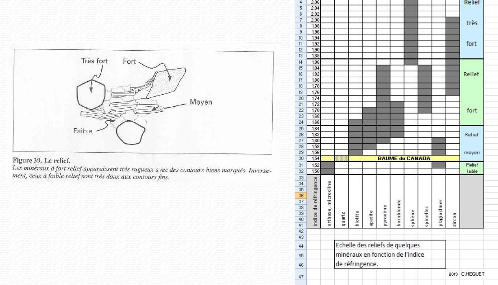
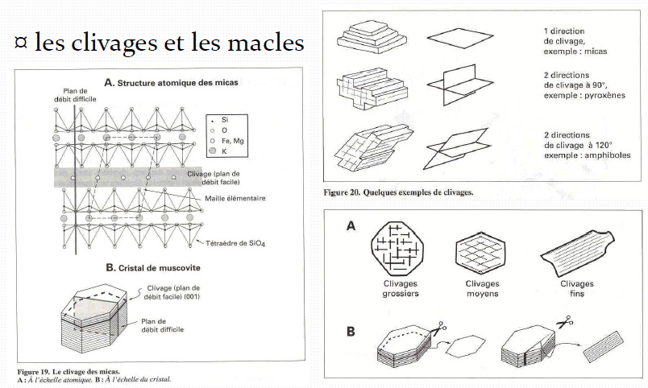
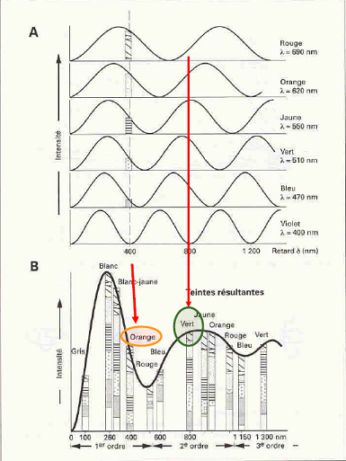
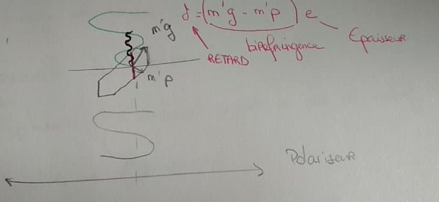
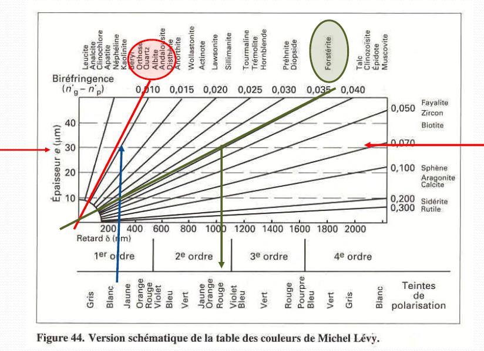
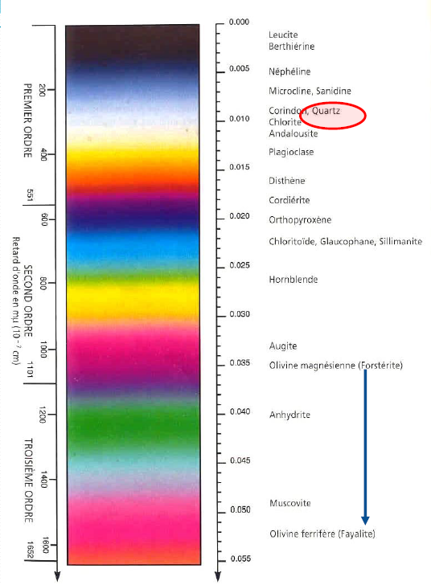

# Séance n°1 : La détermination des minéraux et des roches

## La structure cristalline 

Un minéral est un espèce chimique. Les minéraux vont s'associer entre eux d'une façon particulière pour former un **cristal**. Deux minéraux de même nature associés vont former le **macle**. Les structures peuvent montrer des fragilités qu'on appelle les **clivages**. 

Afin de déterminer les différents minéraux, on utilise des lames où des fragments de roches de 30μm y seront collés.

Pour la première séance nous allons observer les minéraux qu'on retrouve dans le granite, une roche plutonique magmatique à texture grenue. 

## Loi de Fresnel 

δ = V.T d'où V = C/n

Isotrope : la lumière se déplace partout à la même vitesse; gaz, liquides, corps vitreux, ou encore les solides parfaitement cubique  comme le grenat ou la pyrite.

Anisotrope : Biréfringence. Plusieurs types de rayons sont réfractés, on aura donc plusieurs teints sur la lame.

## Clivages et mâcles 

## Granite 

| Masse  |  Lame  | Minéral |
| :--------------- |:---------------:| -----:|
| incolore |   incolore       |  quartz |
| coloré | incolore |   feldspath |
| opaque  | opaque         |   oxyde de fer |
| coloré | coloré | biotite, amphibole 

## Observation des minéraux en LPA

Un minéral donné peut avoir différentes couleurs, ce sont les couleurs résultantes. 

La table des couleurs de Michel Levy

Echelle de biréfringence 

## Les extinctions, l'allongement d'un minéral 

Extinction droite : extinction lorsque les clivages sont dans le même plan que l'analyseur.

La biotite possède 4 moments d'extinctions tous les 90°. L'horblende a une extinction oblique de 15 à 27°.

## Les minéraux du granite 

Les minéraux du granite sont :

- amphibole
- orthose
- apatite
- sphene
- plagioclase
- micas blanc
- biotite

# Séance n°2 : Origine des magmas et variété des roches magmatiques

Les lieux et les modalités de formation des magmas sont variés

magma : solide + liquide > 600°C, si il se refroidit, on a soit des roches plutoniques soit des roches magmatiques

Processus magmatique : 

1. Fusion partielle
   - 20% -> magnésium, nickel
   - 5% -> silice, sodium, potassium

2. Magma
3. Refroidissement -> cristallisation 
   - nucléation 
   - croissance du minéral

Islande : magmatisme dorsale + point chaud

mode : composition minéralogique  d'une roche

zone de subduction : apport d'eau déplace le solidus, l'hydratation permet la fusion

magmatisme alcalin : volcans d'Auvergne avec roches très variés lié à une différenciation 

La teneur en SiO2 = degré de saturation (la présence de quartz ou bien de feldspathoïdes)

La quantité de Na+ et de K+ = alcalinité d’une roche (les feldspaths potassiques et sodiques jusqu’aux
plagioclases calcosodiques)

La proportion de ferromagnésiens qui définira la teinte plus ou moins sombre de la roche
(biotite, hornblende, péridots etc. ; les minéraux sombres.

- obsidienne : texture vitreuse

- micro granite : texture micro granitique

- biotite chloritisée :
  - lpna : incolore à verdâtre 
  - lpa : gris bleu acier

- péridotite 
  - olivine 
    - incolore craquelée lpna
    - teintes vives en lpa

  - pyroxène 
    - gris vert en lpna
    - teintes maximale vives en lpa
    - double clivage 90°

- gabbro 
  - pyroxène + plagioclase
  - parfois olivine / hornblende / biotite

- diorite et diorite quartzique 
  - horblende
  - plagioclase
  - quartz
  - biotite

- syénite

# Séance 3 : Du Massif Central aux volcans d'Auvergne

Dernière activité volcanique : 600 000 ans 

Chaîne du Puy : 100 000 ans

Massif granitique : magmatisme d'Anatexie

- marganide
- puy en velay
  
Roches métamorphiques : miclastique, gneiss

Zone de basalte -> zone de dépression où il y a eu effondrement (3 000 m)

Milieu : failles normales -> dynamique de divergence (effondrement) -> activité volcanique s'est faite dans ces zones

Effondrement gravitationnelle -> expansion puis remontée du manteau

40 000 an -> mise en place des Alpes -> amplification de l'extension

Les volcans sont aligné sur les lignes de failles. Les cônes sont bien marqués = STROMBOLIEN. Les cratères vont jusqu'à 5 Km de diamètre.

Maars : cratère d'explosion avec de l'eau 

Projection : 

- T < 1/16 mm : cendres fines
- 1/16 mm < T < 2 mm : cendres grossières
- 2 mm < T < 6,4 mm : lapili
- T > 6,4 mm : blocs

Scorries : projection avec beaucoup de bulles de gaz

Ponces : lave vitrifiée

Laves : 

- trachyte 
- basalte
- andésite
- trachy - andésite

Même lieu au même moment (90 000 ans) mais les roches sont différentes parce qu'on a une petite surface géographique sur un laps de temps court. Le traceur géochimique nous permet de  savoir que c'est le même magma. Les premiers minéraux formés vont devenir les plus lourds et ne sont pas alcalins donc on a de plus en plus d'alcalins et donc le magma deviendra de plus en plus acide.

