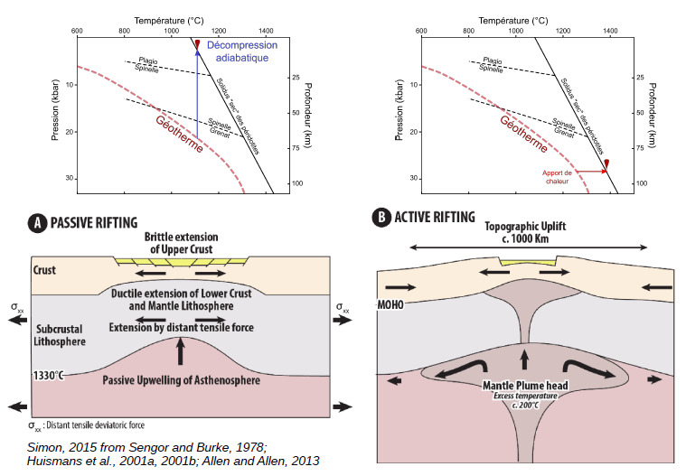
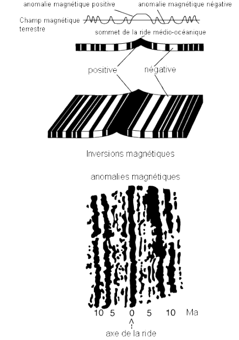
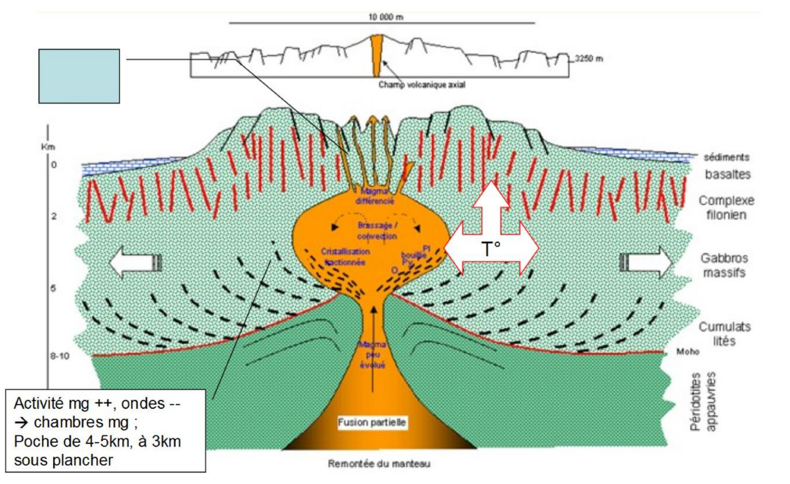
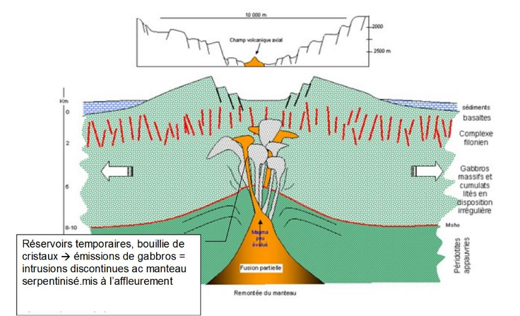
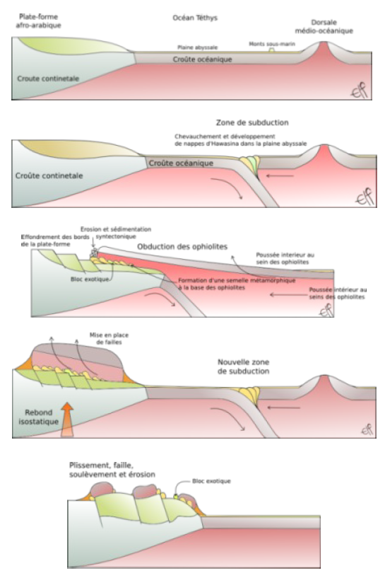
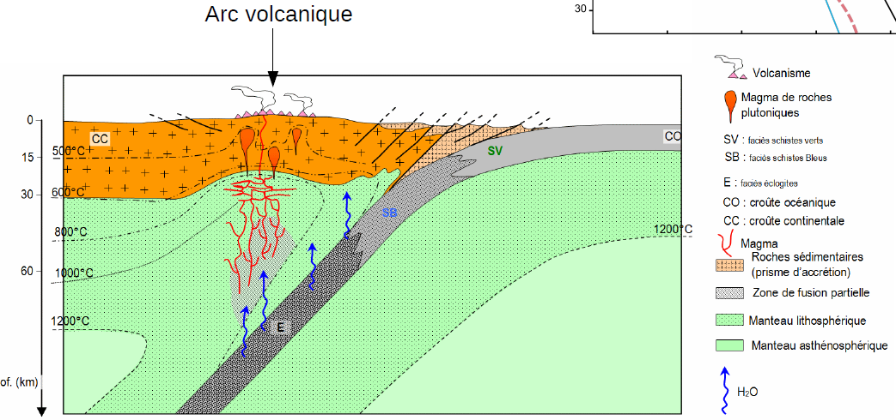
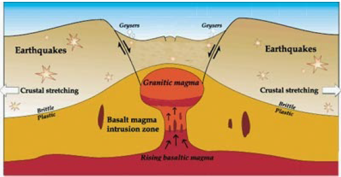
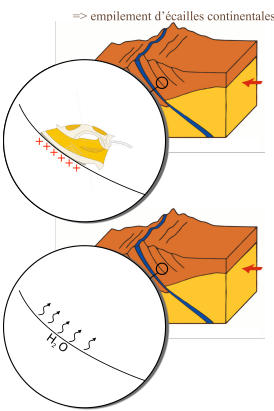

# 5. Magmatisme et géodynamique

## Les rifts continentaux

Rift passif: fossé qui s'étire, forme structural bordé par des failles normales. Le manteau va monté et va se mettre à fondre et à long terme formé du volcanisme. 

Rift actif : manteau chaud qui remonte et va pousser sur la croûte, on aura la formation d'un dôme. Le volcan sera formé plutôt et il y aura plusieurs types de volcanisme car présence de point chaud. 

Au fur et à mesure du rift, le manteau supérieur fond partiellement, les premiers éléments à partir sont les éléments incompatibles. Les premiers magmas sont très riches en alcalins. Les séries deviennent de plus en plus tholéitiques (présence de basalte riche en silice). Le rift deviendra alors un dorsale océanique avec une fabrication constante de la croûte océanique.

## Les dorsales océaniques

La surface de la croûte océanique est constitué de pillows lava, les basaltes en coussins. Les roches vont sortir en permanence et donc on aura une extension océanique. La croûte en vieillissant, va refroidir et va s'épaissir. Elle va devenir de plus en plus dense et va avoir tendance à plonger dans le manteau car elle sera plus dense que lui. La croûte la plus vieille à 180 millions d'années. 

Les dorsales ne vont pas toutes à la même vitesse donc on aura des segments qui sont plus ou moins reliées les uns aux autres. Ils vont tout de même dans le même sens, c'est une zone transformante. Ces segments sont recoupés par des failles transformantes. 

Dans ces basaltes, nous avons la présence de minéraux qui vont s'orienter en fonction du champ magnétique terrestre. Le champ magnétique s'inverse et nous pouvons l'observer dans ces roches. Nous pouvons donc retracer les champs magnétiques dans l'histoire. 

Le manteau va décompresser de façon adiabatique. Les plus forts taux de fusions partielles sont entre 20 et 30%. On va produire des basaltes de type MORB et de gabbros. 

Les vitesses d'expansion varient selon les dorsales. La dorsale océanique est entre 20 et 25mm par an. 

On distingue donc deux types de dorsales océanique : 

* dorsales rapides : dorsale Est - Pacifique 
  * Expansion de 7 à 17 cm/an
  * vallée de rift marquée, voire absente 
  * régime thermique élevé

* dorsales lente : dorsale océanique
  * expansion de 1,5 à 3,5 cm/an
  * vallée du rift bien marquée
  * régime thermique modéré

La chambre magmatique est plus petite dans les dorsales lente donc le toit de la chambre magmatique a tendance à s'éffondrer.

## Les ophiolites

On peut avoir un morceau de croûte océanique sur la croûte continentale.

## Magmatisme de subduction

Subduction : zone de convergence entre  un plateau océanique et un plateau continentale. Ce sont des marges actives.

Les marges passives sont des zones où il ne se passe rien entre la croûte continental et la croûte océanique car ils proviennent de la même plaque tectonique.

Lors d'une subduction, on un la déshydratation des micas puis des amphiboles. On aura une fusion partielle du coin mantellique liée à la déshydratation du slab (croûte océanique et lithosphère océanique) qui subduit. 

On une contribution des sédiments marins du prisme d'accrétion à la chimie des magmas primaires. Les basaltes vont être très marquées et d'autres très peu.

Le mode de fusion partielle est lié à l'hydratation.

Lors d'une subduction on peut avoir un volcanisme de type strombolien à plinien ou péléen. La largeur de l'arc est fonction de l'inclinaison du panneau plongeant. 

## Les trapps ou LIPs.

Les trapps sont des gigantesques coulées basaltiques de lave très fluide de série  tholéitiques. La source mantellique est de faible profondeur qui est réchauffé par un courant ascendant profond et va stocker le basalte de longue période sous la croûte continentale. Cela va faire une couverture qui va bloquer la chambre magmatique jusqu'à saturation de basalte.

On peut avoir des coulées basaltiques pendant des millions d'années. Elles font parties des plus grandes éruptions qu'on connaisse.

## La tomographie sismique

Méthode pour faire des cartographies en 3D à l'aide des ondes sismiques. On a`trois types d'ondes :

- ondes P : compression et dilatation. Ce sont les premières à arriver.
- ondes S : ressemble aux vagues, ce sont les deuxième à arriver.
- ondes de surface : se propage à la surface en torsion, ces ondes sont les plus lentes.

On a une variation de la vitesse de propagation en fonction de 

- la pression
- la température
- la densité

## Les points chauds océanique

Les points chauds océanique sont des alcalins et sont possiblement tholéïthiques. Généralement, le taux de fusion partielle est assez faible (5%).

## Les points chauds continentaux

Les points chauds continentaux ont le même fonctionnement que les points chauds océanique. On a une contamination par l'épaisse croûte continentale traversée. Cependant, ces points chauds sont plus facilement bloqués par la croûte terrestre. On peut les confondre avec des rifts continentaux.

On peut observer deux formes de roches mise en place :

- sill : cristallisation du sill se fait perpendiculairement au sol.
- coulée : formation en prisme qui ne sont pas très bien marqué ou droit, figure dissymétrique. 
  
## Magmatisme et chaînes de production

Le taux partiel peut être très variable. Ce volcanisme est généralement peut étudier car on a peu d'exemples.

