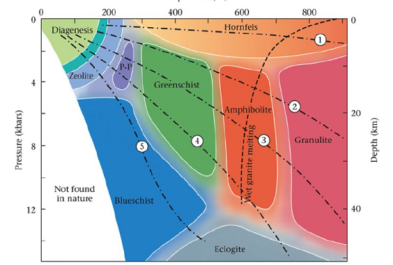
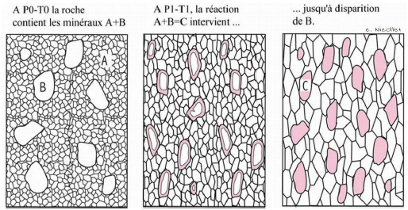

# 6. Métamorphisme

## Qu'est ce que le métamorphisme ?

Le métamorphisme est un ensemble de transformations structurales et minéralogiques des roches à l'état solide. La roche mère est sédimentaire, magmatique ou métamorphique: protolithe qui nous donnera différentes séquences métamorphiques. Sous l'effet des variations de P,T avec ou sans présence de fluides, on a différents gradients métamorphique.

Lors des phases de recristallisation, on a l'apparition et la disparition de phases minéralogiques. Les déformations se font avec ou sans recristallisation.

Il existe différentes types de chemins que peut faire la roche dans le domaine de pression et de température.

1. : Enfouissement de roches supra crustales,
et exhumation à des vitesses
différentes
2. Même chose
3. Idem pour une roche de la croûte inférieure
4. Roche magmatique (basique) se mettant en
place à la base de la croûte et refroidissant
5. Gabbro de la croûte océanique refroidissant
avec l’éloignement à la dorsale
6. Intrusions magmatiques subissant une
compression, suivie d’une exhumation

Le terme **isograde** défini les lignes d'égale intensité du métamorphisme marquées par l'apparition ou la disparition de minéraux.

### Le métasomatose

Le métamorphisme est isochimique en première approximation. Il est cependant accompagné d'un déshydratation des roches. Les fluides peuvent jouer un grand rôle : extraction, transport et/ou éléments. La solubilité des éléments varie avec la température et la pression.

# Les réactions du métamorphisme

Les cortèges minéraux résultent :

* de la composition chimique de a roche initiale
* de l'état de cristallisation de cette roche initiale 
* des conditions pression - température et ede teneur en eau lors de la recristallisation 
* de la cinétique du parcours pression - température précédent et pendant la recristallisation

polymorphes : même composition chimique mais réseaux cristallins différents

## Les réactions minéralogiques 

Il existe des réactions entre plusieurs minéraux. En effet, un minéral à une température et pression donnée peuvent former deux minéraux sans avoir besoin de fluide.

* albite → jadéite + quartz

* enstatite + anorthite → grenat + quartz

En ayant besoin de fluide : 

* trémolite (Al) → Diopside + Hypersthène + Anorthite + Eau

* dolomite + Quartz + Eau --> Talc + Calcite + CO2

## Les réactions du métamorphisme

Étapes d’une réaction métamorphique :

Dissolution → Nucléation → Croissance

La cinétique des réactions est contrôlée par le processus le plus lent : la diffusion

Diffusion à 2 échelles spatiales

- le minéral
- la roche, voire le massif.

Le coefficient de diffusion dans les solides est très faible. La diffusion des éléments dans les roches est principalement influencée par 3 facteurs :

- les fluides
- la température : favorise la mobilité des éléments
- la déformation

Les fluides dans les roches sont à l'état supercritique. Les fluides sont aussi dense qu'un liquide mais ont le comportement d'un gaz. Ce sont principalement de l'eau ou du dioxyde de carbone. Ces fluides contiennent des ions en solution. Ils sont abondants dans la croûte mais leur proportion diminue rapidement avec la profondeur.

Il existe quatre types de fluides : 

- les fluides libres
  - Dans les pores intergranulaires ou dans les inclusions fluides des minéraux
  - Phase vapeur ou fluide dans les para genèse
  - Déplacement en fonction de la perméabilité et du gradient de pression, du m au km
  - Quantifiée en pression partielle de fluides

- les fluides adsorbés
  - Très fine pellicule (qqs Å) le long des surfaces cristallines
  - Faiblement mobile
  - Volume variable, assez faible
  - Milieu de diffusion intergranulaire qui favorise la diffusion rapide des ions et la déformation

- les fluides liés
  - Groupements hydroxyles dans les minéraux hydratés (micas, amphiboles)
  - Carbonates (CaCO3)
  - Libérés sous forme de phase vapeur lors de réaction de  volatilisation (déshydratation ou décarbonatation)

- les fluides dissous
    - fusion partielle libère les fluides liées restants, dissous dans les liquides magmatiques → Roches résiduelles anhydres (Granulites)

La cinétique des réactions peut réduire la distance entre les grains, introduit les micro fractures favorisant la diffusion, favorise aussi la circulation des fluides dans les plans de foliation et peut apporter de l'énergie nécessaire au franchissement de la barrière énergétique d'une réaction. 