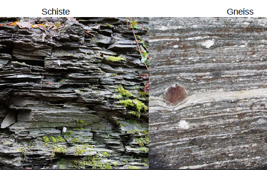

# 7.Les déformations associées au métamorphisme

La déformation finie dépend :

- de la rhéologie des matériaux
    - déformation cassante : seuil plastique élevée
    - déformation ductile : seuil plastique bas
- du champ de contraintes

Différents paramètres influents sur la rhéologie : 

- la pression lithostatique
- la température
- la vitesse de déformation
- la nature de la roche
- les assemblages minéralogiques

Un même champ de contraintes appliqué sur des matériaux de rhéologies différentes déforme différemment les roches de théologie différentes.  Avec le temps, la rhéologie peut devenir homogène.

Déformation ductiles : La

 - structure mécanique : plans de débit préférentiel : **schistosité**
 - structure minéralogique : plans marqués par des niveaux de composition minéralogique contrastée, ou arrangements de minéraux individuels : **foliation**

