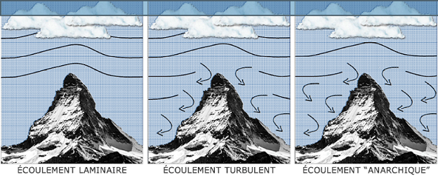

# Introduction à la dynamique cotière 

## Zones cotières

La zone côtière marine et son littoral sont de natures très variées (lagons,
baies, embouchures de rivières, falaises, plages, mangroves…etc…).
C’est le lieu où s’exacerbent les pressions anthropiques et climatiques.

L’hydrodynamique côtière est responsable de :

* le transport de polluants (pétrole, ..), des mouvements sédimentaires (erosion, sedimentation, ..) ayant des consequences importantes, comme le recul du trait de cote ou la formation de bancs de sable,
* fort impact sur les paysages et les habitats marins: fonctionnement des écosystèmes marins

Echelles Différentes : court-terme au long-terme 

L’objet de l’hydrodynamique qui fait partie d’une façon générale de l’étude
des fluides en mouvement ou encore Mécanique des Fluides : ce domaine
s’attache à étudier la façon dont les forces génèrent les mouvements de l’eau : mesurer un ou plusieurs paramètres de ce mouvement: courant en surface, au fond. 

Mesure discrète et représentative en un point donné ou une zone très
particulière et pour une période temporelle correspondant à celle de la mise
en oeuvre du matériel de mesure.

Description du champ complet de ce mouvement -> faire appel à des résolutions numériques du problème mathématique continus -> modélisation

Dynamique des masses d'eau -> équation physiques complexes -> conservation du mouvement et de l'énergie

Ces équations ont été établies progressivement mais le formalisme actuellement utilisé doit beaucoup aux physiciens français Henry Navier et anglais Georges Stokes qui leur ont donné leurs noms.

## Pression atmosphérique

La pression atmosphérique est donc le poids exercé par une colonne d’air
partant du sol et s’étirant jusqu’à l’atmosphère.

La pression se mesure à l'aide d'un baromètre et s'exprime en hectopascal
(hPa). 1 hectopascal équivaut à 100 Pascals (Pa) ou encore à 1 millibar.
Au niveau de la mer, la pression moyenne est de 1013.25 hPa.
En météorologie , dès lors que la pression descend en dessous de 1010 hPa, il s'agit de basses pressions (dit aussi : « conditions dépressionnaires »).
(Le vent est plutôt fort avec un ciel souvent fort encombré et des précipitations fréquentes.) Au contraire, lorsque la pression dépasse 1015 hPa, on parle alors de hautes pressions (dit aussi : « conditions anticycloniques »). (Le vent est faible avec un ciel souvent bien dégagé)

Pour analyser une situation météorologique, le champ de pression est un
élément fondamental. Chaque observation de pression à l’échelle du globe est ramenée au niveau de la mer, de façon à ce que les mesures soient comparables entre elles.

Un tracé de lignes isobares est ensuite réalisé, reliant les points d’égale
pression, effectués généralement de 5 hPa en 5 hPa. Ainsi, on obtient une carte isobarique permettant de délimiter les zones dépressionnaires et les zones anticycloniques. 

La pression peut également être représentée sous une autre forme : « les
géopotentiels ». Il est d’ailleurs plus pratique de reporter les altitudes où se situent les mêmes pressions de manière à cartographier le champ de pression à différentes altitudes.

Les lignes d’égale altitude sont appelés des isohypses. Les formes dessinées par les isobares nous permettent de reconnaitre la nature des perturbations atmosphériques comme les dépressions, les anticyclones.

Elle varie aussi en rapport avec la température de l’air parce que l’air chaud a une moins grande densité que l’air froid ; une couche d’air chaud de même taille qu'une autre couche d’air froid aura une moins grande pression.

## Vent

Le vent représente la vitesse à laquelle une particule d’air présentée dans
l'atmosphère est soumise. Il prend naissance sous l'effet des différences de
températures et de pression.

Plus la différence de pression entre deux masses d'air est importante et plus le vent sera important. Au contraire si la pression reste constante, les vents demeureront faibles. Les courants d'air horizontaux sont en moyenne beaucoup plus importants que les verticaux.

La vitesse verticale moyenne des vents ne dépasse pas quelques dizaines de
centimètres par seconde, contre 10 m/s pour la vitesse horizontale ; toutefois, à l'échelle locale, en présence de reliefs importants et à l'intérieur des systèmes convectifs, elle peut atteindre des valeurs extrêmes, jusqu'à 40 m/s (dans des supercellules).

Les données de vent sont classifiées selon deux informations : la vitesse et la direction selon le plan horizontal. En général l’unité du système international pour la vitesse est le mètre par seconde (m/s), or en ce qui concerne la vitesse du vent en météorologie, on utilise le plus souvent les kilomètres par heure (km/h) et les noeuds pour la météorologie maritime.

1 m/s = 3.6 km/h, 1 km/h = 0.5 noeuds

Concernant la direction du vent, on indique d’où vient le vent. Pour cela on
utilise le plus souvent une rose des vents où est indiqué les 4 points cardinaux.

Les mesures de vent sont recueillies par les stations météorologiques avec des appareils adaptés comme l'anémomètre (équipé d'une girouette).
Cet instrument possède une partie mobile qui entre en mouvement autour d’un
axe sous l’effet d’un flux d’air. La girouette indique la direction d’où vient le vent alors que l’anémomètre est quant à lui constitué de trois coupelles qui tournent plus ou moins vite selon la pression exercée par l’air.

Les données de vent sont recueillies par l'anémomètre de trois manières :

* le vent instantané ; qui correspond à la vitesse de déplacement du vent à un instant précis qui permet d’enregistrer les rafales de vent.

* le vent moyen ; calculé dans un intervalle de temps plus ou moins précis en fonction de son utilisation qui correspond à la moyenne de la vitesse instantanée du vent.

* la vitesse maximale est la vitesse instantanée la plus forte enregistrée lors des rafales de vent les plus puissantes.

### Origine du vent 

#### Les gradients de pression

Il existe de fortes variations de température entre les zones équatoriales et les régions polaires qui engendrent des gradients de densité de l'air (car une masse d'air froid est plus dense qu'une masse d'air chaud) et donc des gradients de pression atmosphérique. Il en découle des mouvements de l'air présents à l'échelle planétaire. 

Les vents ainsi générés ont un rôle principal : celui de transporter de la chaleur depuis les régions équatoriales vers les zones polaires pour compenser le déséquilibre thermique. Seulement, l'équilibre thermique n'est jamais atteint, car le rayonnement solaire l'en empêche ;aucun équilibre ne peut donc être atteint de façon durable.

#### Rotation de la Terre

La rotation de la Terre intervient dans la déviation, à l'échelle planétaire, des courants aériens : vers la gauche dans l'hémisphère sud et vers la droite dans l'hémisphère nord. La force responsable de cette déviation est la force de Coriolis qui dépend à la fois de la vitesse de la masse d'air et de la latitude concernée.

Dans les régions équatoriales la force de Coriolis est faible, les vents soufflent donc des hautes vers les basses pressions sans être déviés. Aux latitudes tempérées et près des pôles, les vents ont tendance à suivre les lignes isobares en tournant dans le sens des aiguilles d'une montre autour des anticyclones dans l'hémisphère nord et dans le sens anti-horaire autour des dépressions.

Près du sol, les forces de frottement sont plus importantes ; ainsi la vitesse du vent décroît suivant la verticale pour atteindre une valeur quasi nulle à la surface.

Les régions polaires et tempérées sont exposées à une décroissance des vents qui se traduit par une réduction de la force de Coriolis ; le vent est alors dévié vers les basses pressions.

Schéma montrant comment les vents sont déviés pour donner une circulation antihoraire dans l’hémisphère nord autour d’une dépression. (La force de gradient de pression est en bleu, celle de Coriolis en rouge et le déplacement en noir).

### Ecoulement du vent

Le vent s'écoule de façon plus ou moins régulière et peut-être caractérisé par différents régimes. Nous parlerons d’écoulement laminaire lorsque l'air est peu agité, les lignes de courant disposées en couches parallèles; donc le vent est régulier.

Dans le cas de l'écoulement turbulent, l'air est agité de façon désordonnée, le vent est alors très irrégulier en direction et en vitesse (les fluctuations peuvent atteindre des valeurs importantes sur des temps relativement brefs).

Pour finir, l'écoulement est anarchique lorsque les vents se déplacent dans tous les sens à cause de la turbulence due aux frottements contre les massifs montagneux par exemple, et aux perturbations associées à la présence de barrières orographiques ou de mouvements convectifs.

### Courants de jet

Un tube de vent très fort s’observe dans les moyennes latitudes : le courant-jet ou jet stream. Il existe différents courants-jets.

Situé à des altitudes évoluant entre 6 et 15 km, le courant-jet ondule autour de la planète en ayant des phases d’accélération ou de décélération. Ces différentes phases rythment le temps de chaque parcelle de notre planète.

Dans les zones les plus actives du courant-jet, les vents peuvent y atteindre plus de 500 km/h comme lors de la tempête du 27 décembre 1999 où à la verticale de Brest, une rafale de 529,2 km/h a été mesurée par radiosondage à 8 138 m du sol !

Cette tempête illustre bien les dangers causés par le vent ; celui-ci peut parfois atteindre des valeurs remarquables, comme par exemple lors des cyclones les plus actifs.

### Echelle de Beaufort

Vent -> état de mer : houle

En 1805, Francis Beaufort a imaginé une échelle capable de décrire assez
précisément les effets du vent sur la mer. Il en est ressorti une échelle de
mesure empirique comportant 13 niveaux (de 0 à 12) auxquels on associe une
vitesse moyenne de vent et une description de l’état de la mer. Par la suite, des critères liés aux conditions sur terre furent ajoutés pour étendre son utilisation.

## Patrons isobares : cyclones - depression

### Formation d'un anticyclone

Au cours de ce déplacement l’air, le parcours de l’anticyclone est modifié par une force nommée la force de Coriolis. L’anticyclone se met alors à
effectuer des tourbillons, de façon horaire dans l’hémisphère Nord et antihoraire dans l’hémisphère Sud.

Un ciel dégagé et de l’air sec sont donc les résultats du passage d'un anticyclone. Alors, si un anticyclone reste dans une région plusieurs jours
des périodes de sécheresse et de froid intense peuvent s’en suivre.

### Formation d'un cyclone

Quand l’air circule par-dessus un océan quelconque ou d’un sol à température assez élevée, il finit par se réchauffer. Ce réchauffement entraine une diminution de la masse volumique de l’air en question. Répondant aux courants de convection, l’air chaud monte et forme une zone de basse pression en raison de sa faible densité. Cette zone est appelée «cyclone » ou même « dépression ».

La formation de cyclone est souvent causée par la rencontre de deux masses d’air, mais celles-ci sont généralement beaucoup plus petites que les anticyclones. Les cyclones apportent avec eux des précipitations et des vents parfois violents.

Il existe cinq facteurs précurseurs de la formation d’un cyclone :

* la température de la mer doit dépasser 26,5°C jusqu’à une profondeur d’au au moins 60 mètres, et la température de la surface doit dépasser 28/29°C. En effet, si l’ouragan se déplace vers une source plus froide, il perd rapidement en intensité

* les conditions atmosphériques doivent être favorables à la formation d’orages : cumulonimbus, instabilité de l’air, humidité…

* une perturbation atmosphérique préalable. Il est possible de le voir dans le tableau un peu plus haut, il est toujours question de dépression ou de
 perturbation tropicale avant l’évolution en cyclone. Le point de départ de tout ceci est appelé l’onde tropicale

* une distance de plus de 10° de l’équateur. C’est la force de Coriolis qui crée la rotation du cyclone. Or, autour de l’équateur, cette force est quasiment inexistante, empêchant la création de gros ouragans. 

* une absence de « cisaillement vertical du vent », qui nuirait fortement à la structure déjà instable du cyclone.

### Cyclone, ouragan, typhon, tornade

L’échelle de Beaufort mesure la vitesse moyenne du vent sur une durée de 10
minutes. Selon la zone géographique, la limite nécessaire pour qu’une tempête devienne un cyclone n’est pas la même (niveau 7, 10…). C’est également cette zone qui définit le nom du phénomène :

L’**ouragan** : un ouragan s’appelle ainsi lorsque il se situe dans la partie nord de l’océan Atlantique, ou bien dans la région nord-est du Pacifique

Le **cyclone** : un cyclone s’appelle ainsi lorsque il se situe dans l’océan Indien, autour de l’Australie et dans le sud du Pacifique

Le **typhon** : un typhon s’appelle ainsi lorsque il se situe dans le nord-ouest du Pacifique.

# Processus physique au large

## Caractéristiques

Déformation périodique d'un interface. En océanographie, les ondes se matérialisent par un déformation de la surface de la mer (l'interface entre l'atmosphère et l'océan). 

(voir diapo pour le graphique)

H = 2A
h = profondeur
L ou delta = longueur d'onde
T = période
g = 9.81

Les ondes sont classifiées en fonction du rapport entre la longueur d'onde et la profondeur à laquelle elle se propage

* ondes courtes 
* onde longues

### Types

En eau profonde c'est à dire lorsque la longueur d'onde est faible

C = célérité = L/T = (g.h)^1/2

En eau profonde, c'est à dire lorsque la longue d'onde est très grande par rapport à la profondeur d'eau (au moins 20 fois plus grande). Les particules d'eau se propagent en ellipse.

#### Tsunami

Lors de la formation d'un tsunami au large, la profondeur de l'eau est de l'ordre de 4000 m. La longueur d'onde d'un tsunami est en général supérieur à 100 Km.

Au large, les tsunamis se propagent très rapidement. En effet, ceux sont des ondes longues et leur vitesse est proportionnelle à la profondeur de l'océan.

Au large, la profondeur de l'océan est 4000 m et les tsunamis se propagent avec un vitesse bien derterminé (50-900 Km/h)

A l'arrivée près des côtes, un tsunami devient dangereux : la hauteur des vagues augmente de façon considérable. En se rappochant des côtes, la longueur d'onde diminue car la profondeur diminue. 

De plus, g a toujours la même valeur donc la vitesse de propagation du tsunami dépend de la profondeur.

En eau profonde, un tsunami atteint généralement quelques dizaine de centimètre de hauteur en surface, mais la hauteur de ces vagues augmentent rapidement en eau peu profonde.

#### Marées

La marée est le mouvement périodique de montée et descente du niveau de la mer. Arrivée en estuaire il y a une déformation des ondes de marées.

courant de flot : courant de l'océan vers les côtes

courant de jusant : courant des côtes vers l'océan

#### Houle

La longueur d'onde de la houle est de l'ordre d'une centaine de mètre. Au large, la profondeur de l'océan est supérieur à 4000 m.

Le "fetch" est un plan d'eau sur lequel souffle le vent sans rencontrer d'obstacle.

Le clapot de mer correspond à l'état de mer caractérisé par 

L'effet du vent sur l'état de la mer dépend :

1. de la distance sur laquelle le vent souffle sans rencontrer d'obstacle
2. du temps pendant lequel le vent souffle de façon continue à une force donnée

La hauteur d'une vague dépend donc de la durée d'exposition au vent et de sa zone effective d'action, ou plutôt la surface sur laquelle il souffle.

L'énergie d'une houle, c'est son énergie cinétique (représentée par la vitesse), avec son énergie potentielle. (L'énergie potentielle est une énergie qui a le potentiel de se transformer en une autre forme d'énergie).

E houle = E cinétique + E potentiel

Célérité = fréquence angulaire / nombre d'onde

truc chelou : élevation d'un point x dans l'espace et un temps bien déterminer à savoir

équation de dispersion à savoir

